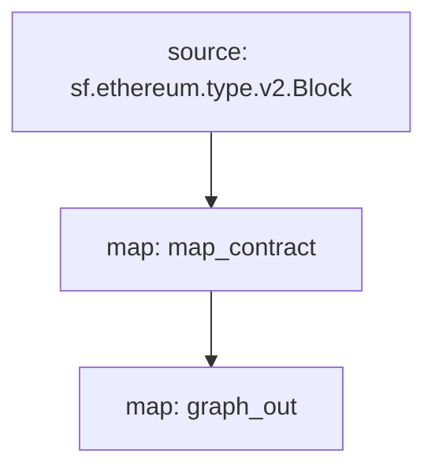

[Substreams](/substreams) je nový framework pro zpracování blockchainových dat vyvinutý společností StreamingFast pro The Grafu síť. Moduly Substreams mohou vypisovat změny entit, které jsou kompatibilní s entitami Subgraph. Subgraph může takový modul Substreams používat jako zdroj dat, což vývojářům Subgraphu přináší rychlost indexování a další data Substreams.

## Požadavky

This cookbook requires [yarn](https://yarnpkg.com/), [the dependencies necessary for local Substreams development](https://substreams.streamingfast.io/documentation/consume/installing-the-cli), and the latest version of Graph CLI (>=0.52.0):

```
npm install -g @graphprotocol/graph-cli
```

## Získejte kuchařku

> Tato kuchařka používá tento [Substreams-powered subgraph jako referenci](https://github.com/graphprotocol/graph-tooling/tree/main/examples/substreams-powered-subgraph).

```
graph init --from-example substreams-powered-subgraph
```

## Definování balíčku Substreams

Balíček Substreams se skládá z typů (definovaných jako [Protocol Buffers](https://protobuf.dev/)), modulů (napsaných v jazyce Rust) a souboru `substreams.yaml`, který odkazuje na typy a určuje, jak se moduly spouštějí. [Navštivte dokumentaci Substreams, kde se dozvíte více o vývoji Substreams](/substreams), a podívejte se na [awesome-substreams](https://github.com/pinax-network/awesome-substreams) a [Substreams cookbook](https://github.com/pinax-network/substreams-cookbook), kde najdete další příklady.

Dotyčný balíček Substreams detekuje nasazení kontraktů na Mainnet Ethereum a sleduje blok vytvoření a časové razítko všech nově nasazených kontraktů. K tomu je v souboru `/proto/example.proto` ([více informací o definování protokolových bufferů](https://protobuf.dev/programming-guides/proto3/#simple)) vyhrazen typ `Contract`:

```proto
syntax = "proto3";

package example;

message Contracts {
  repeated Contract contracts = 1;
}

message Contract {
    string address = 1;
    uint64 blockNumber = 2;
    string timestamp = 3;
    uint64 ordinal = 4;
}
```

Jádrem logiky balíčku Substreams je modul `map_contract` v souboru `lib.rs`, který zpracovává každý blok, filtruje volání Create, která nebyla vrácena, a vrací `Contracts`:

```rust
#[substreams::handlers::map]
fn map_contract(block: eth::v2::Block) -> Result<Contracts, substreams::errors::Error> {
    let contracts = block
        .transactions()
        .flat_map(|tx| {
            tx.calls
                .iter()
                .filter(|call| !call.state_reverted)
                .filter(|call| call.call_type == eth::v2::CallType::Create as i32)
                .map(|call| Contract {
                    address: format!("0x{}", Hex(&call.address)),
                    block_number: block.number,
                    timestamp: block.timestamp_seconds().to_string(),
                    ordinal: tx.begin_ordinal,
                })
        })
        .collect();
    Ok(Contracts { contracts })
}
```

Balíček Substreams může být použit podgrafem, pokud má modul, který vypisuje kompatibilní změny entit. Příklad balíčku Substreams má v `lib.rs` další modul `graph_out`, který vrací výstup `substreams_entity_change::pb::entity::EntityChanges`, který může zpracovat Graph Node.

> Bedna `substreams_entity_change` má také speciální funkci `Tables` pro jednoduché generování změn entit ([dokumentace](https://docs.rs/substreams-entity-change/1.2.2/substreams_entity_change/tables/index.html)). Vygenerované změny entit musí být kompatibilní s entitami `schema.graphql` definovanými v `subgraph.graphql` příslušného podgrafu.

```rust
#[substreams::handlers::map]
pub fn graph_out(contracts: Contracts) -> Result<EntityChanges, substreams::errors::Error> {
    // hash map of name to a table
    let mut tables = Tables::new();

    for contract in contracts.contracts.into_iter() {
        tables
            .create_row("Contract", contract.address)
            .set("timestamp", contract.timestamp)
            .set("blockNumber", contract.block_number);
    }

    Ok(tables.to_entity_changes())
}
```

Tyto typy a moduly jsou sdruženy v souboru `substreams.yaml`:

```yaml
specVersion: v0.1.0
package:
  name: 'substreams_test' # the name to be used in the .spkg
  version: v1.0.1 # the version to use when creating the .spkg

imports: # dependencies
  entity: https://github.com/streamingfast/substreams-entity-change/releases/download/v0.2.1/substreams-entity-change-v0.2.1.spkg

protobuf: # specifies custom types for use by Substreams modules
  files:
    - example.proto
  importPaths:
    - ./proto

binaries:
  default:
    type: wasm/rust-v1
    file: ./target/wasm32-unknown-unknown/release/substreams.wasm

modules: # specify modules with their inputs and outputs.
  - name: map_contract
    kind: map
    inputs:
      - source: sf.ethereum.type.v2.Block
    output:
      type: proto:test.Contracts

  - name: graph_out
    kind: map
    inputs:
      - map: map_contract
    output:
      type: proto:substreams.entity.v1.EntityChanges # this type can be consumed by Graph Node
```

Celkový "tok" z bloku do `map_contract` a `graph_out` můžete zkontrolovat spuštěním `substreams graph`:



Chcete-li tento balíček Substreams připravit ke spotřebě podgrafem, musíte spustit následující příkazy:

```bash
yarn substreams:protogen # generates types in /src/pb
yarn substreams:build # builds the substreams
yarn substreams:package # packages the substreams in a .spkg file

# alternatively, yarn substreams:prepare calls all of the above commands
```

> Tyto skripty jsou definovány v souboru `package.json`, pokud chcete porozumět základním příkazům substreamů

Tím se vygeneruje soubor `spkg` na základě názvu a verze balíčku ze souboru `substreams.yaml`. Soubor `spkg` obsahuje všechny informace, které Grafu uzel potřebuje k požití tohoto balíčku Substreams.

> Pokud aktualizujete balíček Substreams, může být v závislosti na provedených změnách nutné spustit některé nebo všechny výše uvedené příkazy, aby byl balíček `spkg` aktuální.

## Definování podgrafu poháněný substreamů

Subgrafy poháněné substreamy představují nový typ datového zdroje s názvem "substreams". Tyto subgrafy mohou mít pouze jeden datový zdroj.

Tento zdroj dat musí specifikovat indexovanou síť, balíček Substreams (`spkg`) jako relativní umístění souboru a modul v rámci tohoto balíčku Substreams, který vytváří změny entit kompatibilní s podgrafem (v tomto případě `map_entity_changes` z výše uvedeného balíčku Substreams). Mapování je specifikováno, ale jednoduše identifikuje druh mapování ("substreams/graph-entities") a apiVersion.

> Currently, Subgraph Studio and The Graph Network support Substreams-powered subgraphs which index `mainnet` (Mainnet Ethereum).

```yaml
specVersion: 0.0.4
description: Ethereum Contract Tracking Subgraph (powered by Substreams)
repository: https://github.com/graphprotocol/graph-tooling
schema:
  file: schema.graphql
dataSources:
  - kind: substreams
    name: substream_test
    network: mainnet
    source:
      package:
        moduleName: graph_out
        file: substreams-test-v1.0.1.spkg
    mapping:
      kind: substreams/graph-entities
      apiVersion: 0.0.5
```

Soubor `subgraph.yaml` také odkazuje na soubor se schématem. Požadavky na tento soubor se nemění, ale zadané entity musí být kompatibilní se změnami entit vytvořenými modulem Substreams, na který odkazuje soubor `subgraph.yaml`.

```graphql
type Contract @entity {
  id: ID!

  "The timestamp when the contract was deployed"
  timestamp: String!

  "The block number of the contract deployment"
  blockNumber: BigInt!
}
```

Vzhledem k výše uvedenému mohou vývojáři podgrafů použít rozhraní Graph CLI k nasazení tohoto podgrafu poháněného substreamy.

> Subgrafy poháněné substreamy indexující hlavní síť Ethereum mohou být nasazeny do [Subgraph Studio](https://thegraph.com/studio/).

```bash
yarn install # install graph-cli
yarn subgraph:build # build the subgraph
yarn subgraph:deploy # deploy the subgraph
```

Hotovo! Postavil(a) jste a nasadil(a) podgraf poháněný substreamy.

## Obsluha podgrafů poháněných substreamy

Aby bylo možné servírovat subgrafy napájené Substreams, musí být Graph Node nakonfigurován s poskytovatelem Substreams pro příslušnou síť a také s Firehose nebo RPC pro sledování hlavy řetězce. Tyto poskytovatele lze nakonfigurovat pomocí souboru `config.toml`:

```toml
[chains.mainnet]
shard = "main"
protocol = "ethereum"
provider = [
  { label = "substreams-provider-mainnet",
    details = { type = "substreams",
    url = "https://mainnet-substreams-url.grpc.substreams.io/",
    token = "exampletokenhere" }},
  { label = "firehose-provider-mainnet",
    details = { type = "firehose",
    url = "https://mainnet-firehose-url.grpc.firehose.io/",
    token = "exampletokenhere" }},
]
```
