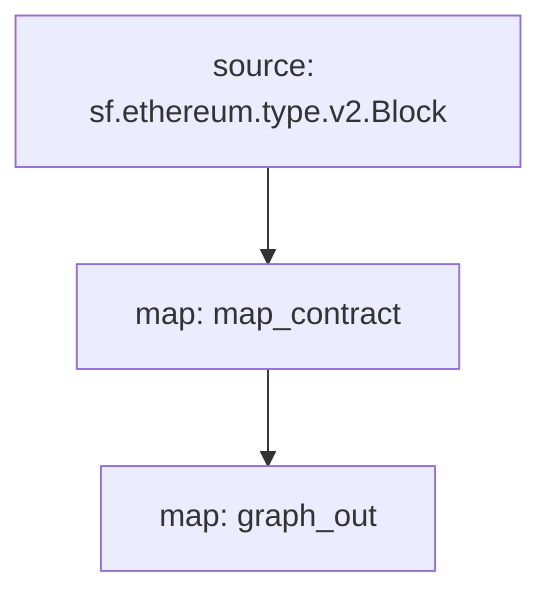

[Substreams](/substreams) est un nouveau framework de traitement des données blockchain, développé par StreamingFast pour The Graph Network. Un module de sous-flux peut générer des modifications d'entité, qui sont compatibles avec les entités Subgraph. Un subgraph peut utiliser un tel module Substreams comme source de données, apportant la vitesse d'indexation et les données supplémentaires des Substreams aux développeurs de subgraphs.

## Exigences

Ce livre de recettes nécessite [yarn](https://yarnpkg.com/), [les dépendances nécessaires au développement local de Substreams](https://substreams.streamingfast.io/developers-guide/installation-requirements) et la dernière version du graph CLI (>=0.52.0) :

```
npm install -g @graphprotocol/graph-cli
```

## Obtenir le livre de cuisine

> This cookbook uses this [Substreams-powered subgraph as a reference](https://github.com/graphprotocol/graph-tooling/tree/main/examples/substreams-powered-subgraph).

```
graph init --from-example substreams-powered-subgraph
```

## Définir un package Substreams

A Substreams package is composed of types (defined as [Protocol Buffers](https://protobuf.dev/)), modules (written in Rust), and a `substreams.yaml` file which references the types, and specifies how modules are triggered. [Visit the Substreams documentation to learn more about Substreams development](/substreams), and check out [awesome-substreams](https://github.com/pinax-network/awesome-substreams) and the [Substreams cookbook](https://github.com/pinax-network/substreams-cookbook) for more examples.

The Substreams package in question detects contract deployments on Mainnet Ethereum, tracking the creation block and timestamp for all newly deployed contracts. To do this, there is a dedicated `Contract` type in `/proto/example.proto` ([learn more about defining Protocol Buffers](https://protobuf.dev/programming-guides/proto3/#simple)):

```proto
syntax = "proto3";

package example;

message Contracts {
  repeated Contract contracts = 1;
}

message Contract {
    string address = 1;
    uint64 blockNumber = 2;
    string timestamp = 3;
    uint64 ordinal = 4;
}
```

The core logic of the Substreams package is a `map_contract` module in `lib.rs`, which processes every block, filtering for Create calls which did not revert, returning `Contracts`:

```
#[substreams::handlers::map]
fn map_contract(block: eth::v2::Block) -> Résultat<Contracts, substreams::errors::Error> {
     laisser les contrats = bloquer
         .transactions()
         .flat_map(|tx| {
             tx.appels
                 .iter()
                 .filter(|call| !call.state_reverted)
                 .filter(|call| call.call_type == eth::v2::CallType::Create as i32)
                 .map(|appel| Contrat {
                     adresse : format!("0x{}", Hex(&call.address)),
                     numéro_bloc : bloc.numéro,
                     horodatage : block.timestamp_seconds().to_string(),
                     ordinal : tx.begin_ordinal,
                 })
         })
         .collecter();
     Ok(Contrats { contrats })
}
```

Un package Substreams peut être utilisé par un subgraph tant qu'il possède un module qui produit des changements d'entité compatibles. Le paquet Substreams de l'exemple a un module supplémentaire `graph_out` dans `lib.rs` qui renvoie une sortie `substreams_entity_change::pb::entity::EntityChanges`, qui peut être traitée par Graph Node.

> The `substreams_entity_change` crate also has a dedicated `Tables` function for simply generating entity changes ([documentation](https://docs.rs/substreams-entity-change/1.2.2/substreams_entity_change/tables/index.html)). The Entity Changes generated must be compatible with the `schema.graphql` entities defined in the `subgraph.graphql` of the corresponding subgraph.

```
#[substreams::handlers::map]
pub fn graph_out (contrats : contrats) -> Résultat<EntityChanges, substreams::errors::Error> {
     // Carte de hachage du nom vers une table
     laissez mut tables = Tables::new();

     pour le contrat dans contracts.contracts.into_iter() {
         les tables
             .create_row("Contrat", contrat.adresse)
             .set("horodatage", contrat.timestamp)
             .set("blockNumber", contrat.block_number);
     }

     Ok(tables.to_entity_changes())
}
```

These types and modules are pulled together in `substreams.yaml`:

```
specVersion: v0.1.0
package:
  name: 'substreams_test' # the name to be used in the .spkg
  version: v1.0.1 # the version to use when creating the .spkg

imports: # dependencies
  entity: https://github.com/streamingfast/substreams-entity-change/releases/download/v0.2.1/substreams-entity-change-v0.2.1.spkg

protobuf: # specifies custom types for use by Substreams modules
  files:
    - example.proto
  importPaths:
    - ./proto

binaries:
  default:
    type: wasm/rust-v1
    file: ./target/wasm32-unknown-unknown/release/substreams.wasm

modules: # specify modules with their inputs and outputs.
  - name: map_contract
    kind: map
    inputs:
      - source: sf.ethereum.type.v2.Block
    output:
      type: proto:test.Contracts

  - name: graph_out
    kind: map
    inputs:
      - map: map_contract
    output:
      type: proto:substreams.entity.v1.EntityChanges # this type can be consumed by Graph Node

```

You can check the overall "flow" from a Block, to `map_contract` to `graph_out` by running `substreams graph`:



To prepare this Substreams package for consumption by a subgraph, you must run the following commands:

```bash
yarn substreams:protogen # génère des types dans /src/pb
yarn substreams:build # construit les substreams
yarn substreams:package # empaquette les substreams dans un fichier .spkg

# alternativement, yarn substreams:prepare appelle toutes les commandes ci-dessus
```

> Ces scripts sont définis dans le fichier `package.json` si vous voulez comprendre les commandes substreams sous-jacentes

Cela génère un fichier `spkg` basé sur le nom et la version du paquet provenant de `substreams.yaml`. Le fichier `spkg` contient toutes les informations dont Graph Node a besoin pour ingérer ce paquet Substreams.

> If you update the Substreams package, depending on the changes you make, you may need to run some or all of the above commands so that the `spkg` is up to date.

## Définition d'un subgraph alimenté par les courants de Substreams

Substreams-powered subgraphs introduce a new `kind` of data source, "substreams". Such subgraphs can only have one data source.

Cette source de données doit spécifier le réseau indexé, le paquet Substreams (`spkg`) en tant qu'emplacement de fichier relatif, et le module au sein de ce paquet Substreams qui produit des changements d'entités compatibles avec le subgraph (dans ce cas, `map_entity_changes`, du paquet Substreams ci-dessus). Le mapping est spécifié, mais identifie simplement le type de mapping ("substreams/graph-entities") et l'apiVersion.

> Currently the Subgraph Studio and The Graph Network support Substreams-powered subgraphs which index `mainnet` (Mainnet Ethereum).

```yaml
spécification de la version : 0.0.4
description : Subgraph de suivi des contrats Ethereum (propulsé par Substreams)
référentiel  : https://github.com/graphprotocol/graph-tooling
schéma:
    fichier : schéma.graphql
les sources de données :
    - genre  : sous-flux
      nom : substream_test
      réseau : réseau principal
      source:
        emballeur :
          Nom du module : graph_out
          fichier  : substreams-test-v1.0.1.spkg
      cartographie :
        genre : sous-flux/entités graphs
        Api : 0.0.5
```

The `subgraph.yaml` also references a schema file. The requirements for this file are unchanged, but the entities specified must be compatible with the entity changes produced by the Substreams module referenced in the `subgraph.yaml`.

```graphql
type Contract @entity {
  id: ID!

  "The timestamp when the contract was deployed"
  timestamp: String!

  "The block number of the contract deployment"
  blockNumber: BigInt!
}
```

Given the above, subgraph developers can use Graph CLI to deploy this Substreams-powered subgraph.

> Substreams-powered subgraphs indexing mainnet Ethereum can be deployed to the [Subgraph Studio](https://thegraph.com/studio/).

```bash
yarn install # install graph-cli
yarn subgraph:build # build the subgraph
yarn subgraph:deploy # deploy the subgraph
```

That's it! You have built and deployed a Substreams-powered subgraph.

## Serving Substreams-powered subgraphs

In order to serve Substreams-powered subgraphs, Graph Node must be configured with a Substreams provider for the relevant network, as well as a Firehose or RPC to track the chain head. These providers can be configured via a `config.toml` file:

```toml
[chains.mainnet]
shard = "main"
protocol = "ethereum"
provider = [
  { label = "substreams-provider-mainnet",
    details = { type = "substreams",
    url = "https://mainnet-substreams-url.grpc.substreams.io/",
    token = "exampletokenhere" }},
  { label = "firehose-provider-mainnet",
    details = { type = "firehose",
    url = "https://mainnet-firehose-url.grpc.firehose.io/",
    token = "exampletokenhere" }},
]
```
