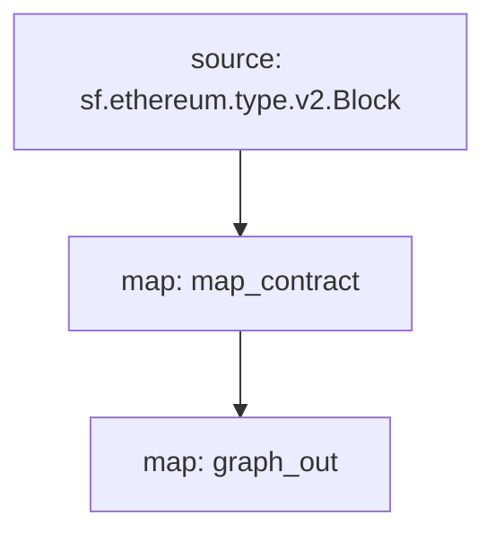

[Substreams](/substreams) est un nouveau framework de traitement des données blockchain, développé par StreamingFast pour The Graph Network. Un module de sous-flux peut générer des modifications d'entité, qui sont compatibles avec les entités Subgraph. Un subgraph peut utiliser un tel module Substreams comme source de données, apportant la vitesse d'indexation et les données supplémentaires des Substreams aux développeurs de subgraphs.

## Exigences

Ce livre de recettes nécessite [yarn](https://yarnpkg.com/), [les dépendances nécessaires au développement local de Substreams](https://substreams.streamingfast.io/developers-guide/installation-requirements) et la dernière version du graph CLI (>=0.52.0) :

```
npm install -g @graphprotocol/graph-cli
```

## Obtenir le livre de cuisine

> Ce guide utilise ce [subgraph alimenté par Substreams comme référence] \(https://github.com/graphprotocol/graph-tooling/tree/main/examples/substreams-powered-subgraph).

```
graph init --from-example substreams-powered-subgraph
```

## Définir un package Substreams

Un paquet Substreams est composé de types (définis comme [Protocol Buffers](https://protobuf.dev/)), de modules (écrits en Rust) et d'un fichier `substreams.yaml` qui référence les types et spécifie comment les modules sont déclenchés. [Visitez la documentation Substreams pour en savoir plus sur le développement de Substreams](/substreams), et consultez [awesome-substreams](https://github.com/pinax-network/awesome-substreams) et le [Substreams cookbook](https://github.com/pinax-network/substreams-cookbook) pour plus d'exemples.

Le package Substreams en question détecte les déploiements de contrats sur Mainnet Ethereum, en suivant le bloc de création et l'horodatage de tous les contrats nouvellement déployés. Pour ce faire, il existe un type `Contract` dédié dans `/proto/example.proto` ([en savoir plus sur la définition des tampons de protocole](https://protobuf.dev/programming-guides/proto3/#simple)) :

```proto
syntax = "proto3";

package example;

message Contracts {
  repeated Contract contracts = 1;
}

message Contract {
    string address = 1;
    uint64 blockNumber = 2;
    string timestamp = 3;
    uint64 ordinal = 4;
}
```

La logique de base du paquet Substreams est un module `map_contract` dans `lib.rs`, qui traite chaque bloc, filtrant les appels Create qui n'ont pas été réversibles, et retournant des `Contrats` :

```
#[substreams::handlers::map]
fn map_contract(block: eth::v2::Block) -> Result<Contracts, substreams::errors::Error> {
    let contracts = block
        .transactions()
        .flat_map(|tx| {
            tx.calls
                .iter()
                .filter(|call| !call.state_reverted)
                .filter(|call| call.call_type == eth::v2::CallType::Create as i32)
                .map(|call| Contract {
                    address: format!("0x{}", Hex(&call.address)),
                    block_number: block.number,
                    timestamp: block.timestamp_seconds().to_string(),
                    ordinal: tx.begin_ordinal,
                })
        })
        .collect();
    Ok(Contracts { contracts })
}
```

Un package Substreams peut être utilisé par un subgraph tant qu'il possède un module qui produit des changements d'entité compatibles. Le paquet Substreams de l'exemple a un module supplémentaire `graph_out` dans `lib.rs` qui renvoie une sortie `substreams_entity_change::pb::entity::EntityChanges`, qui peut être traitée par Graph Node.

> Le crate `substreams_entity_change` a aussi une fonction `Tables` dédiée pour générer simplement des changements d'entités ([documentation](https://docs.rs/substreams-entity-change/1.2.2/substreams_entity_change/tables/index.html)). Les changements d'entités générés doivent être compatibles avec les entités `schema.graphql` définies dans le `subgraph.graphql` du subgraph correspondant.

```
#[substreams::handlers::map]
pub fn graph_out(contracts: Contracts) -> Result<EntityChanges, substreams::errors::Error> {
    // hash map of name to a table
    let mut tables = Tables::new();

    for contract in contracts.contracts.into_iter() {
        tables
            .create_row("Contract", contract.address)
            .set("timestamp", contract.timestamp)
            .set("blockNumber", contract.block_number);
    }

    Ok(tables.to_entity_changes())
}
```

Ces types et modules sont regroupés dans `substreams.yaml` :

```
specVersion: v0.1.0
package:
  name: 'substreams_test' # le nom à utiliser dans le .spkg
  version: v1.0.1 # la version à utiliser lors de la création du .spkg

imports: # dépendances
  entity: https://github.com/streamingfast/substreams-entity-change/releases/download/v0.2.1/substreams-entity-change-v0.2.1.spkg

protobuf: # spécifie les types personnalisés à utiliser par les modules Substreams
  files:
    - example.proto
  importPaths:
    - ./proto

binaries:
  default:
    type: wasm/rust-v1
    file: ./target/wasm32-unknown-unknown/release/substreams.wasm

modules: # spécifie les modules avec leurs entrées et sorties.
  - name: map_contract
    kind: map
    inputs:
      - source: sf.ethereum.type.v2.Block
    output:
      type: proto:test.Contracts

  - name: graph_out
    kind: map
    inputs:
      - map: map_contract
    output:
      type: proto:substreams.entity.v1.EntityChanges # ce type peut être consommé par Graph Node

```

Vous pouvez vérifier le « flux » global d'un bloc, vers « map_contract » et « graph_out » en exécutant « substreams graph » :



Pour préparer ce module Substreams à être utilisé par un subgraph, vous devez exécuter les commandes suivantes :

```bash
yarn substreams:protogen # génère des types dans /src/pb
yarn substreams:build # construit les substreams
yarn substreams:package # empaquette les substreams dans un fichier .spkg

# alternativement, yarn substreams:prepare appelle toutes les commandes ci-dessus
```

> Ces scripts sont définis dans le fichier `package.json` si vous voulez comprendre les commandes substreams sous-jacentes

Cela génère un fichier `spkg` basé sur le nom et la version du paquet provenant de `substreams.yaml`. Le fichier `spkg` contient toutes les informations dont Graph Node a besoin pour ingérer ce paquet Substreams.

> Si vous mettez à jour le module Substreams, en fonction des modifications apportées, vous devrez peut-être exécuter tout ou partie des commandes ci-dessus pour que le paquet `spkg` soit à jour.

## Définition d'un subgraph alimenté par les courants de Substreams

Les subgraphs alimentés par Substreams introduisent un nouveau type de source de données, "substreams". De tels subgraphs ne peuvent avoir qu'une seule source de données.

Cette source de données doit spécifier le réseau indexé, le paquet Substreams (`spkg`) en tant qu'emplacement de fichier relatif, et le module au sein de ce paquet Substreams qui produit des changements d'entités compatibles avec le subgraph (dans ce cas, `map_entity_changes`, du paquet Substreams ci-dessus). Le mapping est spécifié, mais identifie simplement le type de mapping ("substreams/graph-entities") et l'apiVersion.

> Actuellement, le Subgraph Studio et The Graph Network prennent en charge les subgraphs alimentés par Substreams qui indexent `mainnet` (Mainnet Ethereum).

```yaml
specVersion: 0.0.4
description: Ethereum Contract Tracking Subgraph (powered by Substreams)
repository: https://github.com/graphprotocol/graph-tooling
schema:
  file: schema.graphql
dataSources:
  - kind: substreams
    name: substream_test
    network: mainnet
    source:
      package:
        moduleName: graph_out
        file: substreams-test-v1.0.1.spkg
    mapping:
      kind: substreams/graph-entities
      apiVersion: 0.0.5
```

Le `subgraph.yaml` fait également référence à un fichier de schéma. Les exigences pour ce fichier sont inchangées, mais les entités spécifiées doivent être compatibles avec les changements d'entités produits par le module Substreams référencé dans le `subgraph.yaml`.

```graphql
type Contrat @entity {
  id: ID!

  "La date et l'heure de déploiement du contrat"
  horodatage: String!

  "Le numéro de bloc du déploiement du contrat"
  numéroDeBloc: BigInt!
}
```

Le `subgraph. yaml` fait également référence à un fichier de schéma. Les exigences pour ce fichier sont inchangées, mais les entités spécifiées doivent être compatibles avec les changements d'entités produits par le module Substreams référencé dans `subgraph. yaml`.

> Les subgraphs alimentés par Substreams indexant le mainnet Ethereum peuvent être déployés sur le [Subgraph Studio] \(https://thegraph.com/studio/).

```bash
yarn install # installe graph-cli
yarn subgraph:build # construit le subgraph
yarn subgraph:deploy # déploie le subgraph
```

Voilà, c'est fait ! Vous avez construit et déployé un subgraph alimenté par Substreams.

## Servir des subgraphs alimentés par Substreams

Afin de servir des subgraphs alimentés par Substreams, Graph Node doit être configuré avec un fournisseur Substreams pour le réseau concerné, ainsi qu'un Firehose ou un RPC pour suivre la tête de chaîne. Ces fournisseurs peuvent être configurés via un fichier `config.toml` :

```toml
[chains.mainnet]
shard = "main"
protocol = "ethereum"
provider = [
  { label = "fournisseur-substreams-mainnet",
    details = { type = "substreams",
    url = "https://mainnet-substreams-url.grpc.substreams.io/",
    token = "exempletokenici" }},
  { label = "fournisseur-firehose-mainnet",
    details = { type = "firehose",
    url = "https://mainnet-firehose-url.grpc.firehose.io/",
    token = "exempletokenici" }},
]
```
