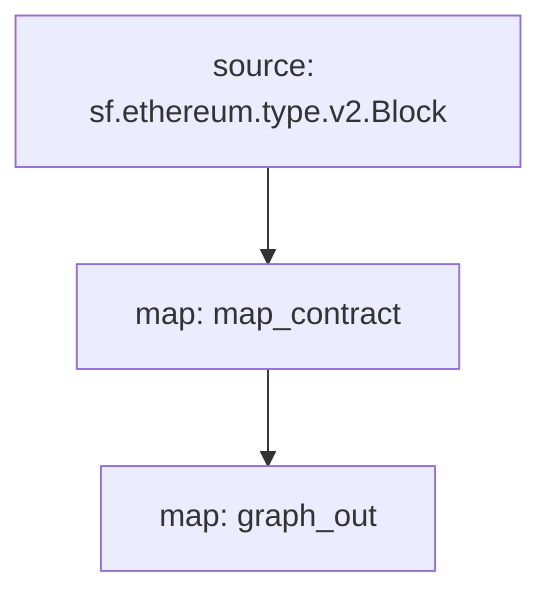

[Substreams](/substreams/README) is a new framework for processing blockchain data, developed by StreamingFast for The Graph Network. A substreams modules can output entity changes, which are compatible with Subgraph entities. A subgraph can use such a Substreams module as a data source, bringing the indexing speed and additional data of Substreams to subgraph developers.

> This cookbook uses this [Substreams-powered subgraph as a reference](https://github.com/graphprotocol/graph-tooling/tree/main/examples/substreams-powered-subgraph).

## Requirements

This cookbook requires [yarn](https://yarnpkg.com/) as well as [the dependencies necessary for local Substreams development](https://substreams.streamingfast.io/developers-guide/installation-requirements).

## सबस्ट्रीम पैकेज को परिभाषित करना

एक सबस्ट्रीम पैकेज प्रकारों से बना होता है ([प्रोटोकॉल बफ़र्स] \(https://protobuf.dev/) के रूप में परिभाषित), मॉड्यूल (रस्ट में लिखा गया), और एक `substreams.yaml` फ़ाइल जो प्रकारों को संदर्भित करती है, और निर्दिष्ट करती है कि मॉड्यूल कैसे हैं ट्रिगर हो गए हैं. [सबस्ट्रीम विकास के बारे में और जानें](/सबस्ट्रीम/रीडमी)।

विचाराधीन सबस्ट्रीम पैकेज मेननेट एथेरियम पर अनुबंध परिनियोजन का पता लगाता है, सभी नए तैनात अनुबंधों के लिए निर्माण ब्लॉक और टाइमस्टैम्प को ट्रैक करता है। ऐसा करने के लिए, `/proto/example.proto` में एक समर्पित `अनुबंध` प्रकार है ([प्रोटोकॉल बफ़र्स को परिभाषित करने के बारे में और जानें](https://protobuf.dev/programming-guides/proto3/#simple)):

```proto
syntax = "proto3";

package example;

message Contracts {
  repeated Contract contracts = 1;
}

message Contract {
    string address = 1;
    uint64 blockNumber = 2;
    string timestamp = 3;
    uint64 ordinal = 4;
}
```

सबस्ट्रीम पैकेज का मुख्य तर्क `lib.rs` में एक `map_contract` मॉड्यूल है, जो प्रत्येक ब्लॉक को संसाधित करता है, क्रिएट कॉल के लिए फ़िल्टर करता है जो वापस नहीं आया, और `कॉन्ट्रैक्ट` लौटाता है:

```
#[substreams::handlers::map]
fn map_contract(block: eth::v2::Block) -> Result<Contracts, substreams::errors::Error> {
    let contracts = block
        .transactions()
        .flat_map(|tx| {
            tx.calls
                .iter()
                .filter(|call| !call.state_reverted)
                .filter(|call| call.call_type == eth::v2::CallType::Create as i32)
                .map(|call| Contract {
                    address: format!("0x{}", Hex(&call.address)),
                    block_number: block.number,
                    timestamp: block.timestamp_seconds().to_string(),
                    ordinal: tx.begin_ordinal,
                })
        })
        .collect();
    Ok(Contracts { contracts })
}
```

A Substreams package can be used by a subgraph as long as it has a module which outputs compatible entity changes. The example Substreams package has an additional `graph_out` module in `lib.rs` which returns a `substreams_entity_change::pb::entity::EntityChanges` output, which can be processed by Graph Node.

> The `substreams_entity_change` crate also has a dedicated `Tables` function for simply generating entity changes ([documentation](https://docs.rs/substreams-entity-change/1.2.2/substreams_entity_change/tables/index.html)). The Entity Changes generated must be compatible with the `schema.graphql` entities defined in the `subgraph.graphql` of the corresponding subgraph.

```
#[substreams::handlers::map]
pub fn graph_out(contracts: Contracts) -> Result<EntityChanges, substreams::errors::Error> {
    // hash map of name to a table
    let mut tables = Tables::new();

    for contract in contracts.contracts.into_iter() {
        tables
            .create_row("Contract", contract.address)
            .set("timestamp", contract.timestamp)
            .set("blockNumber", contract.block_number);
    }

    Ok(tables.to_entity_changes())
}
```

इन प्रकारों और मॉड्यूल को `substreams.yaml` में एक साथ खींचा गया है:

```
specVersion: v0.1.0
package:
  name: 'substreams_test' # the name to be used in the .spkg
  version: v1.0.1 # the version to use when creating the .spkg

imports: # dependencies
  entity: https://github.com/streamingfast/substreams-entity-change/releases/download/v0.2.1/substreams-entity-change-v0.2.1.spkg

protobuf: # specifies custom types for use by Substreams modules
  files:
    - example.proto
  importPaths:
    - ./proto

binaries:
  default:
    type: wasm/rust-v1
    file: ./target/wasm32-unknown-unknown/release/substreams.wasm

modules: # specify modules with their inputs and outputs.
  - name: map_contract
    kind: map
    inputs:
      - source: sf.ethereum.type.v2.Block
    output:
      type: proto:test.Contracts

  - name: graph_out
    kind: map
    inputs:
      - map: map_contract
    output:
      type: proto:substreams.entity.v1.EntityChanges # this type can be consumed by Graph Node

```

आप `सबस्ट्रीम ग्राफ़` चलाकर किसी ब्लॉक से `map_contract` से `graph_out` तक के समग्र "प्रवाह" की जांच कर सकते हैं:



इस सबस्ट्रीम पैकेज को सबग्राफ द्वारा उपभोग के लिए तैयार करने के लिए, आपको निम्नलिखित कमांड चलाने होंगे:

```bash
yarn substreams:protogen # generates types in /src/pb
yarn substreams:build # builds the substreams
yarn substreams:package # packages the substreams in a .spkg file

# alternatively, yarn substreams:prepare calls all of the above commands
```

> यदि आप अंतर्निहित सबस्ट्रीम कमांड को समझना चाहते हैं तो इन स्क्रिप्ट को `package.json` फ़ाइल में परिभाषित किया गया है

यह पैकेज नाम और `substreams.yaml` के संस्करण के आधार पर एक `spkg` फ़ाइल उत्पन्न करता है। `spkg` फ़ाइल में वह सारी जानकारी है जो ग्राफ़ नोड को इस सबस्ट्रीम पैकेज को ग्रहण करने के लिए आवश्यक है।

> यदि आप सबस्ट्रीम पैकेज को अपडेट करते हैं, तो आपके द्वारा किए गए परिवर्तनों के आधार पर, आपको उपरोक्त कुछ या सभी कमांड चलाने की आवश्यकता हो सकती है ताकि `spkg` अद्यतित रहे।

## सबस्ट्रीम-संचालित सबग्राफ को परिभाषित करना

Substreams-powered subgraphs introduce a new `kind` of data source, "substreams". Such subgraphs can only have one data source. This data source must specify the Substreams network, the Substreams package (`spkg`) as a relative file location, and the module within that Substreams package which produces subgraph-compatible entity changes (in this case `map_entity_changes`, from the Substreams package above). The mapping is specified, but simply identifies the mapping kind ("substreams/graph-entities") and the apiVersion.

```yaml
specVersion: 0.0.4
description: Ethereum Contract Tracking Subgraph (powered by Substreams)
repository: https://github.com/graphprotocol/graph-tooling
schema:
  file: schema.graphql
dataSources:
  - kind: substreams
    name: substream_test
    network: mainnet
    source:
      package:
        moduleName: graph_out
        file: substreams-test-v1.0.1.spkg
    mapping:
      kind: substreams/graph-entities
      apiVersion: 0.0.5
```

The `subgraph.yaml` also references a schema file. The requirements for this file are unchanged, but the entities specified must be compatible with the entity changes produced by the Substreams module referenced in the `subgraph.yaml`.

```graphql
type Contract @entity {
  id: ID!

  "The timestamp when the contract was deployed"
  timestamp: String!

  "The block number of the contract deployment"
  blockNumber: BigInt!
}
```

उपरोक्त को देखते हुए, सबग्राफ डेवलपर्स इस सबस्ट्रीम-संचालित सबग्राफ को तैनात करने के लिए ग्राफ़ सीएलआई का उपयोग कर सकते हैं।

> मेननेट एथेरियम को अनुक्रमित करने वाले सबस्ट्रीम-संचालित सबग्राफ को [सबग्राफ स्टूडियो] \(https://thegraph.com/studio/) पर तैनात किया जा सकता है।

```bash
yarn install # install graph-cli
yarn subgraph:build # build the subgraph
yarn subgraph:deploy # deploy the subgraph
```

इतना ही! आपने एक सबस्ट्रीम-संचालित सबग्राफ बनाया और तैनात किया है।

## सबस्ट्रीम-संचालित सबग्राफ की सेवा

In order to serve Substreams-powered subgraphs, Graph Node must be configured with a Substreams provider for the relevant network, as well as a Firehose or RPC to track the chain head. These providers can be configured via a `config.toml` file:

```toml
[chains.mainnet]
shard = "main"
protocol = "ethereum"
provider = [
  { label = "substreams-provider-mainnet",
    details = { type = "substreams",
    url = "https://mainnet-substreams-url.grpc.substreams.io/",
    token = "exampletokenhere" }},
  { label = "firehose-provider-mainnet",
    details = { type = "firehose",
    url = "https://mainnet-firehose-url.grpc.firehose.io/",
    token = "exampletokenhere" }},
]
```
