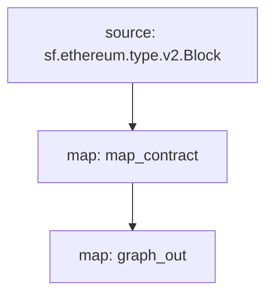

[Substreams](/substreams/README) is a new framework for processing blockchain data, developed by StreamingFast for The Graph Network. A substreams modules can output entity changes, which are compatible with Subgraph entities. A subgraph can use such a Substreams module as a data source, bringing the indexing speed and additional data of Substreams to subgraph developers.

## 要件

This cookbook requires [yarn](https://yarnpkg.com/), [the dependencies necessary for local Substreams development](https://substreams.streamingfast.io/developers-guide/installation-requirements), and the latest version of Graph CLI (>=0.52.0):

```
npm install -g @graphprotocol/graph-cli
```

## 料理本を入手

> このクックブックでは、この [Substreams-powered subgraph を参考として](https://github.com/graphprotocol/graph-tooling/tree/main/examples/substreams-powered-subgraph) を使用します。

```
グラフ初期化 --from-example substreams-powered-subgraph
```

## サブストリームパッケージの定義

A Substreams package is composed of types (defined as [Protocol Buffers](https://protobuf.dev/)), modules (written in Rust), and a `substreams.yaml` file which references the types, and specifies how modules are triggered. [Visit the Substreams documentation to learn more about Substreams development](/substreams/README), and check out [awesome-substreams](https://github.com/pinax-network/awesome-substreams) and the [Substreams cookbook](https://github.com/pinax-network/substreams-cookbook) for more examples.

The Substreams package in question detects contract deployments on Mainnet Ethereum, tracking the creation block and timestamp for all newly deployed contracts. To do this, there is a dedicated `Contract` type in `/proto/example.proto` ([learn more about defining Protocol Buffers](https://protobuf.dev/programming-guides/proto3/#simple)):

```proto
syntax = "proto3";

package example;

message Contracts {
  repeated Contract contracts = 1;
}

message Contract {
    string address = 1;
    uint64 blockNumber = 2;
    string timestamp = 3;
    uint64 ordinal = 4;
}
```

Substreams パッケージのコア ロジックは、`lib.rs` の `map_contract` モジュールです。これは、すべてのブロックを処理し、元に戻されなかった Create 呼び出しをフィルタリングして、`Contracts` を返します。

```
#[substreams::handlers::map]
fn map_contract(block: eth::v2::Block) -> Result<Contracts, substreams::errors::Error> {
    let contracts = block
        .transactions()
        .flat_map(|tx| {
            tx.calls
                .iter()
                .filter(|call| !call.state_reverted)
                .filter(|call| call.call_type == eth::v2::CallType::Create as i32)
                .map(|call| Contract {
                    address: format!("0x{}", Hex(&call.address)),
                    block_number: block.number,
                    timestamp: block.timestamp_seconds().to_string(),
                    ordinal: tx.begin_ordinal,
                })
        })
        .collect();
    Ok(Contracts { contracts })
```

A Substreams package can be used by a subgraph as long as it has a module which outputs compatible entity changes. The example Substreams package has an additional `graph_out` module in `lib.rs` which returns a `substreams_entity_change::pb::entity::EntityChanges` output, which can be processed by Graph Node.

> The `substreams_entity_change` crate also has a dedicated `Tables` function for simply generating entity changes ([documentation](https://docs.rs/substreams-entity-change/1.2.2/substreams_entity_change/tables/index.html)). The Entity Changes generated must be compatible with the `schema.graphql` entities defined in the `subgraph.graphql` of the corresponding subgraph.

```
#[substreams::handlers::map]
pub fn graph_out(contracts: Contracts) -> Result<EntityChanges, substreams::errors::Error> {
    // hash map of name to a table
    let mut tables = Tables::new();

    for contract in contracts.contracts.into_iter() {
        tables
            .create_row("Contract", contract.address)
            .set("timestamp", contract.timestamp)
            .set("blockNumber", contract.block_number);
    }

    Ok(tables.to_entity_changes())
}
```

これらの型とモジュールは `substreams.yaml` にまとめられています。

```
specVersion: v0.1.0
package:
  name: 'substreams_test' # the name to be used in the .spkg
  version: v1.0.1 # the version to use when creating the .spkg

imports: # dependencies
  entity: https://github.com/streamingfast/substreams-entity-change/releases/download/v0.2.1/substreams-entity-change-v0.2.1.spkg

protobuf: # specifies custom types for use by Substreams modules
  files:
    - example.proto
  importPaths:
    - ./proto

binaries:
  default:
    type: wasm/rust-v1
    file: ./target/wasm32-unknown-unknown/release/substreams.wasm

modules: # specify modules with their inputs and outputs.
  - name: map_contract
    kind: map
    inputs:
      - source: sf.ethereum.type.v2.Block
    output:
      type: proto:test.Contracts

  - name: graph_out
    kind: map
    inputs:
      - map: map_contract
    output:
      type: proto:substreams.entity.v1.EntityChanges # this type can be consumed by Graph Node

```

`substreams chart` を実行することで、ブロックから `map_contract`、`graph_out` までの全体的な「フロー」を確認できます。



この Substreams パッケージをサブグラフで使用できるように準備するには、次のコマンドを実行する必要があります。

```bash
yarn substreams:protogen # generates types in /src/pb
yarn substreams:build # builds the substreams
yarn substreams:package # packages the substreams in a .spkg file

# alternatively, yarn substreams:prepare calls all of the above commands
```

> 基礎となるサブストリーム コマンドを理解したい場合は、これらのスクリプトは「package.json」ファイルで定義されます。

This generates a `spkg` file based on the package name and version from `substreams.yaml`. The `spkg` file has all the information which Graph Node needs to ingest this Substreams package.

> Substreams パッケージを更新する場合、加えた変更に応じて、`spkg` を最新にするために上記のコマンドの一部またはすべてを実行する必要がある場合があります。

## サブストリームによって動作するサブグラフの定義

サブストリームによって動作するサブグラフは、新しい "substreams" というデータソースの kind を導入します。このようなサブグラフは、ただ1つのデータソースのみを持つことができます

This data source must specify the indexed network, the Substreams package (`spkg`) as a relative file location, and the module within that Substreams package which produces subgraph-compatible entity changes (in this case `map_entity_changes`, from the Substreams package above). The mapping is specified, but simply identifies the mapping kind ("substreams/graph-entities") and the apiVersion.

> 現在、Subgraph Studio と The Graph Network は、「メインネット」 (メインネット イーサリアム) にインデックスを付けるサブストリームを利用したサブグラフをサポートしています。

```yaml
specVersion: 0.0.4
description: Ethereum Contract Tracking Subgraph (powered by Substreams)
repository: https://github.com/graphprotocol/graph-tooling
schema:
  file: schema.graphql
dataSources:
  - kind: substreams
    name: substream_test
    network: mainnet
    source:
      package:
        moduleName: graph_out
        file: substreams-test-v1.0.1.spkg
    mapping:
      kind: substreams/graph-entities
      apiVersion: 0.0.5
```

The `subgraph.yaml` also references a schema file. The requirements for this file are unchanged, but the entities specified must be compatible with the entity changes produced by the Substreams module referenced in the `subgraph.yaml`.

```graphql
type Contract @entity {
  id: ID!

  "The timestamp when the contract was deployed"
  timestamp: String!

  "The block number of the contract deployment"
  blockNumber: BigInt!
}
```

上記を考慮すると、サブグラフ開発者は Graph CLI を使用して、このサブストリームを利用したサブグラフをデプロイできます。

> サブストリームを利用したサブグラフのインデックス作成メインネット Ethereum は、[Subgraph Studio](https://thegraph.com/studio/) にデプロイできます。

```bash
yarn install # install graph-cli
yarn subgraph:build # build the subgraph
yarn subgraph:deploy # deploy the subgraph
```

それでおしまい！サブストリームを利用したサブグラフを構築してデプロイしました。

## サブストリームを利用したサブグラフの提供

サブストリームを利用したサブグラフを提供するには、チェーン ヘッドを追跡するための Firehose または RPC だけでなく、関連するネットワークのサブストリーム プロバイダーを使用してグラフ ノードを構成する必要があります。これらのプロバイダーは、「config.toml」ファイル経由で設定できます。

```toml
[chains.mainnet]
shard = "main"
protocol = "ethereum"
provider = [
  { label = "substreams-provider-mainnet",
    details = { type = "substreams",
    url = "https://mainnet-substreams-url.grpc.substreams.io/",
    token = "exampletokenhere" }},
  { label = "firehose-provider-mainnet",
    details = { type = "firehose",
    url = "https://mainnet-firehose-url.grpc.firehose.io/",
    token = "exampletokenhere" }},
]
```
