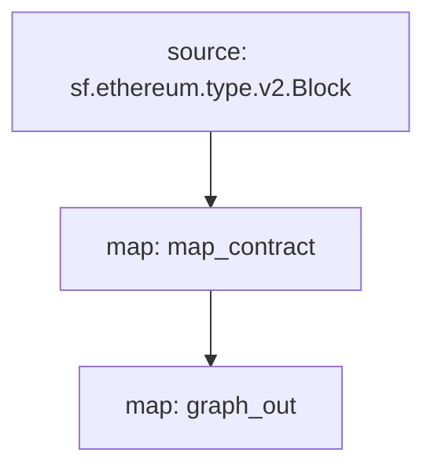

[Substreams](/substreams/README) ब्लॉकचेन डेटावर प्रक्रिया करण्यासाठी एक नवीन फ्रेमवर्क आहे, जो ग्राफ नेटवर्कसाठी स्ट्रीमिंगफास्टने विकसित केला आहे. सबस्ट्रीम्स मॉड्युल्स घटक बदल आउटपुट करू शकतात, जे सबग्राफ घटकांशी सुसंगत आहेत. सबग्राफ अशा सबस्ट्रीम मॉड्यूलचा डेटा स्रोत म्हणून वापर करू शकतो, ज्यामुळे सबग्राफ डेव्हलपरसाठी सबस्ट्रीम्सचा इंडेक्सिंग गती आणि अतिरिक्त डेटा येतो.

> This cookbook uses this [Substreams-powered subgraph as a reference](https://github.com/graphprotocol/graph-tooling/tree/main/examples/substreams-powered-subgraph).

## आवश्यकता

या कूकबुकसाठी [yarn](https://yarnpkg.com/) तसेच [स्थानिक सबस्ट्रीम डेव्हलपमेंटसाठी आवश्यक अवलंबित्व](https://substreams.streamingfast.io/developers-guide/installation-requirements) आवश्यक आहे.

## सबस्ट्रीम पॅकेज परिभाषित करणे

सबस्ट्रीम पॅकेज प्रकारांचे बनलेले आहे ([प्रोटोकॉल बफर्स](https://protobuf.dev/) म्हणून परिभाषित केलेले), मॉड्यूल (रस्टमध्ये लिहिलेले), आणि एक `substreams.yaml` फाइल जी प्रकारांचा संदर्भ देते आणि मॉड्यूल कसे ते निर्दिष्ट करते. ट्रिगर केले जातात. [सबस्ट्रीम्स डेव्हलपमेंटबद्दल अधिक जाणून घ्या](/substreams/README).

प्रश्नातील सबस्ट्रीम पॅकेज मेननेट इथरियमवर कॉन्ट्रॅक्ट डिप्लॉयमेंट शोधते, सर्व नवीन तैनात केलेल्या कॉन्ट्रॅक्ट्ससाठी क्रिएशन ब्लॉक आणि टाइमस्टॅम्पचा मागोवा घेते. हे करण्यासाठी, `/proto/example.proto` मध्ये एक समर्पित `करार` प्रकार आहे ([प्रोटोकॉल बफर परिभाषित करण्याबद्दल अधिक जाणून घ्या](https://protobuf.dev/programming-guides/proto3/#simple)):

```proto
syntax = "proto3";

package example;

message Contracts {
  repeated Contract contracts = 1;
}

message Contract {
    string address = 1;
    uint64 blockNumber = 2;
    string timestamp = 3;
    uint64 ordinal = 4;
}
```

सबस्ट्रीम पॅकेजचे मुख्य तर्क हे `lib.rs` मधील `map_contract` मॉड्यूल आहे, जे प्रत्येक ब्लॉकवर प्रक्रिया करते, परत न आलेले कॉल तयार करण्यासाठी फिल्टर करते, `Contracts` परत करते:

```
#[substreams::handlers::map]
fn map_contract(block: eth::v2::Block) -> Result<Contracts, substreams::errors::Error> {
    let contracts = block
        .transactions()
        .flat_map(|tx| {
            tx.calls
                .iter()
                .filter(|call| !call.state_reverted)
                .filter(|call| call.call_type == eth::v2::CallType::Create as i32)
                .map(|call| Contract {
                    address: format!("0x{}", Hex(&call.address)),
                    block_number: block.number,
                    timestamp: block.timestamp_seconds().to_string(),
                    ordinal: tx.begin_ordinal,
                })
        })
        .collect();
    Ok(Contracts { contracts })
}
```

सबस्ट्रीम्स पॅकेज सबग्राफद्वारे वापरले जाऊ शकते जोपर्यंत त्यात एक मॉड्यूल आहे जे सुसंगत घटक बदलांचे आउटपुट करते. उदाहरण सबस्ट्रीम पॅकेजमध्ये `lib.rs` मध्ये अतिरिक्त `graph_out` मॉड्यूल आहे जे `substreams_entity_change::pb::entity::EntityChanges` आउटपुट देते, ज्यावर ग्राफ नोडद्वारे प्रक्रिया केली जाऊ शकते.

> 'substreams_entity_change' क्रेटमध्ये फक्त अस्तित्वातील बदल जनरेट करण्यासाठी समर्पित 'टेबल्स' फंक्शन आहे ([दस्तऐवज](https://docs.rs/substreams-entity-change/1.2.2/substreams_entity_change/tables/index.html)). व्युत्पन्न केलेले घटक बदल संबंधित सबग्राफच्या `subgraph.graphql` मध्ये परिभाषित केलेल्या `schema.graphql` घटकांशी सुसंगत असले पाहिजेत.

```
#[substreams::handlers::map]
pub fn graph_out(contracts: Contracts) -> Result<EntityChanges, substreams::errors::Error> {
    // hash map of name to a table
    let mut tables = Tables::new();

    for contract in contracts.contracts.into_iter() {
        tables
            .create_row("Contract", contract.address)
            .set("timestamp", contract.timestamp)
            .set("blockNumber", contract.block_number);
    }

    Ok(tables.to_entity_changes())
}
```

हे प्रकार आणि मॉड्यूल `substreams.yaml` मध्ये एकत्र खेचले जातात:

```
specVersion: v0.1.0
package:
  name: 'substreams_test' # the name to be used in the .spkg
  version: v1.0.1 # the version to use when creating the .spkg

imports: # dependencies
  entity: https://github.com/streamingfast/substreams-entity-change/releases/download/v0.2.1/substreams-entity-change-v0.2.1.spkg

protobuf: # specifies custom types for use by Substreams modules
  files:
    - example.proto
  importPaths:
    - ./proto

binaries:
  default:
    type: wasm/rust-v1
    file: ./target/wasm32-unknown-unknown/release/substreams.wasm

modules: # specify modules with their inputs and outputs.
  - name: map_contract
    kind: map
    inputs:
      - source: sf.ethereum.type.v2.Block
    output:
      type: proto:test.Contracts

  - name: graph_out
    kind: map
    inputs:
      - map: map_contract
    output:
      type: proto:substreams.entity.v1.EntityChanges # this type can be consumed by Graph Node

```

तुम्ही `सबस्ट्रीम आलेख` चालवून ब्लॉकमधून `नकाशा_कंत्राट` ते `ग्राफ_आउट` पर्यंत एकूण "प्रवाह" तपासू शकता:



हे सबस्ट्रीम पॅकेज सबग्राफद्वारे वापरण्यासाठी तयार करण्यासाठी, तुम्ही खालील आदेश चालवा:

```bash
yarn substreams:protogen # generates types in /src/pb
yarn substreams:build # builds the substreams
yarn substreams:package # packages the substreams in a .spkg file

# alternatively, yarn substreams:prepare calls all of the above commands
```

> जर तुम्हाला अंतर्निहित सबस्ट्रीम कमांड्स समजून घ्यायच्या असतील तर या स्क्रिप्ट्स `package.json` फाईलमध्ये परिभाषित केल्या आहेत

हे `substreams.yaml` मधील पॅकेज नाव आणि आवृत्तीवर आधारित `spkg` फाइल तयार करते. `spkg` फाईलमध्ये ग्राफ नोडला हे सबस्ट्रीम पॅकेज अंतर्भूत करण्यासाठी आवश्यक असलेली सर्व माहिती आहे.

> तुम्ही सबस्ट्रीम पॅकेज अपडेट केल्यास, तुम्ही केलेल्या बदलांवर अवलंबून, तुम्हाला वरीलपैकी काही किंवा सर्व कमांड्स चालवाव्या लागतील जेणेकरून `spkg` अद्ययावत असेल.

## सबस्ट्रीम-सक्षम सबग्राफ परिभाषित करणे

सबस्ट्रीम-समर्थित सबग्राफ डेटा स्त्रोताचा एक नवीन `प्रकार' सादर करतात, "सबस्ट्रीम". अशा सबग्राफमध्ये फक्त एक डेटा स्रोत असू शकतो. या डेटा स्रोताने सबस्ट्रीम नेटवर्क, सबस्ट्रीम पॅकेज (`spkg`) सापेक्ष फाइल स्थान म्हणून निर्दिष्ट करणे आवश्यक आहे आणि सबस्ट्रीम पॅकेजमधील मॉड्यूल जे सबग्राफ-सुसंगत घटक बदल घडवून आणते (या प्रकरणात वरील सबस्ट्रीम पॅकेजमधून `map_entity_changes\`). मॅपिंग निर्दिष्ट केले आहे, परंतु फक्त मॅपिंग प्रकार ("सबस्ट्रीम/ग्राफ-एंटिटी") आणि apiVersion ओळखते.

```yaml
specVersion: 0.0.4
description: Ethereum Contract Tracking Subgraph (powered by Substreams)
repository: https://github.com/graphprotocol/graph-tooling
schema:
  file: schema.graphql
dataSources:
  - kind: substreams
    name: substream_test
    network: mainnet
    source:
      package:
        moduleName: graph_out
        file: substreams-test-v1.0.1.spkg
    mapping:
      kind: substreams/graph-entities
      apiVersion: 0.0.5
```

`subgraph.yaml` स्कीमा फाईलचाही संदर्भ देते. या फाइलसाठी आवश्यकता अपरिवर्तित आहेत, परंतु निर्दिष्ट केलेल्या घटक `subgraph.yaml` मध्ये संदर्भित सबस्ट्रीम मॉड्यूलद्वारे उत्पादित घटक बदलांशी सुसंगत असणे आवश्यक आहे.

```graphql
type Contract @entity {
  id: ID!

  "The timestamp when the contract was deployed"
  timestamp: String!

  "The block number of the contract deployment"
  blockNumber: BigInt!
}
```

वरील दिलेले, सबग्राफ डेव्हलपर हे सबस्ट्रीम-सक्षम सबग्राफ उपयोजित करण्यासाठी ग्राफ CLI वापरू शकतात.

> सबस्ट्रीम-सक्षम सबग्राफ इंडेक्सिंग मेननेट इथरियम [सबग्राफ स्टुडिओ](https://thegraph.com/studio/) मध्ये तैनात केले जाऊ शकतात.

```bash
yarn install # install graph-cli
yarn subgraph:build # build the subgraph
yarn subgraph:deploy # deploy the subgraph
```

बस एवढेच! तुम्ही सबस्ट्रीम-संचालित सबग्राफ तयार आणि तैनात केले आहे.

## सबस्ट्रीम-समर्थित सबग्राफ सेवा देत आहे

सबस्ट्रीम-संचालित सबग्राफ सर्व्ह करण्यासाठी, ग्राफ नोड संबंधित नेटवर्कसाठी सबस्ट्रीम प्रदात्यासह कॉन्फिगर केले जाणे आवश्यक आहे, तसेच चेन हेडचा मागोवा घेण्यासाठी फायरहोस किंवा RPC असणे आवश्यक आहे. हे प्रदाते `config.toml` फाईलद्वारे कॉन्फिगर केले जाऊ शकतात:

```toml
[chains.mainnet]
shard = "main"
protocol = "ethereum"
provider = [
  { label = "substreams-provider-mainnet",
    details = { type = "substreams",
    url = "https://mainnet-substreams-url.grpc.substreams.io/",
    token = "exampletokenhere" }},
  { label = "firehose-provider-mainnet",
    details = { type = "firehose",
    url = "https://mainnet-firehose-url.grpc.firehose.io/",
    token = "exampletokenhere" }},
]
```
