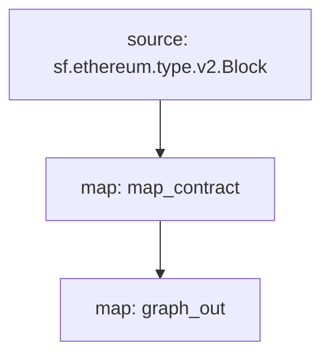

[Substreams](/substreams/README) é uma nova infraestrutura para o processamento de dados na blockchain, desenvolvida pela StreamingFast para a Graph Network. Um módulo de substreams pode gerar mudanças de entidade, que são compatíveis com entidades de Subgraph. Um subgraph pode usar um tal modelo de Substreams como uma fonte de dados, trazendo a velocidade de indexação e dados adicionais do Substreams aos desenvolvedores de subgraph.

## Requisitos

Este manual requer o [yarn](https://yarnpkg.com/), [as dependências necessárias para o desenvolvimento local da Substreams](https://substreams.streamingfast.io/developers-guide/installation-requirements), e a versão mais recente do Graph CLI (>=0.52.0):

```
npm install -g @graphprotocol/graph-cli
```

## O manual

> Este manual usa este [subgraph movido pelo Substreams como referência](https://github.com/graphprotocol/graph-tooling/tree/main/examples/substreams-powered-subgraph).

```
graph init --from-example substreams-powered-subgraph
```

## Como definir um pacote de Substreams

Um pacote de Substreams é composto de tipos (definidos como [Protocol Buffers](https://protobuf.dev/)), módulos (escritos em Rust), e um arquivo `substreams.yaml` que referencia os tipos, e especifica como os módulos são ativados. [Visite a documentação de Substreams para aprender mais sobre o desenvolvimento de Substreams](/substreams/README), e confira o [awesome-substreams](https://github.com/pinax-network/awesome-substreams) e o [manual de Substreams](https://github.com/pinax-network/substreams-cookbook) para mais exemplos.

O pacote de Substreams em questão deteta publicações de contratos na Mainnet do Ethereum, com rastreio do bloco de criação e horas para todos os contratos recém-lançados. Para fazer isto, há um tipo dedicado de `Contrato` no `/proto/example.proto` ([aprenda mais sobre a definição de Buffers de Protocolo](https://protobuf.dev/programming-guides/proto3/#simple)):

```proto
syntax = "proto3";

package example;

message Contracts {
  repeated Contract contracts = 1;
}

message Contract {
    string address = 1;
    uint64 blockNumber = 2;
    string timestamp = 3;
    uint64 ordinal = 4;
}
```

A lógica central do pacote de Substreams é um módulo `map_contract` em `lib.rs`, que processa cada bloco, assim filtrando chamadas de Criação que não foram revertidas e retornando `Contratos`:

```
#[substreams::handlers::map]
fn map_contract(block: eth::v2::Block) -> Result<Contracts, substreams::errors::Error> {
    let contracts = block
        .transactions()
        .flat_map(|tx| {
            tx.calls
                .iter()
                .filter(|call| !call.state_reverted)
                .filter(|call| call.call_type == eth::v2::CallType::Create as i32)
                .map(|call| Contract {
                    address: format!("0x{}", Hex(&call.address)),
                    block_number: block.number,
                    timestamp: block.timestamp_seconds().to_string(),
                    ordinal: tx.begin_ordinal,
                })
        })
        .collect();
    Ok(Contracts { contracts })
}
```

Um pacote de Substreams também pode ser usado por um subgraph enquanto tiver um módulo que gere mudanças de entidade compatíveis. O pacote de Substreams usado como exemplo tem um módulo `graph_out` adicional no `lib.rs` que retorna um `substreams_entity_change::pb::entity::EntityChanges`, que pode então ser processado pelo Graph Node.

> O `substreams_entity_change` também tem uma função `Tables` dedicada à geração simples de mudanças de entidade ([documentação](https://docs.rs/substreams-entity-change/1.2.2/substreams_entity_change/tables/index.html)). As Mudanças de Entidade geradas devem ser compatíveis com as entidades `schema.graphql` definidas no `subgraph.graphql` do subgraph correspondente.

```
#[substreams::handlers::map]
pub fn graph_out(contracts: Contracts) -> Result<EntityChanges, substreams::errors::Error> {
    // hash map of name to a table
    let mut tables = Tables::new();

    for contract in contracts.contracts.into_iter() {
        tables
            .create_row("Contract", contract.address)
            .set("timestamp", contract.timestamp)
            .set("blockNumber", contract.block_number);
    }

    Ok(tables.to_entity_changes())
}
```

Estes tipos e módulos são juntados no `substreams.yaml`:

```
specVersion: v0.1.0
package:
  name: 'substreams_test' # o nome a ser usado no .spkg
  version: v1.0.1 # a versão a ser usada na criação do .spkg

imports: # dependências
  entity: https://github.com/streamingfast/substreams-entity-change/releases/download/v0.2.1/substreams-entity-change-v0.2.1.spkg

protobuf: # especifica tipos personalizados a serem usados por módulos Substreams
  files:
    - example.proto
  importPaths:
    - ./proto

binaries:
  default:
    type: wasm/rust-v1
    file: ./target/wasm32-unknown-unknown/release/substreams.wasm

modules: # especifica módulos com suas entradas e saídas
  - name: map_contract
    kind: map
    inputs:
      - source: sf.ethereum.type.v2.Block
    output:
      type: proto:test.Contracts

  - name: graph_out
    kind: map
    inputs:
      - map: map_contract
    output:
      type: proto:substreams.entity.v1.EntityChanges # este tipo pode ser consumido pelo Graph Node

```

Podes conferir o "fluxo" geral de um Bloco, de `map_contract` a `graph_out` ao executar o `substreams graph`:



Para preparar este pacote de Substreams para consumo por um subgraph, os seguintes comandos devem ser executados:

```bash
yarn substreams:protogen # gera tipos no /src/pb
yarn substreams:build # constroi as substreams
yarn substreams:package # empacota as substreams em um arquivo .spkg

# como alternativa, o yarn substreams:prepare chama todos os comandos acima
```

> Estes scripts são definidos no pacote `package.json` se quiser entender os comandos subjacentes

Isto gera um arquivo `spkg` baseado no nome e na versão do pacote da `substreams.yaml`. O arquivo `spkg` tem toda a informação necessária para que o Graph Node ingeste este pacote Substreams.

> Em caso de atualização do pacote de Substreams, dependendo das mudanças feitas, pode ser necessário executar alguns dos — ou todos — os comandos acima para que o `spkg` esteja atualizado.

## Definição de um subgraph movido a Substreams

Subgraphs movidos a Substreams introduzem um novo `tipo` de fonte de dados, "substreams". Tais subgraphs só podem ter uma fonte de dados.

Esta fonte de dados deve especificar a rede indexada, o pacote de Substreams ('spkg') como um local relativo de arquivos, e o módulo dentro daquele pacote de Substreams que produz mudanças de entidade compatíveis com o subgraph (neste caso 'map_entity_changes', do pacote de Substreams acima). O mapeamento é especificado, mas apenas identifica o tipo de mapeamento ("substreams/graph-entities") e a apiVersion.

> Atualmente, o Subgraph Studio e a Graph Network apoiam subgraphs movidos a Substreams que indexam a `mainnet` (Mainnet do Ethereum).

```yaml
specVersion: 0.0.4
description: Ethereum Contract Tracking Subgraph (powered by Substreams)
repository: https://github.com/graphprotocol/graph-tooling
schema:
  file: schema.graphql
dataSources:
  - kind: substreams
    name: substream_test
    network: mainnet
    source:
      package:
        moduleName: graph_out
        file: substreams-test-v1.0.1.spkg
    mapping:
      kind: substreams/graph-entities
      apiVersion: 0.0.5
```

O 'subgraph.yaml' também referencia um arquivo schema. Os requerimentos para este arquivo são os mesmos, mas as entidades especificadas devem ser compatíveis com as mudanças de entidade produzidas pelo módulo de Substreams referenciados no 'subgraph.yaml'.

```graphql
type Contract @entity {
  id: ID!

  "The timestamp when the contract was deployed"
  timestamp: String!

  "The block number of the contract deployment"
  blockNumber: BigInt!
}
```

Vendo acima, os programadores de subgraph podem usar a Graph CLI para editar este subgraph movido pelo Substreams.

> Subgraphs movidos a substreams que indexam a mainnet do Ethereum podem ser editados ao [Subgraph Studio](https://thegraph.com/studio/).

```bash
yarn install # instala o graph-cli
yarn subgraph:build # constroi o subgraph
yarn subgraph:deploy # publica o subgraph
```

Pronto! Está construído e editado um subgraph movido a Substreams.

## Servindo subgraphs movidos por substreams

Para poder servir subgraphs movidos a Substreams, o Graph Node deve ser configurado com um provedor de Substreams para a rede relevante, assim como um Firehose ou RPC para rastrear a cabeça da chain. Estes provedores podem ser configurados através de um arquivo 'config.toml':

```toml
[chains.mainnet]
shard = "main"
protocol = "ethereum"
provider = [
  { label = "substreams-provider-mainnet",
    details = { type = "substreams",
    url = "https://mainnet-substreams-url.grpc.substreams.io/",
    token = "exampletokenhere" }},
  { label = "firehose-provider-mainnet",
    details = { type = "firehose",
    url = "https://mainnet-firehose-url.grpc.firehose.io/",
    token = "exampletokenhere" }},
]
```
