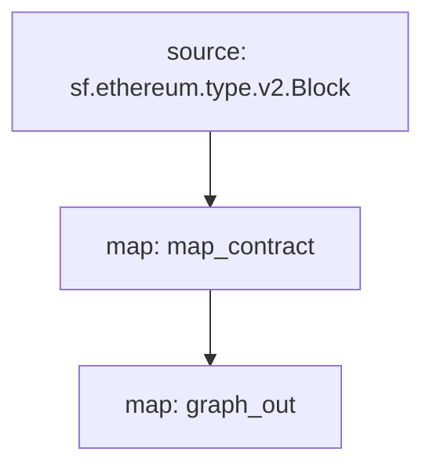

[Substreams](/substreams/README) - это новый фреймворк для обработки данных блокчейна, разработанный StreamingFast для The Graph Network. Модули субпотоков могут выводить изменения объектов, которые совместимы с объектами субграфа. Субграф может использовать такой модуль субпотоков в качестве источника данных, обеспечивая разработчикам субграфов скорость индексации и дополнительные данные субпотоков.

## Требования

Для использования этого справочного материала требуются [yarn]\(https://yarnpkg.com /), [зависимости, необходимые для разработки локальных субпотоков](https://substreams.streamingfast.io/developers-guide/installation-requirements) и последняя версия Graph CLI (>=0.52.0):

```
npm install -g @graphprotocol/graph-cli
```

## Используйте справочный материал

> В качестве справочного материала здесь используется этот [субграф на основе субпотоков в качестве ссылки](https://github.com/graphprotocol/graph-tooling/tree/main/examples/substreams-powered-subgraph).

```
graph init --from-example substreams-powered-subgraph
```

## Определение пакета субпотоков

Пакет субпотоков состоит из типов (определенных как [Protocol Buffers]\(https://protobuf.dev /)), модулей (написанных на Rust) и файла `substreams.yaml`, который ссылается на типы и определяет, как запускаются модули. [Изучите документацию по субпотокам, чтобы узнать больше об их разработке](/substreams/README), ознакомьтесь также с [awesome-substreams](https://github.com/pinax-network/awesome-substreams) и [справочником субпотоков](https://github.com/pinax-network/substreams-cookbook) для получения большего количества примеров.

Рассматриваемый пакет Substreams обнаруживает развертывания контрактов в основной сети Ethereum, отслеживая блок создания и временную метку для всех вновь развернутых контрактов. Для этого в `/proto/example.proto` есть специальный тип `Contract` ([узнайте больше об определении Protocol Buffers](https://protobuf.dev/programming-guides/proto3/#simple)):

```proto
syntax = "proto3";

package example;

message Contracts {
  repeated Contract contracts = 1;
}

message Contract {
    string address = 1;
    uint64 blockNumber = 2;
    string timestamp = 3;
    uint64 ordinal = 4;
}
```

Основной логикой пакета Substreams является модуль `map_contract` в `lib.rs `, который обрабатывает каждый блок, фильтруя вызовы Create, которые не были отменены, возвращая `Contracts`:

```
#[substreams::handlers::map]
fn map_contract(block: eth::v2::Block) -> Result<Contracts, substreams::errors::Error> {
    let contracts = block
        .transactions()
        .flat_map(|tx| {
            tx.calls
                .iter()
                .filter(|call| !call.state_reverted)
                .filter(|call| call.call_type == eth::v2::CallType::Create as i32)
                .map(|call| Contract {
                    address: format!("0x{}", Hex(&call.address)),
                    block_number: block.number,
                    timestamp: block.timestamp_seconds().to_string(),
                    ordinal: tx.begin_ordinal,
                })
        })
        .collect();
    Ok(Contracts { contracts })
}
```

Пакет Substreams может использоваться субграфом, если у него есть модуль, который выдает совместимые изменения объектов. В примере пакета Substreams есть дополнительный модуль `graph_out` в `lib.rs` который возвращает выходные данные `substreams_entity_change::pb::entity::EntityChanges`, которые могут быть обработаны Graph Node.

> В крейте `substreams_entity_change` также есть специальная функция `Tables` для простой генерации изменений объектов ([documentation](https://docs.rs/substreams-entity-change/1.2.2/substreams_entity_change/tables/index.html)). Сгенерированные изменения объектов должны быть совместимы с объектами `schema.graphql`, определенными в `subgraph.graphql` соответствующего субграфа.

```
#[substreams::handlers::map]
pub fn graph_out(contracts: Contracts) -> Result<EntityChanges, substreams::errors::Error> {
    // hash map of name to a table
    let mut tables = Tables::new();

    for contract in contracts.contracts.into_iter() {
        tables
            .create_row("Contract", contract.address)
            .set("timestamp", contract.timestamp)
            .set("blockNumber", contract.block_number);
    }

    Ok(tables.to_entity_changes())
}
```

Эти типы и модули объединены в `substreams.yaml`:

```
specVersion: v0.1.0
package:
  name: 'substreams_test' # имя, которое будет использовано в .spkg
  version: v1.0.1 # версия, которая будет использована при создании .spkg

imports: # dependencies
  entity: https://github.com/streamingfast/substreams-entity-change/releases/download/v0.2.1/substreams-entity-change-v0.2.1.spkg

protobuf: # определяет пользовательские типы для использования модулями Substreams
  files:
    - example.proto
  importPaths:
    - ./proto

binaries:
  default:
    type: wasm/rust-v1
    file: ./target/wasm32-unknown-unknown/release/substreams.wasm

modules: # указывает модули с их входами и выходами.
  - name: map_contract
    kind: map
    inputs:
      - source: sf.ethereum.type.v2.Block
    output:
      type: proto:test.Contracts

  - name: graph_out
    kind: map
    inputs:
      - map: map_contract
    output:
      type: proto:substreams.entity.v1.EntityChanges # этот тип может быть использован Graph Node

```

Вы можете проверить общий "поток" из Блока от `map_contract` до `graph_out`, запустив `substreams graph`:



Чтобы подготовить этот пакет субпотоков к использованию субграфом, необходимо выполнить следующие команды:

```bash
yarn substreams:protogen # генерирует типы в /src/pb
yarn substreams:build # создает субпотоки
yarn substreams:package # упаковывает субпотоки в файл .spkg

# в качестве альтернативы, yarn substreams:prepare вызывают все вышеперечисленные команды
```

> Эти скрипты определены в файле `package.json`, если вы хотите понять базовые команды субпотоков

При этом создается файл `spkg` на основе имени и версии пакета из `substreams.yaml`. Файл `spkg` содержит всю информацию, которая необходима Graph Node для приема этого пакета субпотоков.

> Если Вы обновите пакет субпотоков, в зависимости от внесенных Вами изменений, Вам может потребоваться выполнить некоторые или все вышеперечисленные команды, чтобы `spkg` был обновлен.

## Определение субграфа, работающего на основе субпотоков

Субграфы, работающие на основе на субпотоков, вводят в употребление новый "вид" источника данных - "субпотоки". Такие субграфы могут иметь только один источник данных.

В этом источнике данных должна быть указана индексированная сеть, пакет Substreams (`spkg`) в качестве относительного местоположения файла и модуль в этом пакете Substreams, который производит совместимые с субграфами изменения объектов (в данном случае `map_entity_changes` из пакета Substreams, указанного выше). Мэппинг указан, но просто идентифицирует вид мэппинга ("substreams/graph-entities") и apiVersion.

> В настоящее время Subgraph Studio и The Graph Network поддерживают субграфы, работающие на основе субпотоков, которые индексируют "mainnet" (Mainnet Ethereum).

```yaml
specVersion: 0.0.4
description: Ethereum Contract Tracking Subgraph (powered by Substreams)
repository: https://github.com/graphprotocol/graph-tooling
schema:
  file: schema.graphql
dataSources:
  - kind: substreams
    name: substream_test
    network: mainnet
    source:
      package:
        moduleName: graph_out
        file: substreams-test-v1.0.1.spkg
    mapping:
      kind: substreams/graph-entities
      apiVersion: 0.0.5
```

`subgraph.yaml` также ссылается на файл схемы. Требования к этому файлу не изменились, но указанные объекты должны быть совместимы с изменениями объектов, произведенными модулем Substreams, на который ссылается `subgraph.yaml`.

```graphql
type Contract @entity {
  id: ID!

  "The timestamp when the contract was deployed"
  timestamp: String!

  "The block number of the contract deployment"
  blockNumber: BigInt!
}
```

Учитывая вышеизложенное, разработчики субграфов могут использовать Graph CLI для развертывания этого субграфа, работающего на основе субпотоков.

> Субграфы, работающие на основе субпотоков, индексирующие основную сеть Ethereum, могут быть развернуты в [Subgraph Studio](https://thegraph.com/studio/).

```bash
yarn install # install graph-cli
yarn subgraph:build # build the subgraph
yarn subgraph:deploy # deploy the subgraph
```

Вот и все! Вы создали и развернули субграф, работающий на основе субпотоков.

## Обслуживание субграфов, работающих на основе субпотоков

Для обслуживания субграфов, работающих на основе субпотоков, Graph Node должен быть сконфигурирован с соответствующей сетью провайдера субпотоков, а также с Firehose или RPC для отслеживания головного блока чейна. Эти провайдеры могут быть настроены с помощью файла `config.toml`:

```toml
[chains.mainnet]
shard = "main"
protocol = "ethereum"
provider = [
  { label = "substreams-provider-mainnet",
    details = { type = "substreams",
    url = "https://mainnet-substreams-url.grpc.substreams.io/",
    token = "exampletokenhere" }},
  { label = "firehose-provider-mainnet",
    details = { type = "firehose",
    url = "https://mainnet-firehose-url.grpc.firehose.io/",
    token = "exampletokenhere" }},
]
```
