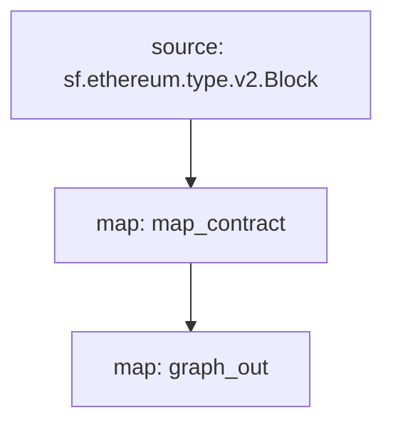

[Substreams](/substreams) är en ny ramverk för att behandla blockkedjedata som utvecklats av StreamingFast för The Graph Network. Ett Substreams-modul kan generera ändringar i entiteter som är kompatibla med Subgraph-entiteter. En subgraf kan använda en sådan Substreams-modul som en datakälla och därmed ta del av Substreams indexeringshastighet och ytterligare data för subgrafutvecklare.

## Krav

This cookbook requires [yarn](https://yarnpkg.com/), [the dependencies necessary for local Substreams development](https://substreams.streamingfast.io/documentation/consume/installing-the-cli), and the latest version of Graph CLI (>=0.52.0):

```
npm install -g @graphprotocol/graph-cli
```

## Skaffa kokboken

> Den här kokboken använder denna [Substreams-powered subgraph som referens](https://github.com/graphprotocol/graph-tooling/tree/main/examples/substreams-powered-subgraph).

```
graph init --from-example substreams-powered-subgraph
```

## Definiera ett Substreams-paket

En Substreams-paket består av typer (definierade som [Protocol Buffers](https://protobuf.dev/)), moduler (skrivna i Rust) och en `substreams.yaml`-fil som refererar till typerna och specificerar hur modulerna utlöses. [Besök Substreams-dokumentationen för att lära dig mer om Substreams-utveckling](/substreams), och kolla in [awesome-substreams](https://github.com/pinax-network/awesome-substreams) och [Substreams cookbook](https://github.com/pinax-network/substreams-cookbook) för fler exempel.

Substreams-paketet i fråga upptäcker kontraktsdistributioner på Mainnet Ethereum, spårar skapandeblocket och tidsstämpeln för alla nyligen distribuerade kontrakt. För att göra detta finns det en dedikerad "kontrakt"-typ i "/proto/example.proto" ([läs mer om att definiera protokollbuffertar](https://protobuf.dev/programming-guides/proto3/#simple)):

```proto
syntax = "proto3";

package example;

message Contracts {
  repeated Contract contracts = 1;
}

message Contract {
    string address = 1;
    uint64 blockNumber = 2;
    string timestamp = 3;
    uint64 ordinal = 4;
}
```

Kärnlogiken i Substreams-paketet är en `map_contract`-modul i `lib.rs`, som bearbetar varje block, filtrerar efter Skapa-anrop som inte återgick, returnerar `Contracts`:

```rust
#[substreams::handlers::map]
fn map_contract(block: eth::v2::Block) -> Result<Contracts, substreams::errors::Error> {
    let contracts = block
        .transactions()
        .flat_map(|tx| {
            tx.calls
                .iter()
                .filter(|call| !call.state_reverted)
                .filter(|call| call.call_type == eth::v2::CallType::Create as i32)
                .map(|call| Contract {
                    address: format!("0x{}", Hex(&call.address)),
                    block_number: block.number,
                    timestamp: block.timestamp_seconds().to_string(),
                    ordinal: tx.begin_ordinal,
                })
        })
        .collect();
    Ok(Contracts { contracts })
}
```

Ett Substreams-paket kan användas av en subgraf så länge det har en modul som matar ut kompatibla enhetsändringar. Exemplet på Substreams-paketet har en extra `graph_out`-modul i `lib.rs` som returnerar en `substreams_entity_change::pb::entity::EntityChanges`-utdata, som kan bearbetas av Graph Node.

> "substreams_entity_change"-lådan har också en dedikerad "Tables"-funktion för att helt enkelt generera entitetsändringar ([documentation](https://docs.rs/substreams-entity-change/1.2.2/substreams_entity_change/tables/index.html)). Entitetsändringarna som genereras måste vara kompatibla med "schema.graphql"-entiteterna som definieras i "subgraph.graphql" i motsvarande subgraf.

```rust
#[substreams::handlers::map]
pub fn graph_out(contracts: Contracts) -> Result<EntityChanges, substreams::errors::Error> {
    // hash map of name to a table
    let mut tables = Tables::new();

    for contract in contracts.contracts.into_iter() {
        tables
            .create_row("Contract", contract.address)
            .set("timestamp", contract.timestamp)
            .set("blockNumber", contract.block_number);
    }

    Ok(tables.to_entity_changes())
}
```

Dessa typer och moduler dras ihop i `substreams.yaml`:

```yaml
specVersion: v0.1.0
package:
  name: 'substreams_test' # the name to be used in the .spkg
  version: v1.0.1 # the version to use when creating the .spkg

imports: # dependencies
  entity: https://github.com/streamingfast/substreams-entity-change/releases/download/v0.2.1/substreams-entity-change-v0.2.1.spkg

protobuf: # specifies custom types for use by Substreams modules
  files:
    - example.proto
  importPaths:
    - ./proto

binaries:
  default:
    type: wasm/rust-v1
    file: ./target/wasm32-unknown-unknown/release/substreams.wasm

modules: # specify modules with their inputs and outputs.
  - name: map_contract
    kind: map
    inputs:
      - source: sf.ethereum.type.v2.Block
    output:
      type: proto:test.Contracts

  - name: graph_out
    kind: map
    inputs:
      - map: map_contract
    output:
      type: proto:substreams.entity.v1.EntityChanges # this type can be consumed by Graph Node
```

Du kan kontrollera det övergripande "flödet" från ett block, till `map_contract` till `graph_out` genom att köra `substreams graph`:



För att förbereda detta Substreams paket för konsumtion av en subgraf måste du köra följande kommandon:

```bash
yarn substreams:protogen # genererar typer i /src/pb
yarn substreams:build # bygger substreams
yarn substreams:package # paketerar substreams i en .spkg-fil

# alternativt anropar yarn substreams:prepare alla ovanstående kommandon
```

> Dessa skript definieras i filen `package.json` om du vill förstå de underliggande substreams-kommandona

Detta genererar en `spkg`-fil baserat på paketnamnet och versionen från `substreams.yaml`. `spkg`-filen har all information som Graph Node behöver för att mata in detta Substreams-paket.

> Om du uppdaterar Substreams-paketet, beroende på de ändringar du gör, kan du behöva köra några eller alla ovanstående kommandon så att `spkg` är uppdaterad.

## Definiera en Substream-driven subgraf

Substreams-drivna subgrafer introducerar en ny "typ" av datakälla, "substreams". Sådana subgrafer kan bara ha en datakälla.

Denna datakälla måste ange det indexerade nätverket, Substreams-paketet ("spkg") som en relativ filplats och modulen i det Substreams-paketet som producerar subgrafkompatibla entitetsändringar (i detta fall "map_entity_changes", från Substreams-paketet ovan). Mappningen är specificerad, men identifierar helt enkelt mappningstypen ("substreams/graph-entities") och apiVersion.

> Currently, Subgraph Studio and The Graph Network support Substreams-powered subgraphs which index `mainnet` (Mainnet Ethereum).

```yaml
specVersion: 0.0.4
description: Ethereum Contract Tracking Subgraph (powered by Substreams)
repository: https://github.com/graphprotocol/graph-tooling
schema:
  file: schema.graphql
dataSources:
  - kind: substreams
    name: substream_test
    network: mainnet
    source:
      package:
        moduleName: graph_out
        file: substreams-test-v1.0.1.spkg
    mapping:
      kind: substreams/graph-entities
      apiVersion: 0.0.5
```

`subgraph.yaml` refererar också till en schemafil. Kraven för denna fil är oförändrade, men de angivna entiteterna måste vara kompatibla med entitetsändringarna som produceras av Substreams-modulen som refereras till i `subgraph.yaml`.

```graphql
type Contract @entity {
  id: ID!

  "Tidsstämpeln när kontraktet implementerades"
  timestamp: String!

  "Blocknummer för kontraktsimplementeringen"
  blockNumber: BigInt!
}
```

Med tanke på ovanstående kan subgraf utvecklare använda Graph CLI för att distribuera denna Substreams-drivna subgraf.

> Underströmsdrivna subgrafer som indexerar mainnet Ethereum kan distribueras till [Subgraph Studio](https://thegraph.com/studio/).

```bash
yarn install # install graph-cli
yarn subgraph:build # bygg subgrafen
yarn subgraph:deploy # deploy the subgraph
```

Det är allt! Du har byggt och distribuerat en Substreams-drivna subgraf.

## Visa substreams-drivna subgrafer

För att kunna betjäna Substreams-drivna subgrafer måste Graph Node konfigureras med en Substreams-leverantör för det relevanta nätverket, samt en Firehose eller RPC för att spåra kedjehuvudet. Dessa leverantörer kan konfigureras via en `config.toml`-fil:

```toml
[chains.mainnet]
shard = "main"
protocol = "ethereum"
provider = [
  { label = "substreams-provider-mainnet",
    details = { type = "substreams",
    url = "https://mainnet-substreams-url.grpc.substreams.io/",
    token = "exampletokenhere" }},
  { label = "firehose-provider-mainnet",
    details = { type = "firehose",
    url = "https://mainnet-firehose-url.grpc.firehose.io/",
    token = "exampletokenhere" }},
]
```
