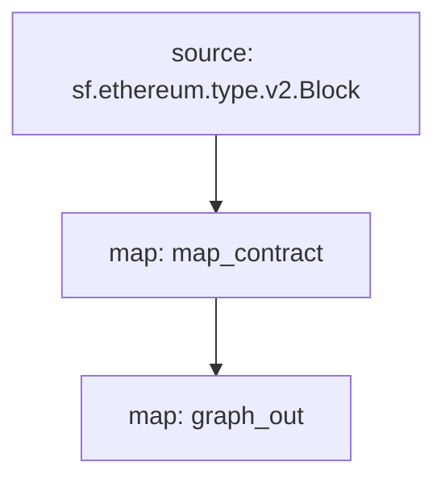

[Substreams](/substreams/README), Graph Ağı için StreamingFast tarafından geliştirilen bir blok zinciri verilerini işleme çerçevesidir. Bir substreams modülü, subgraph varlıklarıyla uyumlu olan varlık değişiklikleri çıktısı verebilir. Bir subgraph, böyle bir Substreams modülünü veri kaynağı olarak kullanabilir ve Substreams'in hızlı indeksleme hızını ve ek verilerini subgraph geliştiricilere getirebilir.

## Gereksinimler

Bu cookbook, [yarn](https://yarnpkg.com/), [yerel Substreams geliştirme için gerekli bağımlılıklar](https://substreams.streamingfast.io/developers-guide/installation-requirements) ve Graph CLI'nin en son sürümünü (>=0.52.0) gerektirir:

```
npm install -g @graphprotocol/graph-cli
```

## Cookbook'u edinin

> Bu rehber, bu [Substreams destekli subgraph'ı referans](https://github.com/graphprotocol/graph-tooling/tree/main/examples/substreams-powered-subgraph) olarak kullanmaktadır.

```
graph init --from-example substreams-powered-subgraph
```

## Bir Substreams paketi tanımlama

Bir Substreams paketi tiplerden ([Protocol Buffers](https://protobuf.dev/) olarak tanımlanmış olanlar), modüllerden (Rust dilinde yazılmış), tiplere referans veren ve modüllerin nasıl tetikleneceğini belirten bir `substreams.yaml` dosyasından oluşur. [Substreams geliştirme hakkında daha fazla bilgi edinmek için Substreams belgelerini ziyaret edin](/substreams/README) ve daha fazla örnek için [awesome-substreams](https://github.com/pinax-network/awesome-substreams) ve [Substreams cookbook](https://github.com/pinax-network/substreams-cookbook) sayfalarına göz atın.

Bahsi geçen Substreams paketi, Ethereum Ana Ağı'nda kontrat dağıtımlarını algılar ve yeni oluşturulan kontratlar için oluşturma bloğunu ve zaman damgasını takip eder. Bunun için `/proto/example.proto` içinde buna özel bir `Contract` türü bulunmaktadır ([Protokol Buffers tanımlama hakkında daha fazla bilgi edinin](https://protobuf.dev/programming-guides/proto3/#simple)):

```proto
syntax = "proto3";

package example;

message Contracts {
  repeated Contract contracts = 1;
}

message Contract {
    string address = 1;
    uint64 blockNumber = 2;
    string timestamp = 3;
    uint64 ordinal = 4;
}
```

Substreams paketinin temel mantığı, her bloğu işleyen, Create çağrıları için bir filtreleme yapan ve geri dönüş olarak `Contracts` verisini döndüren `lib.rs` içindeki bulunan `map_contract` modülüdür:

```
#[substreams::handlers::map]
fn map_contract(block: eth::v2::Block) -> Result<Contracts, substreams::errors::Error> {
    let contracts = block
        .transactions()
        .flat_map(|tx| {
            tx.calls
                .iter()
                .filter(|call| !call.state_reverted)
                .filter(|call| call.call_type == eth::v2::CallType::Create as i32)
                .map(|call| Contract {
                    address: format!("0x{}", Hex(&call.address)),
                    block_number: block.number,
                    timestamp: block.timestamp_seconds().to_string(),
                    ordinal: tx.begin_ordinal,
                })
        })
        .collect();
    Ok(Contracts { contracts })
}
```

Bir Substreams paketi, uyumlu varlık değişiklikleri üreten bir modüle sahip olduğu sürece bir subgraph tarafından kullanılabilir. Örnek Substreams paketi, `lib.rs` dosyasında ek bir `graph_out` modülüne sahiptir ve Graph Düğümü tarafından işlenebilen `substreams_entity_change::pb::entity::EntityChanges` çıktısını döndürür.

> `substreams_entity_change` paketi ayrıca varlık değişiklikleri oluşturmak için özel bir `Tables` işlevine sahiptir ([documentation](https://docs.rs/substreams-entity-change/1.2.2/substreams_entity_change/tables/index.html)). Oluşturulan Varlık Değişiklikleri, buna karşılık gelen subgraph'ın `subgraph.graphql` dosyasında tanımlanan `schema.graphql` varlıklarıyla uyumlu olmalıdır.

```
#[substreams::handlers::map]
pub fn graph_out(contracts: Contracts) -> Result<EntityChanges, substreams::errors::Error> {
    // hash map of name to a table
    let mut tables = Tables::new();

    for contract in contracts.contracts.into_iter() {
        tables
            .create_row("Contract", contract.address)
            .set("timestamp", contract.timestamp)
            .set("blockNumber", contract.block_number);
    }

    Ok(tables.to_entity_changes())
}
```

Bu türler ve modüller `substreams.yaml` dosyasında bir araya getirilir:

```
specVersion: v0.1.0
package:
  name: 'substreams_test' # the name to be used in the .spkg
  version: v1.0.1 # the version to use when creating the .spkg

imports: # dependencies
  entity: https://github.com/streamingfast/substreams-entity-change/releases/download/v0.2.1/substreams-entity-change-v0.2.1.spkg

protobuf: # specifies custom types for use by Substreams modules
  files:
    - example.proto
  importPaths:
    - ./proto

binaries:
  default:
    type: wasm/rust-v1
    file: ./target/wasm32-unknown-unknown/release/substreams.wasm

modules: # specify modules with their inputs and outputs.
  - name: map_contract
    kind: map
    inputs:
      - source: sf.ethereum.type.v2.Block
    output:
      type: proto:test.Contracts

  - name: graph_out
    kind: map
    inputs:
      - map: map_contract
    output:
      type: proto:substreams.entity.v1.EntityChanges # this type can be consumed by Graph Node

```

`substreams graph` komutunu çalıştırarak bir Bloktan `map_contract`'a ve ardından `graph_out`'a genel "akışı" kontrol edebilirsiniz:



Bu Substreams paketini bir subgraph tarafından kullanılmak üzere hazırlamak için aşağıdaki komutları çalıştırmanız gerekir:

```bash
yarn substreams:protogen # generates types in /src/pb
yarn substreams:build # builds the substreams
yarn substreams:package # packages the substreams in a .spkg file

# alternatively, yarn substreams:prepare calls all of the above commands
```

> Substreams komutlarının temelini anlamak isterseniz, bu komutlar, `package.json` dosyasında tanımlanmıştır

Bu,`substreams.yaml` dosyasındaki paket adı ve sürümden hareketle bir `spkg` dosyası oluşturur. `spkg` dosyası, Graph Düğümü'nün bu Substreams paketini alabilmesi için gereken tüm bilgilere sahiptir.

> Substreams paketini güncellerseniz, yaptığınız değişikliklere bağlı olarak `spkg`'yı güncel tutmak için yukarıdaki komutların bazılarını veya tümünü çalıştırmanız gerekebilir.

## Substreams Destekli Bir Subgraph Tanımlama

Substreams destekli subgraphlar yeni bir veri kaynağı türü('kind') olan "substreams"'i sunar. Bu tür subgraphlar yalnızca bir veri kaynağına sahip olabilir.

Bu veri kaynağı indekslenen ağı, Substreams paketi (`spkg`) olarak ilgili bir dosya konumu ve Substreams paketinin subgraph uyumlu varlık değişiklikleri üreten modülü belirtmelidir (bu durumda yukarıdaki Substreams paketinden `map_entity_changes`). Eşleştirme belirtilmiştir, fakat yalnızca eşleştirme türünü ("substreams/graph-entities") ve apiVersion'ı tanımlar.

> Şu anda Subgraph Stüdyo ve Graph Ağı, `mainnet`i (Ethereum Ana Ağı) indeksleyen Substreams destekli subgraphları desteklemektedir.

```yaml
specVersion: 0.0.4
description: Ethereum Contract Tracking Subgraph (powered by Substreams)
repository: https://github.com/graphprotocol/graph-tooling
schema:
  file: schema.graphql
dataSources:
  - kind: substreams
    name: substream_test
    network: mainnet
    source:
      package:
        moduleName: graph_out
        file: substreams-test-v1.0.1.spkg
    mapping:
      kind: substreams/graph-entities
      apiVersion: 0.0.5
```

`subgraph.yaml` dosyası ayrıca bir şema dosyasına referans verir. Bu dosyanın gereksinimleri değişmemiş olmasına rağmen, `subgraph.yaml` içinde referans verilen Substreams modülü tarafından üretilen varlık değişiklikleriyle uyumlu olmalıdır.

```graphql
type Contract @entity {
  id: ID!

  "The timestamp when the contract was deployed"
  timestamp: String!

  "The block number of the contract deployment"
  blockNumber: BigInt!
}
```

Yukarıdakiler verildiğinde, subgraph geliştiricileri Graph CLI kullanarak bu Substreams destekli subgraph'ı dağıtabilir.

> Ethereum Ana Ağını indeksleyen Substreams destekli subgraphlar, [Subgraph Stüdyo'ya](https://thegraph.com/studio/) dağıtılabilir.

```bash
yarn install # install graph-cli
yarn subgraph:build # build the subgraph
yarn subgraph:deploy # deploy the subgraph
```

Bu kadar! Bir Substreams destekli subgraph oluşturup dağıttınız.

## Substreams destekli subgraphlar'ın sunulması

Substreams destekli subgraphlar'ı sunabilmek için Graph Düğümü'nün ilgili ağ için bir Substreams sağlayıcısı ve zincir başını takip etmek için bir Firehose veya RPC yapılandırılması gerekmektedir. Bu sağlayıcılar, bir `config.toml` dosyası aracılığıyla yapılandırılabilir:

```toml
[chains.mainnet]
shard = "main"
protocol = "ethereum"
provider = [
  { label = "substreams-provider-mainnet",
    details = { type = "substreams",
    url = "https://mainnet-substreams-url.grpc.substreams.io/",
    token = "exampletokenhere" }},
  { label = "firehose-provider-mainnet",
    details = { type = "firehose",
    url = "https://mainnet-firehose-url.grpc.firehose.io/",
    token = "exampletokenhere" }},
]
```
