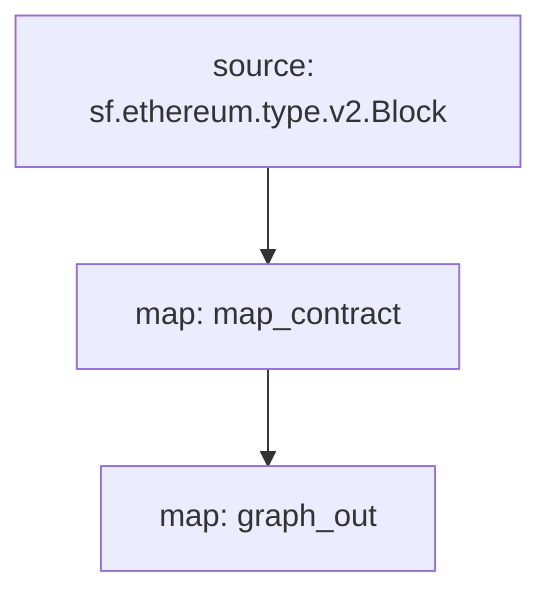

[Substreams](/سب سٹریمز) بلاکچین ڈیٹا کی پروسیسنگ کے لیے ایک نیا فریم ورک ہے، جسے سٹریمنگ فاسٹ نے گراف نیٹ ورک کے لیے تیار کیا ہے۔ سب سٹریمز کے ماڈیولز ہستی کی تبدیلیوں کو آؤٹ پٹ کر سکتے ہیں، جو سب گراف اداروں کے ساتھ ہم آہنگ ہیں۔ ایک سب گراف اس طرح کے سب سٹریمز ماڈیول کو ڈیٹا سورس کے طور پر استعمال کر سکتا ہے، جس سے انڈیکسنگ کی رفتار اور سب سٹریمز کا اضافی ڈیٹا سب گراف ڈویلپرز تک پہنچ جاتا ہے.

## تقاضے

This cookbook requires [yarn](https://yarnpkg.com/), [the dependencies necessary for local Substreams development](https://substreams.streamingfast.io/documentation/consume/installing-the-cli), and the latest version of Graph CLI (>=0.52.0):

```
npm install -g @graphprotocol/graph-cli
```

## کک بک حاصل کریں

> یہ کک بک اس [سب اسٹریم سے چلنے والے سب گراف کو بطور حوالہ استعمال کرتی ہے](https://github.com/graphprotocol/graph-tooling/tree/main/examples/substreams-powered-subgraph).

```
graph init --from-example substreams-powered-subgraph
```

## سب سٹریمز پیکیج کی وضاحت کرنا

ایک سب سٹریمز پیکیج اقسام پر مشتمل ہے (جس کی وضاحت [پروٹوکول بفرز](https://protobuf.dev/))، ماڈیولز (Rust میں لکھی گئی ہے)، اور ایک `substreams.yaml` فائل جو اقسام کا حوالہ دیتی ہے، اور یہ بتاتی ہے کہ ماڈیول کیسے ہیں متحرک ہیں. [سب سٹریمز ڈویلپمنٹ کے بارے میں مزید جاننے کے لیے سب سٹریمز کی دستاویزات دیکھیں](/substreams)، اور [wesome-substreams](https://github.com/pinax-network/awesome-substreams) اور [Substreams cookbook](https مزید مثالوں کے لیے://github.com/pinax-network/substreams-cookbook).

زیر بحث سب اسٹریمز پیکیج مینیٹ ایتھیریم پر کنٹریکٹ کی تعیناتیوں کا پتہ لگاتا ہے، تمام نئے تعینات کردہ کنٹریکٹس کے لیے تخلیق بلاک اور ٹائم اسٹیمپ کا پتہ لگاتا ہے۔ ایسا کرنے کے لیے، `/proto/example.proto` ([پروٹوکول بفرز کی تعریف کرنے کے بارے میں مزید جانیں](https://protobuf.dev/programming-guides/proto3/#simple)) میں ایک مخصوص `Contract` قسم ہے:

```proto
syntax = "proto3";

package example;

message Contracts {
  repeated Contract contracts = 1;
}

message Contract {
    string address = 1;
    uint64 blockNumber = 2;
    string timestamp = 3;
    uint64 ordinal = 4;
}
```

سب اسٹریمز پیکج کی بنیادی منطق `lib.rs` میں ایک `map_contract` ماڈیول ہے، جو ہر بلاک پر کارروائی کرتا ہے، ایسی کالز تخلیق کرنے کے لئے فلٹر کرتا ہے جو واپس نہیں آتیں، `Contracts` واپس کرتی ہیں:

```rust
#[substreams::handlers::map]
fn map_contract(block: eth::v2::Block) -> Result<Contracts, substreams::errors::Error> {
    let contracts = block
        .transactions()
        .flat_map(|tx| {
            tx.calls
                .iter()
                .filter(|call| !call.state_reverted)
                .filter(|call| call.call_type == eth::v2::CallType::Create as i32)
                .map(|call| Contract {
                    address: format!("0x{}", Hex(&call.address)),
                    block_number: block.number,
                    timestamp: block.timestamp_seconds().to_string(),
                    ordinal: tx.begin_ordinal,
                })
        })
        .collect();
    Ok(Contracts { contracts })
}
```

سب اسٹریمز پیکیج کو سب گراف کے ذریعہ استعمال کیا جاسکتا ہے جب تک کہ اس میں ایک ماڈیول موجود ہو جو ہم آہنگ ہستی کی تبدیلیوں کو آؤٹ پٹ کرتا ہے۔ مثال کے سب سٹریمز پیکیج میں `lib.rs` میں ایک اضافی `graph_out` ماڈیول ہے جو `substreams_entity_change::pb::entity::EntityChanges` آؤٹ پٹ لوٹاتا ہے، جس پر گراف نوڈ کے ذریعے کارروائی کی جا سکتی ہے.

> 'substreams_entity_change' کریٹ میں صرف ہستی کی تبدیلیاں پیدا کرنے کے لیے ایک وقف کردہ 'Tables' فنکشن ہے ([documentation](https://docs.rs/substreams-entity-change/1.2.2/substreams_entity_change/tables/index.html)). تخلیق کردہ ہستی کی تبدیلیاں متعلقہ سب گراف کے `subgraph.graphql` میں بیان کردہ `schema.graphql` اداروں کے ساتھ ہم آہنگ ہونی چاہئیں.

```rust
#[substreams::handlers::map]
pub fn graph_out(contracts: Contracts) -> Result<EntityChanges, substreams::errors::Error> {
    // hash map of name to a table
    let mut tables = Tables::new();

    for contract in contracts.contracts.into_iter() {
        tables
            .create_row("Contract", contract.address)
            .set("timestamp", contract.timestamp)
            .set("blockNumber", contract.block_number);
    }

    Ok(tables.to_entity_changes())
}
```

ان اقسام اور ماڈیولز کو `substreams.yaml` میں ایک ساتھ کھینچا جاتا ہے:

```yaml
specVersion: v0.1.0
package:
  name: 'substreams_test' # the name to be used in the .spkg
  version: v1.0.1 # the version to use when creating the .spkg

imports: # dependencies
  entity: https://github.com/streamingfast/substreams-entity-change/releases/download/v0.2.1/substreams-entity-change-v0.2.1.spkg

protobuf: # specifies custom types for use by Substreams modules
  files:
    - example.proto
  importPaths:
    - ./proto

binaries:
  default:
    type: wasm/rust-v1
    file: ./target/wasm32-unknown-unknown/release/substreams.wasm

modules: # specify modules with their inputs and outputs.
  - name: map_contract
    kind: map
    inputs:
      - source: sf.ethereum.type.v2.Block
    output:
      type: proto:test.Contracts

  - name: graph_out
    kind: map
    inputs:
      - map: map_contract
    output:
      type: proto:substreams.entity.v1.EntityChanges # this type can be consumed by Graph Node
```

آپ 'سب اسٹریمز گراف' کو چلا کر ایک بلاک سے `map_contract` سے `graph_out` تک مجموعی طور پر "فلو" کو چیک کر سکتے ہیں:



سب اسٹریمز کے ذریعے استعمال کے لیے اس سب اسٹریم پیکیج کو تیار کرنے کے لیے، آپ کو درج ذیل کمانڈز چلانے چاہئیں:

```bash
yarn substreams:protogen # /src/pb میں قسمیں تیار کرتا ہے
yarn substreams:build # سب سٹریمز بناتا ہے
yarn substreams:package # سب اسٹریمز کو .spkg فائل میں پیک کرتا ہے

# متبادل طور پر، یارن سب سٹریمز: مندرجہ بالا تمام کمانڈز کو کالز تیار کریں
```

> ان اسکرپٹس کی وضاحت `package.json` فائل میں کی گئی ہے اگر آپ بنیادی سب سٹریمز کی کمانڈ کو سمجھنا چاہتے ہیں

یہ 'substreams.yaml' سے پیکیج کے نام اور ورژن کی بنیاد پر ایک `spkg` فائل تیار کرتا ہے۔ `spkg` فائل میں وہ تمام معلومات ہیں جن کی گراف نوڈ کو اس سب سٹریمز پیکیج کو ہضم کرنے کی ضرورت ہے.

> اگر آپ سب اسٹریم پیکج کو اپ ڈیٹ کرتے ہیں تو، آپ کی تبدیلیوں پر منحصر ہے، آپ کو مندرجہ بالا کچھ یا سبھی کمانڈز چلانے کی ضرورت پڑسکتی ہے تاکہ `spkg` اپ ٹو ڈیٹ رہے.

## سب اسٹریمز سے چلنے والے سب گراف کی وضاحت کرنا

سب اسٹریمز سے چلنے والے سب گرافس ڈیٹا کے ذریعہ کی ایک نئی `kind` متعارف کراتے ہیں، "سب اسٹریمز"۔ اس طرح کے سب گرافس میں صرف ایک ڈیٹا سورس ہو سکتا ہے.

اس ڈیٹا سورس کو انڈیکسڈ نیٹ ورک، سب اسٹریم پیکیج (`spkg`) کو متعلقہ فائل لوکیشن کے طور پر اور اس سب اسٹریم پیکیج کے اندر موجود ماڈیول کی وضاحت کرنی چاہیے جو سب سٹریمز سے مطابقت رکھنے والی ہستی کی تبدیلیاں (اس صورت میں `map_entity_changes`، اوپر سب اسٹریمز پیکیج سے)۔ میپنگ کی وضاحت کی گئی ہے، لیکن صرف میپنگ کی قسم ("substreams/graph-entities") اور apiVersion کی شناخت کرتا ہے.

> Currently, Subgraph Studio and The Graph Network support Substreams-powered subgraphs which index `mainnet` (Mainnet Ethereum).

```yaml
specVersion: 0.0.4
description: Ethereum Contract Tracking Subgraph (powered by Substreams)
repository: https://github.com/graphprotocol/graph-tooling
schema:
  file: schema.graphql
dataSources:
  - kind: substreams
    name: substream_test
    network: mainnet
    source:
      package:
        moduleName: graph_out
        file: substreams-test-v1.0.1.spkg
    mapping:
      kind: substreams/graph-entities
      apiVersion: 0.0.5
```

`subgraph.yaml` ایک سکیما فائل کا بھی حوالہ دیتا ہے۔ اس فائل کے تقاضے غیر تبدیل شدہ ہیں، لیکن متعین کردہ ہستیوں کو `subgraph.yaml` میں حوالہ کردہ سب سٹریمز ماڈیول کے ذریعہ تیار کردہ ہستی کی تبدیلیوں کے ساتھ ہم آہنگ ہونا چاہئے.

```graphql
type Contract @entity {
  id: ID!

  "The timestamp when the contract was deployed"
  timestamp: String!

  "The block number of the contract deployment"
  blockNumber: BigInt!
}
```

مندرجہ بالا کو دیکھتے ہوئے، سب گراف ڈویلپرز اس سب اسٹریمز سے چلنے والے سب گراف کو تعینات کرنے کے لیے گراف CLI استعمال کر سکتے ہیں.

> سب اسٹریمز سے چلنے والے سب گرافس کو انڈیکس کرنے والے مین نیٹ ایتھیریم کو [سب گراف اسٹوڈیو](https://thegraph.com/studio/) میں تعینات کیا جا سکتا ہے.

```bash
yarn install # graph-cli انسٹال کریں
yarn subgraph:build # سب گراف کی تعمیر کریں
yarn subgraph:deploy # سب گراف کو تعینات کریں
```

یہی ہے! آپ نے سب اسٹریمز سے چلنے والا سب گراف بنایا اور تعینات کیا ہے.

## سب اسٹریمز سے چلنے والے سب گرافس کی خدمت کرنا

سب اسٹریمز سے چلنے والے سب اسٹریمز کو پیش کرنے کے لیے، گراف نوڈ کو متعلقہ نیٹ ورک کے لیے سب اسٹریمز فراہم کنندہ کے ساتھ کنفیگر کیا جانا چاہیے، ساتھ ہی ساتھ چین ہیڈ کو ٹریک کرنے کے لیے فائر ہوز یا RPC کا ہونا چاہیے۔ ان فراہم کنندگان کو ایک `config.toml` فائل کے ذریعے ترتیب دیا جا سکتا ہے:

```toml
[chains.mainnet]
shard = "main"
protocol = "ethereum"
provider = [
  { label = "substreams-provider-mainnet",
    details = { type = "substreams",
    url = "https://mainnet-substreams-url.grpc.substreams.io/",
    token = "exampletokenhere" }},
  { label = "firehose-provider-mainnet",
    details = { type = "firehose",
    url = "https://mainnet-firehose-url.grpc.firehose.io/",
    token = "exampletokenhere" }},
]
```
