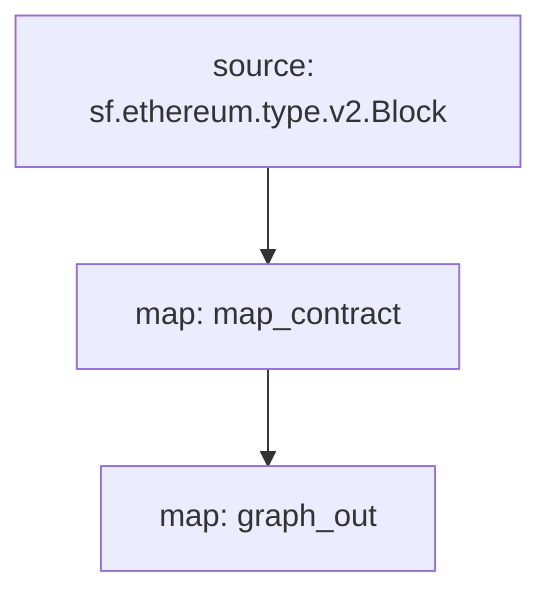

[Substreams](/substreams/README) 是由StreamingFast为The Graph Network开发的一种处理区块链数据的新框架。Substreams模块可以输出与Subgraph实体兼容的实体变更。子图可以将这样的Substreams模块作为数据源，将Substreams的索引速度和附加数据带给子图开发者。

## 要求

本手册需要 [yarn](https://yarnpkg.com/) ，以及本地Substreams开发所需的依赖项 [the dependencies necessary for local Substreams development](https://substreams.streamingfast.io/developers-guide/installation-requirements)，以及最新版本的Graph CLI (>=0.52.0):

```
npm install -g @graphprotocol/graph-cli
```

## 获取手册

> 本手册使用这个基于Substreams的子图[Substreams-powered subgraph as a reference](https://github.com/graphprotocol/graph-tooling/tree/main/examples/substreams-powered-subgraph)作为参考。

```
graph init --from-example substreams-powered-subgraph
```

## 定义Substreams包

Substreams（子流）包由类型（定义为 [Protocol Buffers](https://protobuf.dev/)）、模块（用 Rust 编写）和一个 `substreams.yaml` 文件组成，该文件引用类型并指定模块的触发方式。如果您想了解更多关于 Substreams 开发的信息，请访问 [Substreams 文档](/substreams/README)。另外，您还可以查看 [awesome-substreams](https://github.com/pinax-network/awesome-substreams) 和 [Substreams cookbook](https://github.com/pinax-network/substreams-cookbook) 来获取更多示例。

该Substreams包可以检测以太坊主网上的合约部署，并跟踪所有新部署合约的创建块和时间戳。为此，在/proto/example.proto中有一个专门的Contract类型（了解更多关于定义Protocol Buffers的信息[learn more about defining Protocol Buffers](https://protobuf.dev/programming-guides/proto3/#simple)）：

```proto
syntax = "proto3";

package example;

message Contracts {
  repeated Contract contracts = 1;
}

message Contract {
    string address = 1;
    uint64 blockNumber = 2;
    string timestamp = 3;
    uint64 ordinal = 4;
}
```

Substreams包的核心逻辑是lib.rs中的map_contract模块，它处理每个区块，过滤未回滚的Create调用，并返回Contracts：

```
#[substreams::handlers::map]
fn map_contract(block: eth::v2::Block) -> Result<Contracts, substreams::errors::Error> {
    let contracts = block
        .transactions()
        .flat_map(|tx| {
            tx.calls
                .iter()
                .filter(|call| !call.state_reverted)
                .filter(|call| call.call_type == eth::v2::CallType::Create as i32)
                .map(|call| Contract {
                    address: format!("0x{}", Hex(&call.address)),
                    block_number: block.number,
                    timestamp: block.timestamp_seconds().to_string(),
                    ordinal: tx.begin_ordinal,
                })
        })
        .collect();
    Ok(Contracts { contracts })
}
```

只要Substreams包有一个模块输出与子图兼容的实体变更，就可以被子图使用。示例Substreams包中还有一个额外的graph_out模块在lib.rs中，它返回一个substreams_entity_change::pb::entity::EntityChanges输出，Graph Node可以处理该输出。

> Substreams_entity_change crate还有一个专门的Tables函数，用于生成实体变更（文档[documentation](https://docs.rs/substreams-entity-change/1.2.2/substreams_entity_change/tables/index.html)）。生成的实体变更必须与相应子图的subgraph.graphql中定义的schema.graphql实体兼容。

```
#[substreams::handlers::map]
pub fn graph_out(contracts: Contracts) -> Result<EntityChanges, substreams::errors::Error> {
    // hash map of name to a table
    let mut tables = Tables::new();

    for contract in contracts.contracts.into_iter() {
        tables
            .create_row("Contract", contract.address)
            .set("timestamp", contract.timestamp)
            .set("blockNumber", contract.block_number);
    }

    Ok(tables.to_entity_changes())
}
```

这些类型和模块在substreams.yaml中汇集在一起：

```
specVersion: v0.1.0
package:
  name: 'substreams_test' # 在 .spkg 中使用的名称
  version: v1.0.1 # 创建 .spkg 时使用的版本

imports: # 依赖项
  entity: https://github.com/streamingfast/substreams-entity-change/releases/download/v0.2.1/substreams-entity-change-v0.2.1.spkg

protobuf: # 为Substreams模块指定自定义类型
  files:
    - example.proto
  importPaths:
    - ./proto

binaries:
  default:
    type: wasm/rust-v1
    file: ./target/wasm32-unknown-unknown/release/substreams.wasm

modules: # 指定模块及其输入和输出
  - name: map_contract
    kind: map
    inputs:
      - source: sf.ethereum.type.v2.Block
    output:
      type: proto:test.Contracts

  - name: graph_out
    kind: map
    inputs:
      - map: map_contract
    output:
      type: proto:substreams.entity.v1.EntityChanges # 这个类型可以被Graph Node消费

```

您可以通过运行substreams graph来检查从区块到map_contract到graph_out的整体"流程"：



为了准备这个Substreams包供子图使用，您必须运行以下命令：

```bash
yarn substreams:protogen # 生成/src/pb中的类型
yarn substreams:build # 构建Substreams
yarn substreams:package # 将Substreams打包成.spkg文件

# 或者，yarn substreams:prepare会调用上述所有命令
```

> 这些脚本在package.json文件中定义，如果想了解底层的Substreams命令，可以查看这些脚本。

这将根据substreams.yaml中的包名称和版本生成一个spkg文件。spkg文件包含了Graph Node需要获取此Substreams包的所有信息。

> 如果您更新了Substreams包，根据所做的更改，您可能需要运行部分或全部上述命令，以使spkg保持更新。

## 定义一个基于Substreams的子图

Substreams-powered subgraphs引入了一种名为"substreams"的新型数据源。这样的子图只能包含一个数据源。

基于Substreams的子图引入了一种新的数据源类型，"substreams"。这样的子图只能有一个数据源。该数据源必须指定Substreams网络、Substreams包（spkg）的相对文件位置，以及该Substreams包中生成子图兼容实体变更的模块（在本例中为map_entity_changes）。映射是指定的，但只是标识了映射类型（"substreams/graph-entities"）和apiVersion。

> 目前，Subgraph Studio和The Graph Network支持使用Substreams强化的子图来索引"mainnet"（主网以太坊）数据。

```yaml
specVersion: 0.0.4
description: Ethereum Contract Tracking Subgraph (powered by Substreams)
repository: https://github.com/graphprotocol/graph-tooling
schema:
  file: schema.graphql
dataSources:
  - kind: substreams
    name: substream_test
    network: mainnet
    source:
      package:
        moduleName: graph_out
        file: substreams-test-v1.0.1.spkg
    mapping:
      kind: substreams/graph-entities
      apiVersion: 0.0.5
```

Subgraph.yaml还引用了一个模式文件。对于这个文件的要求没有变化，但是指定的实体必须与subgraph.yaml中引用的Substreams模块生成的实体变更兼容。

```graphql
type Contract @entity {
  id: ID!

  "The timestamp when the contract was deployed"
  timestamp: String!

  "The block number of the contract deployment"
  blockNumber: BigInt!
}
```

有了以上内容，子图开发者可以使用Graph CLI部署这个基于Substreams的子图。

> 基于Substreams的子图索引以太坊主网可以部署到[Subgraph Studio](https://thegraph.com/studio/)。

```bash
yarn install # 安装graph-cli
yarn subgraph:build # 构建子图
yarn subgraph:deploy # 部署子图
```

就是这样！您已经构建并部署了一个基于Substreams的子图。

## 服务基于Substreams的子图

为了服务基于Substreams的子图，Graph Node必须配置与相关网络的Substreams提供程序，以及用于跟踪链头的Firehose或RPC。这些提供程序可以通过config.toml文件进行配置：

```toml
[chains.mainnet]
shard = "main"
protocol = "ethereum"
provider = [
  { label = "substreams-provider-mainnet",
    details = { type = "substreams",
    url = "https://mainnet-substreams-url.grpc.substreams.io/",
    token = "exampletokenhere" }},
  { label = "firehose-provider-mainnet",
    details = { type = "firehose",
    url = "https://mainnet-firehose-url.grpc.firehose.io/",
    token = "exampletokenhere" }},
]
```
