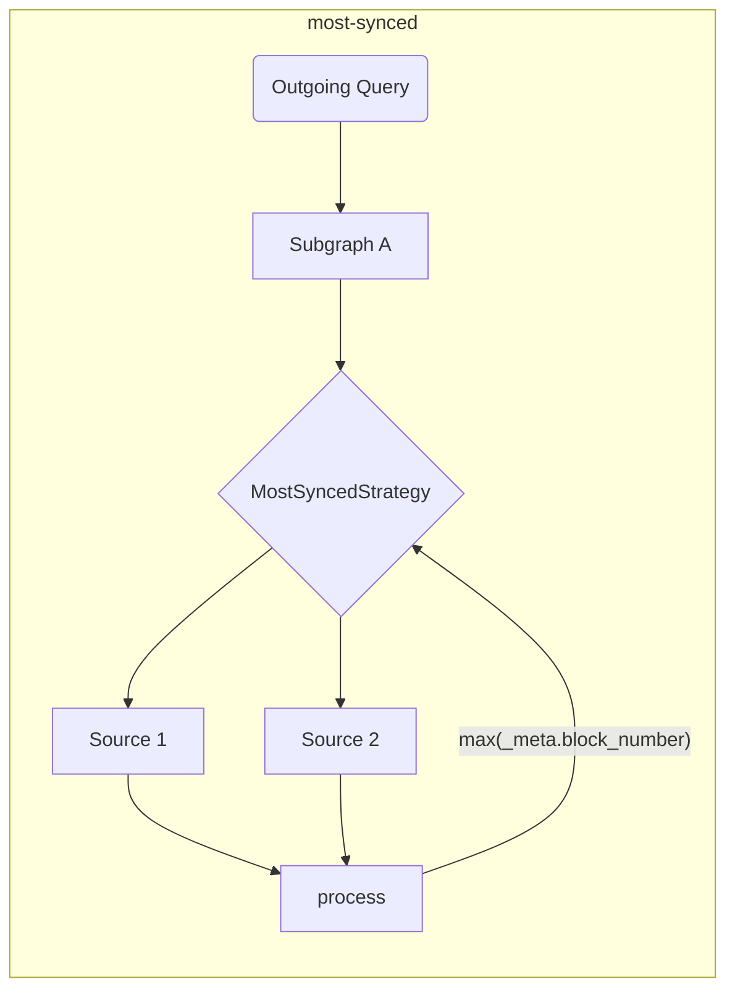

# The Graph Client Tools

This repo is the home for [The Graph](https://thegraph.com) consumer-side tools (for both browser and NodeJS environments).

## Background

The tools provided in this repo are intended to enrich and extend the DX, and add the additional layer required for dApps in order to implement distributed applications.

Developers who consume data from [The Graph](https://thegraph.com) GraphQL API often need peripherals for making data consumption easier, and also tools that allow using multiple indexers at the same time.

## Features and Goals

This library is intended to simplify the network aspect of data consumption for dApps. The tools provided within this repository are intended to run at build time, in order to make execution faster and performant at runtime.

> The tools provided in this repo can be used as standalone, but you can also use it with any existing GraphQL Client!

| Status | Feature                                                                 | Anmerkungen                                                                                                                                                                                                                                |
| :----: | ----------------------------------------------------------------------- | ------------------------------------------------------------------------------------------------------------------------------------------------------------------------------------------------------------------------------------------ |
|    ✅   | Multiple indexers                                                       | basierend auf Abrufstrategien                                                                                                                                                                                                              |
|    ✅   | Abruf-Strategien                                                        | timeout, retry, fallback, race, highestValue                                                                                                                                                                                               |
|    ✅   | Validierung der Erstellungszeit &amp; Optimierungen |                                                                                                                                                                                                                                            |
|    ✅   | Kundenseitige Zusammensetzung                                           | mit verbessertem Ausführungsplaner (basierend auf GraphQL-Mesh)                                                                                                                                                         |
|    ✅   | Behandlung kettenübergreifender Subgraphen                              | Verwenden Sie ähnliche Subgraphen als eine einzige Quelle                                                                                                                                                                                  |
|    ✅   | Unbearbeitete Ausführung (Standalone-Modus)          | ohne einen umhüllenden GraphQL-Client                                                                                                                                                                                                      |
|    ✅   | Lokale (client-seitige) Mutationen                   |                                                                                                                                                                                                                                            |
|    ✅   | [Automatische Blockverfolgung](../packages/block-tracking/README.md)    | Tracking-Blocknummern [wie hier beschrieben] (https://thegraph.com/docs/en/developer/distributed-systems/#polling-for-updated-data) |
|    ✅   | [Automatischer Seitenumbruch](../packages/auto-pagination/README.md)    | mehrere Anfragen in einem einzigen Aufruf, um mehr als das Indexierer-Limit abzurufen                                                                                                                                                      |
|    ✅   | Integration mit `@apollo/client`                                        |                                                                                                                                                                                                                                            |
|    ✅   | Integration mit `urql`                                                  |                                                                                                                                                                                                                                            |
|    ✅   | TypeScript-Unterstützung                                                | mit eingebautem GraphQL Codegen und `TypedDocumentNode`                                                                                                                                                                                    |
|    ✅   | [`@live`-Abfragen](./live.md)                                           | Auf der Grundlage von Umfragen                                                                                                                                                                                                             |

> Einen [erweiterten Architekturentwurf finden Sie hier](./architecture.md)

## Erste Schritte

Sie können [Episode 45 von `graphql.wtf`] (https://graphql.wtf/episodes/45-the-graph-client) verfolgen, um mehr über Graph Client zu erfahren:

[](https://graphql.wtf/episodes/45-the-graph-client)

Um loszulegen, stellen Sie sicher, dass Sie [The Graph Client CLI] in Ihrem Projekt installieren:

```sh
yarn add -D @graphprotocol/client-cli
# oder, mit NPM:
npm install --save-dev @graphprotocol/client-cli
```

> Das CLI wird als Dev-Abhängigkeit installiert, da wir es verwenden, um optimierte Laufzeit-Artefakte zu erzeugen, die direkt aus Ihrer Anwendung geladen werden können!

Erstellen Sie eine Konfigurationsdatei (mit dem Namen `.graphclientrc.yml`) und verweisen Sie auf Ihre GraphQL-Endpunkte, die z.B. von The Graph bereitgestellt werden:

```yml
# .graphclientrc.yml
sources:
  - name: uniswapv2
    handler:
      graphql:
        endpoint: https://api.thegraph.com/subgraphs/name/uniswap/uniswap-v2
```

Erstellen Sie nun ein Laufzeit-Artefakt, indem Sie The Graph Client CLI ausführen:

```sh
Graphclient erstellen
```

> Hinweis: Sie müssen dies mit dem Präfix `yarn` ausführen oder es als Skript in Ihrer `package.json` hinzufügen.

Dies sollte eine einsatzbereite eigenständige Funktion `execute` erzeugen, die Sie für die Ausführung Ihrer GraphQL-Operationen verwenden können. Sie sollten eine Ausgabe ähnlich der folgenden erhalten:

```sh
GraphClient: Bereinigung vorhandener Artefakte
GraphClient: Einlesen der Konfiguration
🕸️: Erzeugen des einheitlichen Schemas
🕸️: Erzeugen von Artefakten
🕸️: Erzeugen der Indexdatei in TypeScript
🕸️: Schreiben der index.ts für ESM auf die Festplatte.
🕸️: Aufräumen
🕸️: Erledigt! =&gt; .graphclient
```

Nun wird das Artefakt `.graphclient` für Sie generiert, und Sie können es direkt aus Ihrem Code importieren und Ihre Abfragen ausführen:

```ts
import { execute } from '../.graphclient'

const myQuery = gql`
  query pairs {
    pair(id: "0x00004ee988665cdda9a1080d5792cecd16dc1220") {
      id
      token0 {
        id
        symbol
        name
      }
      token1 {
        id
        symbol
        name
      }
    }
  }
`

async function main() {
  const result = await execute(myQuery, {})
  console.log(result)
}

main()
```

### Vanilla JavaScript anstelle von TypeScript verwenden

GraphClient CLI generiert die Client-Artefakte standardmäßig als TypeScript-Dateien, aber Sie können CLI so konfigurieren, dass JavaScript- und JSON-Dateien zusammen mit zusätzlichen TypeScript-Definitionsdateien generiert werden, indem Sie `--fileType js` oder `--fileType json` verwenden.

Das `js`-Flag generiert alle Dateien als JavaScript-Dateien mit ESM-Syntax und das `json`-Flag generiert Quellartefakte als JSON-Dateien, während der Einstiegspunkt JavaScript-Dateien mit der alten CommonJS-Syntax erzeugt, da nur CommonJS JSON-Dateien als Module unterstützt.

Wenn Sie nicht gerade CommonJS(`require`) verwenden, empfehlen wir Ihnen, das `js`-Flag zu verwenden.

`graphclient --fileType js`

- [Ein Beispiel für die Verwendung von JavaScript in CommonJS-Syntax mit JSON-Dateien](../examples/javascript-cjs)
- [Ein Beispiel für die Verwendung von JavaScript in der ESM-Syntax](../examples/javascript-esm)

#### The Graph Client Tools

The Graph Client CLI verfügt über ein eingebautes GraphiQL, so dass Sie mit Abfragen in Echtzeit experimentieren können.

Das GraphQL-Schema, das in dieser Umgebung serviert wird, ist das letztendliche Schema, das auf allen zusammengesetzten Subgraphen und Transformationen basiert, die Sie angewendet haben.

Um das DevTool GraphiQL zu starten, führen Sie den folgenden Befehl aus:

```sh
graphclient serve-dev
```

Und öffnen Sie http://localhost:4000/, um GraphiQL zu verwenden. Sie können nun mit Ihrem Graph-Client-seitigen GraphQL-Schema lokal experimentieren! 🥳

#### Beispiele

Sie können auch auf [examples directory in this repo](../examples) verweisen, für fortgeschrittene Beispiele und Integrationsbeispiele:

- [TypeScript & React example with raw `execute` and built-in GraphQL-Codegen](../examples/execute)
- [TS/JS NodeJS standalone mode](../examples/node)
- [Client-Side GraphQL Composition](../examples/composition)
- [Integration with Urql and React](../examples/urql)
- [Integration with NextJS and TypeScript](../examples/nextjs)
- [Integration with Apollo-Client and React](../examples/apollo)
- [Integration with React-Query](../examples/react-query)
- _Cross-chain merging (same Subgraph, different chains)_
- - [Parallel SDK calls](../examples/cross-chain-sdk)
- - [Parallel internal calls with schema extensions](../examples/cross-chain-extension)
- [Customize execution with Transforms (auto-pagination and auto-block-tracking)](../examples/transforms)

### Advanced Examples/Features

#### Customize Network Calls

You can customize the network execution (for example, to add authentication headers) by using `operationHeaders`:

```yaml
sources:
  - name: uniswapv2
    handler:
      graphql:
        endpoint: https://api.thegraph.com/subgraphs/name/uniswap/uniswap-v2
        operationHeaders:
          Authorization: Bearer MY_TOKEN
```

You can also use runtime variables if you wish, and specify it in a declarative way:

```yaml
sources:
  - name: uniswapv2
    handler:
      graphql:
        endpoint: https://api.thegraph.com/subgraphs/name/uniswap/uniswap-v2
        operationHeaders:
          Authorization: Bearer {context.config.apiToken}
```

Then, you can specify that when you execute operations:

```ts
execute(myQuery, myVariables, {
  config: {
    apiToken: 'MY_TOKEN',
  },
})
```

> You can find the [complete documentation for the `graphql` handler here](https://graphql-mesh.com/docs/handlers/graphql#config-api-reference).

#### Environment Variables Interpolation

If you wish to use environment variables in your Graph Client configuration file, you can use interpolation with `env` helper:

```yaml
sources:
  - name: uniswapv2
    handler:
      graphql:
        endpoint: https://api.thegraph.com/subgraphs/name/uniswap/uniswap-v2
        operationHeaders:
          Authorization: Bearer {env.MY_API_TOKEN} # runtime
```

Then, make sure to have `MY_API_TOKEN` defined when you run `process.env` at runtime.

You can also specify environment variables to be filled at build time (during `graphclient build` run) by using the env-var name directly:

```yaml
sources:
  - name: uniswapv2
    handler:
      graphql:
        endpoint: https://api.thegraph.com/subgraphs/name/uniswap/uniswap-v2
        operationHeaders:
          Authorization: Bearer ${MY_API_TOKEN} # build time
```

> You can find the [complete documentation for the `graphql` handler here](https://graphql-mesh.com/docs/handlers/graphql#config-api-reference).

#### Fetch Strategies and Multiple Graph Indexers

It's a common practice to use more than one indexer in dApps, so to achieve the ideal experience with The Graph, you can specify several `fetch` strategies in order to make it more smooth and simple.

All `fetch` strategies can be combined to create the ultimate execution flow.

<details>
 <summary>`retry`</summary>

The `retry` mechanism allow you to specify the retry attempts for a single GraphQL endpoint/source.

The retry flow will execute in both conditions: a netword error, or due to a runtime error (indexing issue/inavailability of the indexer).

```yaml
sources:
  - name: uniswapv2
    handler:
      graphql:
        endpoint: https://api.thegraph.com/subgraphs/name/uniswap/uniswap-v2
        retry: 2 # specify here, if you have an unstable/error prone indexer
```

</details>

<details>
 <summary>`timeout`</summary>

The `timeout` mechanism allow you to specify the `timeout` for a given GraphQL endpoint.

```yaml
sources:
  - name: uniswapv2
    handler:
      graphql:
        endpoint: https://api.thegraph.com/subgraphs/name/uniswap/uniswap-v2
        timeout: 5000 # 5 seconds
```

</details>

<details>
 <summary>`fallback`</summary>

The `fallback` mechanism allow you to specify use more than one GraphQL endpoint, for the same source.

This is useful if you want to use more than one indexer for the same Subgraph, and fallback when an error/timeout happens. You can also use this strategy in order to use a custom indexer, but allow it to fallback to [The Graph Hosted Service](https://thegraph.com/hosted-service).

```yaml
sources:
  - name: uniswapv2
    handler:
      graphql:
        strategy: fallback
        sources:
          - endpoint: https://bad-uniswap-v2-api.com
            retry: 2
            timeout: 5000
          - endpoint: https://api.thegraph.com/subgraphs/name/uniswap/uniswap-v2
```

</details>

<details>
 <summary>`race`</summary>

The `race` mechanism allow you to specify use more than one GraphQL endpoint, for the same source, and race on every execution.

This is useful if you want to use more than one indexer for the same Subgraph, and allow both sources to race and get the fastest response from all specified indexers.

```yaml
sources:
  - name: uniswapv2
    handler:
      graphql:
        strategy: race
        sources:
          - endpoint: https://bad-uniswap-v2-api.com
          - endpoint: https://api.thegraph.com/subgraphs/name/uniswap/uniswap-v2
```

</details>

<details>
  <summary>`highestValue`</summary>

This strategy allows you to send parallel requests to different endpoints for the same source and choose the most updated.

This is useful if you want to choose most synced data for the same Subgraph over different indexers/sources.

```yaml
sources:
  - name: uniswapv2
    handler:
      graphql:
        strategy: highestValue
        strategyConfig:
          selectionSet: |
            {
              _meta {
                block {
                  number
                }
              }
            }
          value: '_meta.block.number'
        sources:
          - endpoint: https://api.thegraph.com/subgraphs/name/uniswap/uniswap-v2-1
          - endpoint: https://api.thegraph.com/subgraphs/name/uniswap/uniswap-v2-2
```



</details>

#### Blockverfolgung

The Graph Client kann Blocknummern verfolgen und die folgenden Abfragen durchführen, indem er [diesem Muster] (https://thegraph.com/docs/en/developer/distributed-systems/#polling-for-updated-data) mit der Transformation `blockTracking` folgt;

```yaml
sources:
  - name: uniswapv2
    handler:
      graphql:
        endpoint: https://api.thegraph.com/subgraphs/name/uniswap/uniswap-v2
    transforms:
      - blockTracking:
          # Sie möchten vielleicht die Schema-Validierung für einen schnelleren Start deaktivieren
           validateSchema: true
          # Ignorieren Sie die Felder, die nicht verfolgt werden sollen
          ignoreFieldNames: [users, prices]
          # Schließen Sie die Operation mit den folgenden Namen aus
          ignoreOperationNames: [NotFollowed]
```

[Hier können Sie ein funktionierendes Beispiel ausprobieren](../examples/transforms)

#### Automatische Paginierung

Bei den meisten Subgraphen ist die Anzahl der Datensätze, die Sie abrufen können, begrenzt. In diesem Fall müssen Sie mehrere Anfragen mit Paginierung senden.

```graphql
query {
 # Wirft einen Fehler, wenn das Limit 1000 ist
 users(first: 2000) {
 id
 name
 }
}
```

Sie müssen also die folgenden Vorgänge nacheinander senden:

```graphql
query {
 # Wirft einen Fehler, wenn das Limit 1000 ist
 users(first: 1000) {
 id
 name
 }
}
```

Dann nach der ersten Antwort:

```graphql
query {
 # Wirft einen Fehler, wenn die Grenze bei 1000 liegt
 users(first: 1000, skip: 1000) {
 id
 name
 }
}
```

Nach der zweiten Antwort müssen Sie die Ergebnisse manuell zusammenführen. The Graph Client erlaubt Ihnen jedoch, die erste Anfrage zu stellen, und führt diese mehreren Anfragen automatisch für Sie durch.

Alles, was Sie tun müssen, ist:

```yaml
sources:
  - name: uniswapv2
    handler:
      graphql:
        endpoint: https://api.thegraph.com/subgraphs/name/uniswap/uniswap-v2
    transforms:
      - autoPagination:
          # Sie möchten vielleicht die Schema-Validierung für einen schnelleren Start deaktivieren
          validateSchema: true
```

[Hier können Sie ein funktionierendes Beispiel ausprobieren](../examples/transforms)

#### Client-seitige Komposition

The Graph Client verfügt über integrierte Unterstützung für clientseitige GraphQL Composition (powered by [GraphQL-Tools Schema-Stitching](https://graphql-tools.com/docs/schema-stitching/stitch-combining-schemas)).

Sie können diese Funktion nutzen, um eine einzige GraphQL-Schicht aus mehreren Subgraphen zu erstellen, die auf mehreren Indexierern bereitgestellt werden.

> 💡 Tipp: Sie können beliebige GraphQL-Quellen zusammenstellen, und nicht nur Subgraphen!

Triviale Komposition kann durch Hinzufügen von mehr als einer GraphQL-Quelle zu Ihrer `.graphclientrc.yml`-Datei erfolgen, hier ein Beispiel:

```yaml
sources:
  - name: uniswapv2
    handler:
      graphql:
        endpoint: https://api.thegraph.com/subgraphs/name/uniswap/uniswap-v2
  - name: compoundv2
    handler:
      graphql:
        endpoint: https://api.thegraph.com/subgraphs/name/graphprotocol/compound-v2
```

Solange es keine Konflikte zwischen den zusammengestellten Schemata gibt, können Sie sie zusammenstellen und dann eine einzige Abfrage für beide Subgraphen ausführen:

```graphql
query myQuery {
  # this one is coming from compound-v2
  markets(first: 7) {
    borrowRate
  }
  # dieser kommt von uniswap-v2
  pair(id: "0x00004ee988665cdda9a1080d5792cecd16dc1220") {
    id
    token0 {
      id
    }
    token1 {
      id
    }
  }
}
```

Sie können auch Konflikte beheben, Teile des Schemas umbenennen, benutzerdefinierte GraphQL-Felder hinzufügen und die gesamte Ausführungsphase ändern.

Für fortgeschrittene Anwendungsfälle mit Komposition lesen Sie bitte die folgenden Ressourcen:

- [Fortgeschrittenes Kompositionsbeispiel](../examples/composition)
- [GraphQL-Mesh Schema-Transformationen](https://graphql-mesh.com/docs/transforms/transforms-introduction)
- [GraphQL-Tools Schema-Stitching Dokumentation](https://graphql-tools.com/docs/schema-stitching/stitch-combining-schemas)

#### TypeScript-Unterstützung

Wenn Ihr Projekt in TypeScript geschrieben ist, können Sie die Leistung von [`TypedDocumentNode`] (https://the-guild.dev/blog/typed-document-node) nutzen und eine vollständig typisierte GraphQL-Client-Erfahrung haben.

Der Standalone-Modus von The GraphQL und populäre GraphQL-Client-Bibliotheken wie Apollo-Client und urql haben integrierte Unterstützung für `TypedDocumentNode`!

The Graph Client CLI wird mit einer gebrauchsfertigen Konfiguration für den [GraphQL Code Generator] (https://graphql-code-generator.com) geliefert und kann `TypedDocumentNode` basierend auf Ihren GraphQL-Operationen erzeugen.

Um loszulegen, definieren Sie Ihre GraphQL-Operationen in Ihrem Anwendungscode und verweisen auf diese Dateien mit dem Abschnitt `documents` in `.graphclientrc.yml`:

```yaml
sources:
  - # ... Ihre Subgraphs/GQL-Quellen hier

documents:
  - ./src/example-query.graphql
```

Sie können auch Glob-Ausdrücke verwenden oder sogar auf Codedateien verweisen, und die CLI wird Ihre GraphQL-Abfragen automatisch finden:

```yaml
documents:
  - './src/**/*.graphql'
 - './src/**/*.{ts,tsx,js,jsx}'
```

Führen Sie nun den GraphQL-CLI-Befehl `build` erneut aus. Die CLI wird für jede gefundene Operation ein `TypedDocumentNode`-Objekt unter `.graphclient` erzeugen.

> Stellen Sie sicher, dass Sie Ihre GraphQL-Operationen benennen, sonst werden sie ignoriert!

Zum Beispiel wird für eine Abfrage mit dem Namen `query ExampleQuery` das entsprechende `ExampleQueryDocument` in `.graphclient` generiert. Sie können es nun importieren und für Ihre GraphQL-Aufrufe verwenden. So haben Sie eine vollständig typisierte Erfahrung, ohne TypeScript manuell schreiben oder angeben zu müssen:

```ts
import { ExampleQueryDocument, execute } from '../.graphclient'

async function main() {
 // Die Variable "result" ist vollständig typisiert und repräsentiert die genaue Struktur der Felder, die Sie in Ihrer Abfrage ausgewählt haben.
 const result = await execute(ExampleQueryDocument, {})
 console.log(result)
}
```

> Sie können ein [TypeScript-Projektbeispiel hier](../examples/urql) finden.

#### Client-seitige Mutationen

Aufgrund der Natur des Graph-Client-Setups ist es möglich, clientseitige Schemata hinzuzufügen, die Sie später überbrücken können, um beliebigen Code auszuführen.

Dies ist hilfreich, da Sie benutzerdefinierten Code als Teil Ihres GraphQL-Schemas implementieren können und es als einheitliches Anwendungsschema haben, das einfacher zu verfolgen und zu entwickeln ist.

> Dieses Dokument erklärt, wie man benutzerdefinierte Mutationen hinzufügt, aber eigentlich kann man jede GraphQL-Operation (Abfrage/Mutation/Abonnements) hinzufügen. Sehen Sie [Erweiterung des einheitlichen Schemaartikels](https://graphql-mesh.com/docs/guides/extending-unified-schema) für weitere Informationen über diese Funktion.

Um zu beginnen, definieren Sie einen Abschnitt `additionalTypeDefs` in Ihrer Konfigurationsdatei:

```yaml
additionalTypeDefs: |
 # Wir sollten dtn fehlenden Typ `Mutation` definieren
  extend schema {
    mutation: Mutation
  }

  type Mutation {
    doSomething(input: SomeCustomInput!): Boolean!
  }

  input SomeCustomInput {
    field: String!
  }
```

Fügen Sie dann einen Pointer auf eine benutzerdefinierte GraphQL-Resolver-Datei hinzu:

```yaml
additionalResolvers:
  - './resolvers'
```

Erstellen Sie nun `resolver.js` (oder `resolvers.ts`) in Ihrem Projekt, und implementieren Sie Ihre benutzerdefinierte Mutation:

```js
module.exports = {
  Mutation: {
    async doSomething(root, args, context, info) {
      // Here, you can run anything you wish.
      // For example, use `web3` lib, connect a wallet and so on.

      return true
    },
  },
}
```

If you are using TypeScript, you can also get fully type-safe signature by doing:

```ts
import { Resolvers } from './.graphclient'

// Now it's fully typed!
const resolvers: Resolvers = {
  Mutation: {
    async doSomething(root, args, context, info) {
      // Here, you can run anything you wish.
      // For example, use `web3` lib, connect a wallet and so on.

      return true
    },
  },
}

export default resolvers
```

If you need to inject runtime variables into your GraphQL execution `context`, you can use the following snippet:

```ts
execute(
  MY_QUERY,
  {},
  {
    myHelper: {}, // this will be available in your Mutation resolver as `context.myHelper`
  },
)
```

> [You can read more about client-side schema extensions here](https://graphql-mesh.com/docs/guides/extending-unified-schema)

> [You can also delegate and call Query fields as part of your mutation](https://graphql-mesh.com/docs/guides/extending-unified-schema#using-the-sdk-to-fetch-sources)

## License

Released under the [MIT license](../LICENSE).
