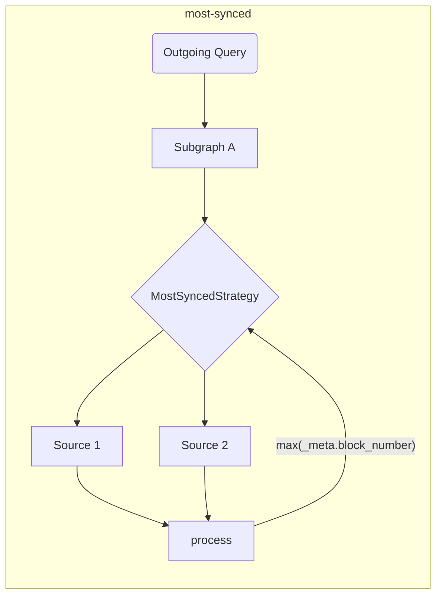

# The Graph Client Tools

Dieses Repo ist das Zuhause für [The Graph](https://thegraph.com) Tools auf der Verbraucherseite (sowohl für Browser- als auch NodeJS-Umgebungen).

## Hintergrund

Die in diesem Repo bereitgestellten Tools sollen den DX bereichern und erweitern und die zusätzliche Schicht hinzufügen, die für dApps erforderlich ist, um verteilte Anwendungen zu implementieren.

Entwickler, die Daten von [The Graph](https://thegraph.com) GraphQL API konsumieren, benötigen oft Peripheriegeräte, um den Datenkonsum zu vereinfachen, und auch Tools, die die gleichzeitige Verwendung mehrerer Indexer ermöglichen.

## Merkmale und Ziele

Diese Bibliothek soll den Netzwerkaspekt des Datenverbrauchs für dApps vereinfachen. Die in diesem Repository bereitgestellten Tools sollen zur Build-Zeit ausgeführt werden, um die Ausführung zur Laufzeit schneller und leistungsfähiger zu machen.

> Die in diesem Repo zur Verfügung gestellten Tools können als Standalone verwendet werden, aber Sie können sie auch mit jedem bestehenden GraphQL Client verwenden!

| Status | Merkmal                                                                 | Anmerkungen                                                                                                                                                                                                                                |
| :----: | ----------------------------------------------------------------------- | ------------------------------------------------------------------------------------------------------------------------------------------------------------------------------------------------------------------------------------------ |
|    ✅   | Mehrere Indexer                                                         | basierend auf Abrufstrategien                                                                                                                                                                                                              |
|    ✅   | Abruf-Strategien                                                        | timeout, retry, fallback, race, highestValue                                                                                                                                                                                               |
|    ✅   | Validierung der Erstellungszeit &amp; Optimierungen |                                                                                                                                                                                                                                            |
|    ✅   | Kundenseitige Zusammensetzung                                           | mit verbessertem Ausführungsplaner (basierend auf GraphQL-Mesh)                                                                                                                                                         |
|    ✅   | Behandlung kettenübergreifender Subgraphen                              | Verwenden Sie ähnliche Subgraphen als eine einzige Quelle                                                                                                                                                                                  |
|    ✅   | Unbearbeitete Ausführung (Standalone-Modus)          | ohne einen umhüllenden GraphQL-Client                                                                                                                                                                                                      |
|    ✅   | Lokale (client-seitige) Mutationen                   |                                                                                                                                                                                                                                            |
|    ✅   | [Automatische Blockverfolgung](../packages/block-tracking/README.md)    | Tracking-Blocknummern [wie hier beschrieben] (https://thegraph.com/docs/en/developer/distributed-systems/#polling-for-updated-data) |
|    ✅   | [Automatischer Seitenumbruch](../packages/auto-pagination/README.md)    | mehrere Anfragen in einem einzigen Aufruf, um mehr als das Indexierer-Limit abzurufen                                                                                                                                                      |
|    ✅   | Integration mit `@apollo/client`                                        |                                                                                                                                                                                                                                            |
|    ✅   | Integration mit `urql`                                                  |                                                                                                                                                                                                                                            |
|    ✅   | TypeScript-Unterstützung                                                | mit eingebautem GraphQL Codegen und `TypedDocumentNode`                                                                                                                                                                                    |
|    ✅   | [`@live`-Abfragen](./live.md)                                           | Auf der Grundlage von Umfragen                                                                                                                                                                                                             |

> Einen [erweiterten Architekturentwurf finden Sie hier](./architecture.md)

## Erste Schritte

Sie können [Episode 45 von `graphql.wtf`] (https://graphql.wtf/episodes/45-the-graph-client) verfolgen, um mehr über Graph Client zu erfahren:

[](https://graphql.wtf/episodes/45-the-graph-client)

Um loszulegen, stellen Sie sicher, dass Sie [The Graph Client CLI] in Ihrem Projekt installieren:

```sh
yarn add -D @graphprotocol/client-cli
# oder, mit NPM:
npm install --save-dev @graphprotocol/client-cli
```

> Das CLI wird als Dev-Abhängigkeit installiert, da wir es verwenden, um optimierte Laufzeit-Artefakte zu erzeugen, die direkt aus Ihrer Anwendung geladen werden können!

Erstellen Sie eine Konfigurationsdatei (mit dem Namen `.graphclientrc.yml`) und verweisen Sie auf Ihre GraphQL-Endpunkte, die z.B. von The Graph bereitgestellt werden:

```yml
# .graphclientrc.yml
sources:
  - name: uniswapv2
    handler:
      graphql:
        endpoint: https://api.thegraph.com/subgraphs/name/uniswap/uniswap-v2
```

Erstellen Sie nun ein Laufzeit-Artefakt, indem Sie The Graph Client CLI ausführen:

```sh
Graphclient erstellen
```

> Hinweis: Sie müssen dies mit dem Präfix `yarn` ausführen oder es als Skript in Ihrer `package.json` hinzufügen.

Dies sollte eine einsatzbereite eigenständige Funktion `execute` erzeugen, die Sie für die Ausführung Ihrer GraphQL-Operationen verwenden können. Sie sollten eine Ausgabe ähnlich der folgenden erhalten:

```sh
GraphClient: Bereinigung vorhandener Artefakte
GraphClient: Einlesen der Konfiguration
🕸️: Erzeugen des einheitlichen Schemas
🕸️: Erzeugen von Artefakten
🕸️: Erzeugen der Indexdatei in TypeScript
🕸️: Schreiben der index.ts für ESM auf die Festplatte.
🕸️: Aufräumen
🕸️: Erledigt! =&gt; .graphclient
```

Nun wird das Artefakt `.graphclient` für Sie generiert, und Sie können es direkt aus Ihrem Code importieren und Ihre Abfragen ausführen:

```ts
import { execute } from '../.graphclient'

const myQuery = gql`
  query pairs {
    pair(id: "0x00004ee988665cdda9a1080d5792cecd16dc1220") {
      id
      token0 {
        id
        symbol
        name
      }
      token1 {
        id
        symbol
        name
      }
    }
  }
`

async function main() {
  const result = await execute(myQuery, {})
  console.log(result)
}

main()
```

### Vanilla JavaScript anstelle von TypeScript verwenden

GraphClient CLI generiert die Client-Artefakte standardmäßig als TypeScript-Dateien, aber Sie können CLI so konfigurieren, dass JavaScript- und JSON-Dateien zusammen mit zusätzlichen TypeScript-Definitionsdateien generiert werden, indem Sie `--fileType js` oder `--fileType json` verwenden.

Das `js`-Flag generiert alle Dateien als JavaScript-Dateien mit ESM-Syntax und das `json`-Flag generiert Quellartefakte als JSON-Dateien, während der Einstiegspunkt JavaScript-Dateien mit der alten CommonJS-Syntax erzeugt, da nur CommonJS JSON-Dateien als Module unterstützt.

Wenn Sie nicht gerade CommonJS(`require`) verwenden, empfehlen wir Ihnen, das `js`-Flag zu verwenden.

`graphclient --fileType js`

- [Ein Beispiel für die Verwendung von JavaScript in CommonJS-Syntax mit JSON-Dateien](../examples/javascript-cjs)
- [Ein Beispiel für die Verwendung von JavaScript in der ESM-Syntax](../examples/javascript-esm)

#### The Graph Client Tools

The Graph Client CLI verfügt über ein eingebautes GraphiQL, so dass Sie mit Abfragen in Echtzeit experimentieren können.

Das GraphQL-Schema, das in dieser Umgebung serviert wird, ist das letztendliche Schema, das auf allen zusammengesetzten Subgraphen und Transformationen basiert, die Sie angewendet haben.

Um das DevTool GraphiQL zu starten, führen Sie den folgenden Befehl aus:

```sh
graphclient serve-dev
```

Und öffnen Sie http://localhost:4000/, um GraphiQL zu verwenden. Sie können nun mit Ihrem Graph-Client-seitigen GraphQL-Schema lokal experimentieren! 🥳

#### Beispiele

Sie können auch auf [examples directory in this repo](../examples) verweisen, für fortgeschrittene Beispiele und Integrationsbeispiele:

- [TypeScript & React example with raw `execute` and built-in GraphQL-Codegen](../examples/execute)
- [TS/JS NodeJS Einzelplatzmodus](../Beispiele/node)
- [Client-seitige GraphQL-Zusammensetzung](../Beispiele/Zusammensetzung)
- [Integration mit Urql und React](../Beispiele/urql)
- [Integration mit NextJS und TypeScript](../examples/nextjs)
- [Integration mit Apollo-Client und React](../examples/apollo)
- [Integration with React-Query](../examples/react-query)
- _Kettenübergreifende Zusammenführung (gleicher Subgraphen, unterschiedliche Ketten)_
- - [Parallele SDK-Aufrufe](../examples/cross-chain-sdk)
- - [Parallele interne Aufrufe mit Schemaerweiterungen](../examples/cross-chain-extension)
- [Ausführung mit Transforms anpassen (Auto-Pagination und Auto-Block-Tracking)](../examples/transforms)

### Erweiterte Beispiele/Funktionen

#### Anpassen von Netzanrufen

Sie können die Netzwerkausführung anpassen (z. B. um Authentifizierungs-Header hinzuzufügen), indem Sie `operationHeaders` verwenden:

```yaml
sources:
  - name: uniswapv2
    handler:
      graphql:
        endpoint: https://api.thegraph.com/subgraphs/name/uniswap/uniswap-v2
        operationHeaders:
          Authorization: Bearer MY_TOKEN
```

Sie können auch Laufzeitvariablen verwenden, wenn Sie dies wünschen, und sie deklarativ angeben:

```yaml
Quellen:
  - Name: uniswapv2
    Handler:
      graphql:
        endpoint: https://api.thegraph.com/subgraphs/name/uniswap/uniswap-v2
        operationHeaders:
          Authorization: Bearer {context.config.apiToken}
```

Dann können Sie dies bei der Ausführung von Vorgängen angeben:

```ts
execute(myQuery, myVariables, {
  config: {
    apiToken: 'MY_TOKEN',
  },
})
```

> Sie finden die [vollständige Dokumentation für den `graphql`-Handler hier](https://graphql-mesh.com/docs/handlers/graphql#config-api-reference).

#### Umgebungsvariablen Interpolation

Wenn Sie Umgebungsvariablen in Ihrer Graph-Client-Konfigurationsdatei verwenden möchten, können Sie die Interpolation mit dem `env`-Helper nutzen:

```yaml
sources:
  - name: uniswapv2
    handler:
      graphql:
        endpoint: https://api.thegraph.com/subgraphs/name/uniswap/uniswap-v2
        operationHeaders:
          Authorization: Bearer {env.MY_API_TOKEN} # runtime
```

Stellen Sie dann sicher, dass Sie `MY_API_TOKEN` definiert haben, wenn Sie `process.env` zur Laufzeit ausführen.

Sie können auch Umgebungsvariablen angeben, die zur Erstellungszeit (während der Ausführung von `graphclient build`) gefüllt werden sollen, indem Sie den Namen der Umgebungsvariablen direkt verwenden:

```yaml
sources:
  - name: uniswapv2
    handler:
      graphql:
        endpoint: https://api.thegraph.com/subgraphs/name/uniswap/uniswap-v2
        operationHeaders:
          Authorization: Bearer ${MY_API_TOKEN} # build time
```

> Sie finden die [vollständige Dokumentation für den `graphql`-Handler hier](https://graphql-mesh.com/docs/handlers/graphql#config-api-reference).

#### Abrufstrategien und mehrere Graph-Indexer

Es ist eine gängige Praxis, mehr als einen Indexer in dApps zu verwenden. Um die ideale Erfahrung mit The Graph zu erreichen, können Sie mehrere „Fetch“-Strategien angeben, um den Vorgang reibungsloser und einfacher zu gestalten.

Alle „Abruf“-Strategien können kombiniert werden, um den ultimativen Ausführungsfluss zu schaffen.

<details> <summary>`retry`</summary>

Mit dem Mechanismus `retry` können Sie die Wiederholungsversuche für einen einzelnen GraphQL-Endpunkt/Quelle festlegen.

Der Wiederholungslauf wird unter beiden Bedingungen ausgeführt: bei einem Netzwortfehler oder aufgrund eines Laufzeitfehlers (Indizierungsproblem/Verfügbarkeit des Indexers).

```yaml
sources:
  - name: uniswapv2
    handler:
      graphql:
        endpoint: https://api.thegraph.com/subgraphs/name/uniswap/uniswap-v2
        retry: 2 # specify here, if you have an unstable/error prone indexer
```

</details>

<details><summary>`Timeout`</summary>

Der „Timeout“-Mechanismus ermöglicht es Ihnen, den „Timeout“ für einen bestimmten GraphQL-Endpunkt anzugeben.

```yaml
sources:
  - name: uniswapv2
    handler:
      graphql:
        endpoint: https://api.thegraph.com/subgraphs/name/uniswap/uniswap-v2
        timeout: 5000 # 5 seconds
```

</details>

<details> <summary>`Fallback`</summary>

Der „Fallback“-Mechanismus ermöglicht es Ihnen, mehr als einen GraphQL-Endpunkt für dieselbe Quelle zu verwenden.

Dies ist nützlich, wenn Sie mehr als einen Indexer für denselben Subgraphen verwenden und bei einem Fehler/Timeout zurückgreifen möchten. Sie können diese Strategie auch verwenden, um einen benutzerdefinierten Indexer zu verwenden, der jedoch auf [The Graph Hosted Service] (https://thegraph.com/hosted-service) zurückgreifen kann.

```yaml
sources:
  - name: uniswapv2
    handler:
      graphql:
        strategy: fallback
        sources:
          - endpoint: https://bad-uniswap-v2-api.com
            retry: 2
            timeout: 5000
          - endpoint: https://api.thegraph.com/subgraphs/name/uniswap/uniswap-v2
```

</details>

<details> <summary>`race`</summary>

Der „Race“-Mechanismus ermöglicht es Ihnen, mehr als einen GraphQL-Endpunkt für dieselbe Quelle zu verwenden und bei jeder Ausführung ein Race durchzuführen.

Dies ist nützlich, wenn Sie mehr als einen Indizierer für denselben Subgraphen verwenden möchten und beide Quellen gegeneinander antreten lassen wollen, um die schnellste Antwort von allen angegebenen Indizierern zu erhalten.

```yaml
sources:
  - name: uniswapv2
    handler:
      graphql:
        strategy: race
        sources:
          - endpoint: https://bad-uniswap-v2-api.com
          - endpoint: https://api.thegraph.com/subgraphs/name/uniswap/uniswap-v2
```

</details>

<details>  <summary>`höchsterWert`</summary>

Diese Strategie ermöglicht es Ihnen, parallele Anfragen an verschiedene Endpunkte für dieselbe Quelle zu senden und die aktuellste auszuwählen.

Dies ist nützlich, wenn Sie die meisten synchronisierten Daten für denselben Subgraphen über verschiedene Indexer/Quellen auswählen möchten.

```yaml
sources:
  - name: uniswapv2
    handler:
      graphql:
        strategy: highestValue
        strategyConfig:
          selectionSet: |
            {
              _meta {
                block {
                  number
                }
              }
            }
          value: '_meta.block.number'
        sources:
          - endpoint: https://api.thegraph.com/subgraphs/name/uniswap/uniswap-v2-1
          - endpoint: https://api.thegraph.com/subgraphs/name/uniswap/uniswap-v2-2
```



</details>

#### Blockverfolgung

The Graph Client kann Blocknummern verfolgen und die folgenden Abfragen durchführen, indem er [diesem Muster] (https://thegraph.com/docs/en/developer/distributed-systems/#polling-for-updated-data) mit der Transformation `blockTracking` folgt;

```yaml
sources:
  - name: uniswapv2
    handler:
      graphql:
        endpoint: https://api.thegraph.com/subgraphs/name/uniswap/uniswap-v2
    transforms:
      - blockTracking:
          # Sie möchten vielleicht die Schema-Validierung für einen schnelleren Start deaktivieren
           validateSchema: true
          # Ignorieren Sie die Felder, die nicht verfolgt werden sollen
          ignoreFieldNames: [users, prices]
          # Schließen Sie die Operation mit den folgenden Namen aus
          ignoreOperationNames: [NotFollowed]
```

[Hier können Sie ein funktionierendes Beispiel ausprobieren](../examples/transforms)

#### Automatische Paginierung

Bei den meisten Subgraphen ist die Anzahl der Datensätze, die Sie abrufen können, begrenzt. In diesem Fall müssen Sie mehrere Anfragen mit Paginierung senden.

```graphql
query {
 # Wirft einen Fehler, wenn das Limit 1000 ist
 users(first: 2000) {
 id
 name
 }
}
```

Sie müssen also die folgenden Vorgänge nacheinander senden:

```graphql
query {
 # Wirft einen Fehler, wenn das Limit 1000 ist
 users(first: 1000) {
 id
 name
 }
}
```

Dann nach der ersten Antwort:

```graphql
query {
 # Wirft einen Fehler, wenn die Grenze bei 1000 liegt
 users(first: 1000, skip: 1000) {
 id
 name
 }
}
```

Nach der zweiten Antwort müssen Sie die Ergebnisse manuell zusammenführen. The Graph Client erlaubt Ihnen jedoch, die erste Anfrage zu stellen, und führt diese mehreren Anfragen automatisch für Sie durch.

Alles, was Sie tun müssen, ist:

```yaml
sources:
  - name: uniswapv2
    handler:
      graphql:
        endpoint: https://api.thegraph.com/subgraphs/name/uniswap/uniswap-v2
    transforms:
      - autoPagination:
          # Sie möchten vielleicht die Schema-Validierung für einen schnelleren Start deaktivieren
          validateSchema: true
```

[Hier können Sie ein funktionierendes Beispiel ausprobieren](../examples/transforms)

#### Client-seitige Komposition

The Graph Client verfügt über integrierte Unterstützung für clientseitige GraphQL Composition (powered by [GraphQL-Tools Schema-Stitching](https://graphql-tools.com/docs/schema-stitching/stitch-combining-schemas)).

Sie können diese Funktion nutzen, um eine einzige GraphQL-Schicht aus mehreren Subgraphen zu erstellen, die auf mehreren Indexierern bereitgestellt werden.

> 💡 Tipp: Sie können beliebige GraphQL-Quellen zusammenstellen, und nicht nur Subgraphen!

Triviale Komposition kann durch Hinzufügen von mehr als einer GraphQL-Quelle zu Ihrer `.graphclientrc.yml`-Datei erfolgen, hier ein Beispiel:

```yaml
sources:
  - name: uniswapv2
    handler:
      graphql:
        endpoint: https://api.thegraph.com/subgraphs/name/uniswap/uniswap-v2
  - name: compoundv2
    handler:
      graphql:
        endpoint: https://api.thegraph.com/subgraphs/name/graphprotocol/compound-v2
```

Solange es keine Konflikte zwischen den zusammengestellten Schemata gibt, können Sie sie zusammenstellen und dann eine einzige Abfrage für beide Subgraphen ausführen:

```graphql
query myQuery {
  # this one is coming from compound-v2
  markets(first: 7) {
    borrowRate
  }
  # dieser kommt von uniswap-v2
  pair(id: "0x00004ee988665cdda9a1080d5792cecd16dc1220") {
    id
    token0 {
      id
    }
    token1 {
      id
    }
  }
}
```

Sie können auch Konflikte beheben, Teile des Schemas umbenennen, benutzerdefinierte GraphQL-Felder hinzufügen und die gesamte Ausführungsphase ändern.

Für fortgeschrittene Anwendungsfälle mit Komposition lesen Sie bitte die folgenden Ressourcen:

- [Fortgeschrittenes Kompositionsbeispiel](../examples/composition)
- [GraphQL-Mesh Schema-Transformationen](https://graphql-mesh.com/docs/transforms/transforms-introduction)
- [GraphQL-Tools Schema-Stitching Dokumentation](https://graphql-tools.com/docs/schema-stitching/stitch-combining-schemas)

#### TypeScript-Unterstützung

Wenn Ihr Projekt in TypeScript geschrieben ist, können Sie die Leistung von [`TypedDocumentNode`] (https://the-guild.dev/blog/typed-document-node) nutzen und eine vollständig typisierte GraphQL-Client-Erfahrung haben.

Der Standalone-Modus von The GraphQL und populäre GraphQL-Client-Bibliotheken wie Apollo-Client und urql haben integrierte Unterstützung für `TypedDocumentNode`!

The Graph Client CLI wird mit einer gebrauchsfertigen Konfiguration für den [GraphQL Code Generator] (https://graphql-code-generator.com) geliefert und kann `TypedDocumentNode` basierend auf Ihren GraphQL-Operationen erzeugen.

Um loszulegen, definieren Sie Ihre GraphQL-Operationen in Ihrem Anwendungscode und verweisen auf diese Dateien mit dem Abschnitt `documents` in `.graphclientrc.yml`:

```yaml
sources:
  - # ... Ihre Subgraphs/GQL-Quellen hier

documents:
  - ./src/example-query.graphql
```

Sie können auch Glob-Ausdrücke verwenden oder sogar auf Codedateien verweisen, und die CLI wird Ihre GraphQL-Abfragen automatisch finden:

```yaml
documents:
  - './src/**/*.graphql'
 - './src/**/*.{ts,tsx,js,jsx}'
```

Führen Sie nun den GraphQL-CLI-Befehl `build` erneut aus. Die CLI wird für jede gefundene Operation ein `TypedDocumentNode`-Objekt unter `.graphclient` erzeugen.

> Stellen Sie sicher, dass Sie Ihre GraphQL-Operationen benennen, sonst werden sie ignoriert!

Zum Beispiel wird für eine Abfrage mit dem Namen `query ExampleQuery` das entsprechende `ExampleQueryDocument` in `.graphclient` generiert. Sie können es nun importieren und für Ihre GraphQL-Aufrufe verwenden. So haben Sie eine vollständig typisierte Erfahrung, ohne TypeScript manuell schreiben oder angeben zu müssen:

```ts
import { ExampleQueryDocument, execute } from '../.graphclient'

async function main() {
 // Die Variable "result" ist vollständig typisiert und repräsentiert die genaue Struktur der Felder, die Sie in Ihrer Abfrage ausgewählt haben.
 const result = await execute(ExampleQueryDocument, {})
 console.log(result)
}
```

> Sie können ein [TypeScript-Projektbeispiel hier](../examples/urql) finden.

#### Client-seitige Mutationen

Aufgrund der Natur des Graph-Client-Setups ist es möglich, clientseitige Schemata hinzuzufügen, die Sie später überbrücken können, um beliebigen Code auszuführen.

Dies ist hilfreich, da Sie benutzerdefinierten Code als Teil Ihres GraphQL-Schemas implementieren können und es als einheitliches Anwendungsschema haben, das einfacher zu verfolgen und zu entwickeln ist.

> Dieses Dokument erklärt, wie man benutzerdefinierte Mutationen hinzufügt, aber eigentlich kann man jede GraphQL-Operation (Abfrage/Mutation/Abonnements) hinzufügen. Sehen Sie [Erweiterung des einheitlichen Schemaartikels](https://graphql-mesh.com/docs/guides/extending-unified-schema) für weitere Informationen über diese Funktion.

Um zu beginnen, definieren Sie einen Abschnitt `additionalTypeDefs` in Ihrer Konfigurationsdatei:

```yaml
additionalTypeDefs: |
 # Wir sollten dtn fehlenden Typ `Mutation` definieren
  extend schema {
    mutation: Mutation
  }

  type Mutation {
    doSomething(input: SomeCustomInput!): Boolean!
  }

  input SomeCustomInput {
    field: String!
  }
```

Fügen Sie dann einen Pointer auf eine benutzerdefinierte GraphQL-Resolver-Datei hinzu:

```yaml
additionalResolvers:
  - './resolvers'
```

Erstellen Sie nun `resolver.js` (oder `resolvers.ts`) in Ihrem Projekt, und implementieren Sie Ihre benutzerdefinierte Mutation:

```js
module.exports = {
  Mutation: {
    async doSomething(root, args, context, info) {
      // Here, you can run anything you wish.
      // For example, use `web3` lib, connect a wallet and so on.

      return true
    },
  },
}
```

Wenn Sie TypeScript verwenden, können Sie auch eine vollständig typsichere Signatur erhalten, indem Sie dies tun:

```ts
import { Resolvers } from './.graphclient'

// Now it's fully typed!
const resolvers: Resolvers = {
  Mutation: {
    async doSomething(root, args, context, info) {
      // Here, you can run anything you wish.
      // For example, use `web3` lib, connect a wallet and so on.

      return true
    },
  },
}

export default resolvers
```

Wenn Sie Laufzeitvariablen in Ihren GraphQL-Ausführungskontext einfügen müssen, können Sie das folgende Snippet verwenden:

```ts
execute(
  MY_QUERY,
  {},
  {
    myHelper: {}, // this will be available in your Mutation resolver as `context.myHelper`
  },
)
```

> [Mehr über clientseitige Schemaerweiterungen erfahren Sie hier](https://graphql-mesh.com/docs/guides/extending-unified-schema)

> [Sie können auch Abfragefelder als Teil Ihrer Mutation delegieren und aufrufen] (https://graphql-mesh.com/docs/guides/extending-unified-schema#using-the-sdk-to-fetch-sources)

## Lizenz

Freigegeben unter der [MIT-Lizenz](../LICENSE).
