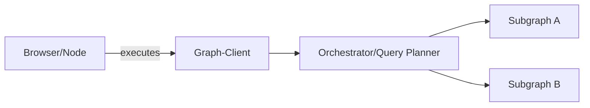
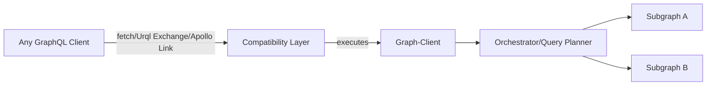
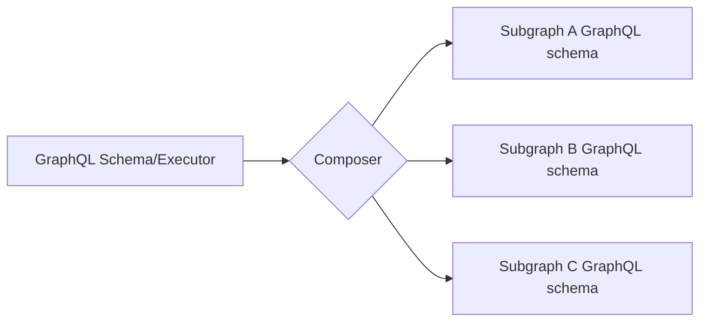
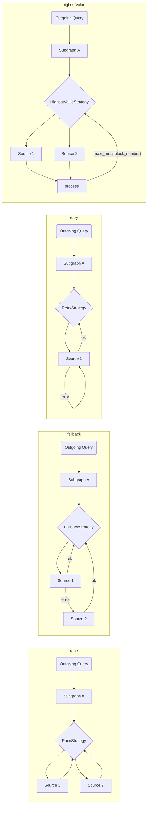
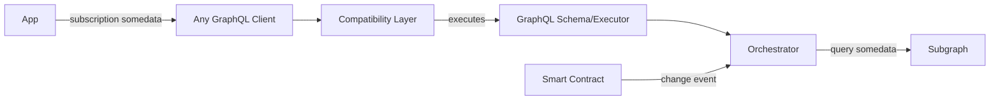

# The Graph-Client-Architektur

Um der Notwendigkeit der Unterstützung eines verteilten Netzwerks gerecht zu werden, planen wir mehrere Maßnahmen, um sicherzustellen, dass der Graph-Client alles bietet, was eine App braucht:

1. Mehrere Subgraphen zusammenstellen (auf der Client-Seite)
2. Fallback auf mehrere Indexer/Quellen/gehostete Dienste
3. Automatische/manuelle Kommissionierstrategie
4. Agnostischer Kern, mit der Fähigkeit, die Integration mit jedem GraphQL-Client auszuführen

## Standalone-Modus

## Mit jedem GraphQL-Client

## Subgraphen-Zusammensetzung

Um eine einfache und effiziente client-seitige Komposition zu ermöglichen, werden wir [`graphql-tools`](https://graphql-tools.com) verwenden, um ein entferntes Schema / Executor zu erstellen, das dann in den GraphQL-Client eingehängt werden kann.

API könnte entweder rohe `graphql-tools`-Transformatoren oder die Verwendung von [GraphQL-Mesh declarative API] (https://graphql-mesh.com/docs/transforms/transforms-introduction) für die Zusammenstellung des Schemas sein.

## Strategien für die Ausführung von Subgraphen

Für jeden Subgraphen, der als Quelle definiert ist, gibt es eine Möglichkeit, seine(n) Quell-Indexer und die Abfragestrategie zu definieren, hier einige Optionen:

> Wir können mehrere eingebaute Strategien liefern, zusammen mit einfachen Schnittstellen, die es Entwicklern ermöglichen, ihre eigenen zu schreiben.

Um das Konzept der Strategien auf die Spitze zu treiben, können wir sogar eine magische Schicht aufbauen, die Abonnement-als-Abfrage mit einem beliebigen Hook durchführt und einen reibungslosen DX für Dapps bietet:

Mit diesem Mechanismus können Entwickler GraphQL-Abonnements schreiben und ausführen, aber unter der Haube führen wir eine GraphQL-Abfrage an die The Graph-Indexer aus und ermöglichen den Anschluss eines externen Hooks/einer externen Probe zur erneuten Ausführung der Operation.
Auf diese Weise können wir auf Änderungen am Smart Contract selbst achten, und der GraphQL-Client füllt die Lücke, wenn Echtzeitänderungen von The Graph erforderlich sind.
