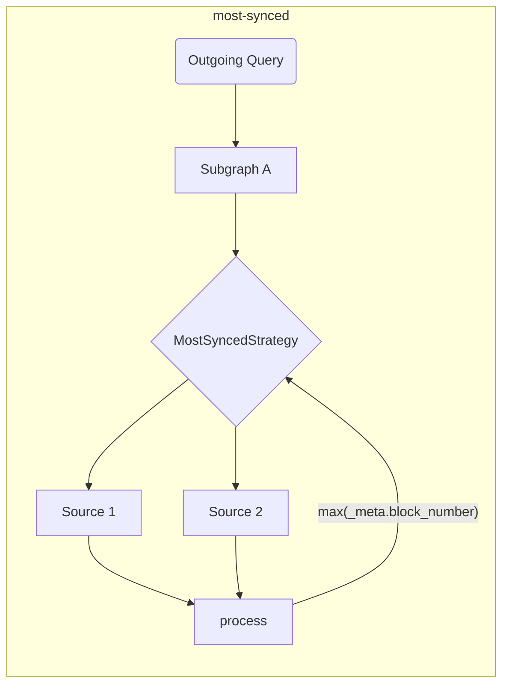

# Les outils de The Graph Client

Ce répertoire abrite les outils côté consommateur de [The Graph](https://thegraph.com) (pour les environnements navigateur et NodeJS).

## Contexte

Les outils fournis dans ce repo sont destinés à enrichir et à étendre le DX, et à ajouter la couche supplémentaire requise pour les dApps afin de mettre en œuvre des applications distribuées.

Les développeurs qui consomment des données à partir de [The Graph](https://thegraph.com) GraphQL API ont souvent besoin de périphériques pour faciliter la consommation des données, ainsi que d'outils permettant d'utiliser plusieurs Indexeurs en même temps.

## Fonctionnalités et objectifs

Cette bibliothèque est destinée à simplifier l'aspect réseau de la consommation de données pour les dApps. Les outils fournis dans ce dépôt sont destinés à être exécutés au moment de la construction, afin de rendre l'exécution plus rapide et plus performante au moment de l'exécution.

> Les outils fournis dans ce repo peuvent être utilisés de manière autonome, mais vous pouvez également les utiliser avec n'importe quel client GraphQL existant !

| Status | Fonctionnalité                                                      | Notes                                                                                                                                      |
| :----: | ------------------------------------------------------------------- | ------------------------------------------------------------------------------------------------------------------------------------------ |
|    ✅   | Indexeurs multiples                                                 | sur la base de stratégies d'extraction                                                                                                     |
|    ✅   | Stratégies d'extraction                                             | timeout, retry, fallback, race, highestValue                                                                                               |
|    ✅   | Validations et optimisations du temps de construction               |                                                                                                                                            |
|    ✅   | Composition côté client                                             | avec un planificateur d'exécution amélioré (basé sur GraphQL-Mesh)                                                      |
|    ✅   | Gestion des subgraphs multi-chaînes                                 | Utiliser des subgraphs similaires comme source unique                                                                                      |
|    ✅   | Exécution brute (mode autonome)                  | sans client GraphQL intégré                                                                                                                |
|    ✅   | Mutations locales (côté client)                  |                                                                                                                                            |
|    ✅   | [Suivi automatique des blocs](../packages/block-tracking/README.md) | les numéros de blocs de suivi [tels que décrits ici](https://thegraph.com/docs/en/developer/distributed-systems/#polling-for-updated-data) |
|    ✅   | [Pagination automatique](../packages/auto-pagination/README.md)     | effectuer plusieurs requêtes en un seul appel pour récupérer plus que la limite de l'Indexeur                                              |
|    ✅   | Intégration avec `@apollo/client`                                   |                                                                                                                                            |
|    ✅   | Intégration avec `urql`                                             |                                                                                                                                            |
|    ✅   | Prise en charge de TypeScript                                       | avec GraphQL Codegen et `TypedDocumentNode` intégrés                                                                                       |
|    ✅   | [`@live` queries](./live.md)                                        | Sur la base de sondages                                                                                                                    |

> Vous pouvez trouver un [modèle d'architecture étendu ici](./architecture.md)

## Introduction

Vous pouvez suivre [l'épisode 45 de `graphql.wtf`] (https://graphql.wtf/episodes/45-the-graph-client) pour en savoir plus sur Graph Client :

[](https://graphql.wtf/episodes/45-the-graph-client)

Pour commencer, assurez-vous d'installer [The Graph Client CLI] dans votre projet :

```sh
yarn add -D @graphprotocol/client-cli
# or, with NPM:
npm install --save-dev @graphprotocol/client-cli
```

> La CLI est installé en tant que dépendance dev puisque nous l'utilisons pour produire des artefacts d'exécution optimisés qui peuvent être chargés directement à partir de votre application !

Créez un fichier de configuration (appelé `.graphclientrc.yml`) et pointez vers vos endpoints GraphQL fournis par The Graph, par exemple :

```yml
# .graphclientrc.yml
sources:
  - name: uniswapv2
    handler:
      graphql:
        endpoint: https://api.thegraph.com/subgraphs/name/uniswap/uniswap-v2
```

Maintenant, créez un artefact d'exécution en exécutant The Graph Client CLI:

```sh
graphclient build
```

> Note : vous devez exécuter ceci avec le préfixe `yarn`, ou ajouter ce script dans votre `package.json`.

Cela devrait produire une fonction autonome `execute` prête à l'emploi, que vous pouvez utiliser pour exécuter les opérations GraphQL de votre application, vous devriez obtenir une sortie similaire à la suivante :

```sh
GraphClient: Cleaning existing artifacts
GraphClient: Reading the configuration
🕸️: Generating the unified schema
🕸️: Generating artifacts
🕸️: Generating index file in TypeScript
🕸️: Writing index.ts for ESM to the disk.
🕸️: Cleanup
🕸️: Done! => .graphclient
```

Maintenant, l'artefact `.graphclient` est généré pour vous, et vous pouvez l'importer directement depuis votre code, et lancer vos requêtes :

```ts
import { execute } from '../.graphclient'

const myQuery = gql`
  query pairs {
    pair(id: "0x00004ee988665cdda9a1080d5792cecd16dc1220") {
      id
      token0 {
        id
        symbol
        name
      }
      token1 {
        id
        symbol
        name
      }
    }
  }
`

async function main() {
  const result = await execute(myQuery, {})
  console.log(result)
}

main()
```

### Utiliser Vanilla JavaScript au lieu de TypeScript

GraphClient CLI génère par défaut les artefacts du client sous forme de fichiers TypeScript, mais vous pouvez configurer la CLI pour générer des fichiers JavaScript et JSON ainsi que des fichiers de définition TypeScript supplémentaires en utilisant `--fileType js` ou `--fileType json`.

L'option `js` génère tous les fichiers en tant que fichiers JavaScript avec la syntaxe ESM et l'option `json` génère les artefacts source en tant que fichiers JSON tandis que le fichier JavaScript du point d'entrée avec l'ancienne syntaxe CommonJS parce que seul CommonJS supporte les fichiers JSON en tant que modules.

A moins que vous n'utilisiez CommonJS (`require`) spécifiquement, nous vous recommandons d'utiliser le l'option `js`.

`graphclient --fileType js`

- [Un exemple d'utilisation de JavaScript dans la syntaxe CommonJS avec des fichiers JSON](../examples/javascript-cjs)
- [Un exemple d'utilisation de JavaScript dans la syntaxe ESM](../examples/javascript-esm)

#### Le DevTools The Graph Client

La CLI de The Graph Client est dotée d'une interface GraphiQL intégrée, ce qui vous permet d'expérimenter des requêtes en temps réel.

Le schéma GraphQL servi dans cet environnement est le schéma final basé sur tous les subgraphs composés et les transformations que vous avez appliquées.

Pour lancer Le DevTool GraphiQL, exécutez la commande suivante :

```sh
graphclient serve-dev
```

Et ouvrez http://localhost:4000/ pour utiliser GraphiQL. Vous pouvez maintenant expérimenter votre schéma GraphQL côté client localement ! 🥳

#### Exemples

Vous pouvez également vous référer aux [répertoires examples dans ce repo](../examples), pour des exemples plus avancés et des exemples d'intégration :

- [Exemple TypeScript & React avec un `execute` brut et GraphQL-Codegen intégré](../examples/execute)
- [TS/JS NodeJS standalone mode](../examples/node)
- [Composition GraphQL côté client](../examples/composition)
- [Intégration avec Urql et React](../examples/urql)
- [Intégration avec NextJS et TypeScript](../examples/nextjs)
- [Intégration avec Apollo-Client et React](../examples/apollo)
- [Intégration avec React-Query](../examples/react-query)
- Fusion interchain (même subgraph, blockchains différentes)
- - [Appels SDK parallèles](../examples/cross-chain-sdk)
- - [Appels internes parallèles avec les extensions de schéma](../examples/cross-chain-extension)
- [Personnaliser l'exécution avec Transforms (auto-pagination et auto-block-tracking)](../examples/transforms)

### Exemples/fonctionnalités avancés

#### Personnaliser les appels réseau

Vous pouvez personnaliser l'exécution du réseau (par exemple, pour ajouter des en-têtes d'authentification) en utilisant `operationHeaders` :

```yaml
sources:
  - name: uniswapv2
    handler:
      graphql:
        endpoint: https://api.thegraph.com/subgraphs/name/uniswap/uniswap-v2
        operationHeaders:
          Authorization: Bearer MY_TOKEN
```

Vous pouvez également utiliser des variables d'exécution si vous le souhaitez, et les spécifier de manière déclarative :

```yaml
sources:
  - name: uniswapv2
    handler:
      graphql:
        endpoint: https://api.thegraph.com/subgraphs/name/uniswap/uniswap-v2
        operationHeaders:
          Authorization: Bearer {context.config.apiToken}
```

Vous pouvez ensuite le spécifier lorsque vous exécutez des opérations :

```ts
execute(myQuery, myVariables, {
  config: {
    apiToken: 'MY_TOKEN',
  },
})
```

> Vous pouvez trouver la [documentation complète du gestionnaire `graphql` ici](https://graphql-mesh.com/docs/handlers/graphql#config-api-reference).

#### Interpolation des Variables d'environnement

Si vous souhaitez utiliser des variables d'environnement dans votre fichier de configuration Graph Client, vous pouvez utiliser l'interpolation avec l'assistant `env` :

```yaml
sources:
  - name: uniswapv2
    handler:
      graphql:
        endpoint: https://api.thegraph.com/subgraphs/name/uniswap/uniswap-v2
        operationHeaders:
          Authorization: Bearer {env.MY_API_TOKEN} # runtime
```

Ensuite, assurez-vous que `MY_API_TOKEN` est défini lorsque vous lancez `process.env` au moment de l'exécution.

Vous pouvez également spécifier des variables d'environnement à remplir au moment de la construction (pendant l'exécution de `graphclient build`) en utilisant directement le nom env-var :

```yaml
sources:
  - name: uniswapv2
    handler:
      graphql:
        endpoint: https://api.thegraph.com/subgraphs/name/uniswap/uniswap-v2
        operationHeaders:
          Authorization: Bearer ${MY_API_TOKEN} # temps de construction
```

> Vous pouvez trouver la [documentation complète du gestionnaire `graphql` ici](https://graphql-mesh.com/docs/handlers/graphql#config-api-reference).

#### Extraire les Stratégies et les multiples Indexeurs de The Graph

C'est une pratique courante d'utiliser plus d'un Indexeur dans les dApps, donc pour obtenir l'expérience idéale avec The Graph, vous pouvez spécifier plusieurs stratégies `fetch` afin de rendre les choses plus fluides et plus simples.

Toutes les stratégies `fetch` peuvent être combinées pour créer le flux d'exécution ultime.

<details>
 <summary>`retry`</summary>

Le mécanisme (retry)`réessai` vous permet de spécifier les tentatives de réessais pour un seul endpoint/source GraphQL.

The retry flow will execute in both conditions: a netword error, or due to a runtime error (indexing issue/inavailability of the indexer).

```yaml
sources:
  - name: uniswapv2
    handler:
      graphql:
        endpoint: https://api.thegraph.com/subgraphs/name/uniswap/uniswap-v2
        retry: 2 # spécifier ici, si vous avez un Indexeur instable ou sujet à des erreurs
```

</details>

<details>
 <summary>`timeout`</summary>

Le mécanisme `timeout` vous permet de spécifier le `timeout` pour un endpoint GraphQL donné.

```yaml
sources:
  - name: uniswapv2
    handler:
      graphql:
        endpoint: https://api.thegraph.com/subgraphs/name/uniswap/uniswap-v2
        timeout: 5000 # 5 secondes
```

</details>

<details>
 <summary>`fallback`</summary>

Le mécanisme `fallback` vous permet de spécifier l'utilisation de plus d'un endpoint GraphQL, pour la même source.

Ceci est utile si vous voulez utiliser plus d'un Indexeur pour le même subgraph, et vous replier en cas d'erreur ou de dépassement de délai. Vous pouvez également utiliser cette stratégie pour utiliser un Indexeur personnalisé, mais lui permettre de se replier sur [Le Service Hébergé de The Graph](https://thegraph.com/hosted-service).

```yaml
sources:
  - name: uniswapv2
    handler:
      graphql:
        strategy: fallback
        sources:
          - endpoint: https://bad-uniswap-v2-api.com
            retry: 2
            timeout: 5000
          - endpoint: https://api.thegraph.com/subgraphs/name/uniswap/uniswap-v2
```

</details>

<details>
 <summary>`race`</summary>

Le mécanisme `race` permet d'utiliser plusieurs endpoints GraphQL simultanément pour une même source et de prendre la réponse la plus rapide.

Cette option est utile si vous souhaitez utiliser plus d'un Indexeur pour le même subgraph, et permettre aux deux sources de faire la course et d'obtenir la réponse la plus rapide de tous les Indexeurs spécifiés.

```yaml
sources:
  - name: uniswapv2
    handler:
      graphql:
        strategy: race
        sources:
          - endpoint: https://bad-uniswap-v2-api.com
          - endpoint: https://api.thegraph.com/subgraphs/name/uniswap/uniswap-v2
```

</details>

<details>
  <summary>`highestValue`</summary>

Cette stratégie vous permet d'envoyer des demandes parallèles à différents endpoints pour la même source et de choisir la plus récente.

Cette option est utile si vous souhaitez choisir les données les plus synchronisées pour le même subgraph parmi différents Indexeurs/sources.

```yaml
sources:
  - name: uniswapv2
    handler:
      graphql:
        strategy: highestValue
        strategyConfig:
          selectionSet: |
            {
              _meta {
                block {
                  number
                }
              }
            }
          value: '_meta.block.number'
        sources:
          - endpoint: https://api.thegraph.com/subgraphs/name/uniswap/uniswap-v2-1
          - endpoint: https://api.thegraph.com/subgraphs/name/uniswap/uniswap-v2-2
```



</details>

#### Suivi des blocs

The Graph Client peut suivre les numéros de blocs et effectuer les requêtes suivantes en suivant [ce schéma](https://thegraph.com/docs/en/developer/distributed-systems/#polling-for-updated-data) avec la transformation `blockTracking` ;

```yaml
sources:
  - name: uniswapv2
    handler:
      graphql:
        endpoint: https://api.thegraph.com/subgraphs/name/uniswap/uniswap-v2
    transforms:
      - blockTracking:
          # Vous pouvez désactiver la validation des schémas pour un démarrage plus rapide
          validateSchema: true
          # Ignorer les champs qui ne doivent pas être suivis
          ignoreFieldNames: [users, prices]
          # Exclure les opérations avec les noms suivants
          ignoreOperationNames: [NotFollowed]
```

[Vous pouvez essayer un exemple pratique ici](../examples/transforms)

#### Pagination automatique

Dans la plupart des subgraphs, le nombre d'enregistrements que vous pouvez récupérer est limité. Dans ce cas, vous devez envoyer plusieurs requêtes avec pagination.

```graphql
query {
  # Lance une erreur si la limite est de 1000
  users(first: 2000) {
    id
    name
  }
}
```

Vous devez donc envoyer les opérations suivantes l'une après l'autre :

```graphql
query {
  # Lance une erreur si la limite est de 1000
  users(first: 1000) {
    id
    name
  }
}
```

Ensuite, après la première réponse :

```graphql
query {
  # Lance une erreur si la limite est de 1000
  users(first: 1000, skip: 1000) {
    id
    name
  }
}
```

Après la deuxième réponse, vous devez fusionner les résultats manuellement. En revanche, The Graph Client vous permet de faire la première réponse et exécute automatiquement ces demandes multiples pour vous.

Tout ce que vous avez à faire, c'est :

```yaml
sources:
  - name: uniswapv2
    handler:
      graphql:
        endpoint: https://api.thegraph.com/subgraphs/name/uniswap/uniswap-v2
    transforms:
      - autoPagination:
          # Vous pouvez désactiver la validation des schémas pour accélérer le démarrage.
          validateSchema: true
```

[Vous pouvez essayer un exemple pratique ici](../examples/transforms)

#### Composition côté client

The Graph Client est doté d'une prise en charge intégrée de la composition GraphQL côté client (assurée par [GraphQL-Tools Schema-Stitching](https://graphql-tools.com/docs/schema-stitching/stitch-combining-schemas)).

Vous pouvez tirer parti de cette fonctionnalité pour créer une seule couche GraphQL à partir de plusieurs subgraphs, déployés sur plusieurs Indexeurs.

> 💡 Astuce : Vous pouvez composer n'importe quelle source GraphQL, et pas seulement des subgraphs !

Une composition triviale peut être faite en ajoutant plus d'une source GraphQL à votre fichier `.graphclientrc.yml`, voici un exemple :

```yaml
sources:
  - name: uniswapv2
    handler:
      graphql:
        endpoint: https://api.thegraph.com/subgraphs/name/uniswap/uniswap-v2
  - name: compoundv2
    handler:
      graphql:
        endpoint: https://api.thegraph.com/subgraphs/name/graphprotocol/compound-v2
```

Tant qu'il n'y a pas de conflit entre les schémas composés, vous pouvez les composer, puis exécuter une seule requête sur les deux subgraphs :

```graphql
query myQuery {
  # Celui-ci provient de compound-v2
  markets(first: 7) {
    borrowRate
  }
  # Celui-ci provient de l'uniswap-v2
  pair(id: "0x00004ee988665cdda9a1080d5792cecd16dc1220") {
    id
    token0 {
      id
    }
    token1 {
      id
    }
  }
}
```

Vous pouvez également résoudre des conflits, renommer des parties du schéma, ajouter des champs GraphQL personnalisés et modifier l'ensemble de la phase d'exécution.

Pour les cas d'utilisation avancée de la composition, veuillez vous référer aux ressources suivantes :

- [Exemple de composition avancée](../examples/composition)
- [Transformations de schémas GraphQL-Mesh](https://graphql-mesh.com/docs/transforms/transforms-introduction)
- [Documentation GraphQL-Tools Schema-Stitching](https://graphql-tools.com/docs/schema-stitching/stitch-combining-schemas)

#### Prise en charge de TypeScript

Si votre projet est écrit en TypeScript, vous pouvez exploiter la puissance de [`TypedDocumentNode`](https://the-guild.dev/blog/typed-document-node) et avoir une expérience GraphQL client entièrement typée.

Le mode autonome de The GraphQL, et les bibliothèques client GraphQL populaires comme Apollo-Client et urql ont une prise en charge intégrée pour `TypedDocumentNode` !

La CLI The Graph Client est livrée avec une configuration prête à l'emploi pour [GraphQL Code Generator](https://graphql-code-generator.com), et il peut générer `TypedDocumentNode` sur la base de vos opérations GraphQL.

Pour commencer, définissez vos opérations GraphQL dans le code de votre application, et pointez vers ces fichiers en utilisant la section `documents` de `.graphclientrc.yml` :

```yaml
sources:
  -  # ... vos sources Subgraphs/GQL ici

documents:
  - ./src/example-query.graphql
```

Vous pouvez également utiliser des expressions globales, ou même pointer vers des fichiers de code, et la CLI trouvera automatiquement vos requêtes GraphQL :

```yaml
documents:
  - './src/**/*.graphql'
  - './src/**/*.{ts,tsx,js,jsx}'
```

Maintenant, lancez à nouveau la commande `build` de la CLI GraphQL, la CLI va générer un objet `TypedDocumentNode` sous `.graphclient` pour chaque opération trouvée.

> Veillez à nommer vos opérations GraphQL, sinon elles seront ignorées !

Par exemple, une requête appelée `query ExampleQuery` aura le `ExampleQueryDocument` correspondant généré dans `.graphclient`. Vous pouvez maintenant l'importer et l'utiliser pour vos appels GraphQL, et vous aurez une expérience entièrement typée sans écrire ou spécifier manuellement du TypeScript :

```ts
import { ExampleQueryDocument, execute } from '../.graphclient'

async function main() {
  //La variable "result" est entièrement typée et représente la structure exacte des champs que vous avez sélectionnés dans votre requête.
  const result = await execute(ExampleQueryDocument, {})
  console.log(result)
}
```

> Vous pouvez trouver un [exemple de projet TypeScript ici](../examples/urql).

#### Mutations côté client

En raison de la nature de la configuration de Graph-Client, il est possible d'ajouter un schéma côté client, que vous pouvez ensuite relier pour exécuter n'importe quel code arbitraire.

Cela est utile car vous pouvez implémenter du code personnalisé dans le cadre de votre schéma GraphQL et en faire un schéma d'application unifié qui est plus facile à suivre et à développer.

> Ce document explique comment ajouter des mutations personnalisées, mais en fait vous pouvez ajouter n'importe quelle opération GraphQL (requête/mutation/abonnements). Voir [Extension de l'article sur le schéma unifié](https://graphql-mesh.com/docs/guides/extending-unified-schema) pour plus d'informations sur cette fonctionnalité.

Pour commencer, définissez une section `additionalTypeDefs` dans votre fichier de configuration :

```yaml
additionalTypeDefs: |
  # Nous devrions définir le type `Mutation` manquant
  extend schema {
    mutation: Mutation
  }

  type Mutation {
    doSomething(input: SomeCustomInput!): Boolean!
  }

  input SomeCustomInput {
    field: String!
  }
```

Ensuite, ajoutez un pointeur vers un fichier de résolveurs GraphQL personnalisé :

```yaml
additionalResolvers:
  - './resolvers'
```

Maintenant, créez `resolver.js` (ou, `resolvers.ts`) dans votre projet, et implémentez votre mutation personnalisée :

```js
module.exports = {
  Mutation: {
    async doSomething(root, args, context, info) {
      // Ici, vous pouvez exécuter tout ce que vous voulez.
      // Par exemple, utiliser la librairie `web3`, connecter un portefeuille et ainsi de suite.

      return true
    },
  },
}
```

Si vous utilisez TypeScript, vous pouvez également obtenir une signature entièrement sécurisée en faisant :

```ts
import { Resolvers } from './.graphclient'

// Maintenant, il est entièrement saisi !
const resolvers: Resolvers = {
  Mutation: {
    async doSomething(root, args, context, info) {
      // Ici, vous pouvez exécuter tout ce que vous voulez.
      // Par exemple, utiliser la librairie `web3`, connecter un portefeuille et ainsi de suite.

      return true
    },
  },
}

export default resolvers
```

Si vous avez besoin d'injecter des variables d'exécution dans votre `contexte` d'exécution GraphQL, vous pouvez utiliser l'extrait suivant :

```ts
execute(
  MY_QUERY,
  {},
  {
    myHelper: {}, // Ceci sera disponible dans votre Mutation resolver as `context.myHelper`
  },
)
```

> [Pour en savoir plus sur les extensions de schéma côté client, cliquez ici](https://graphql-mesh.com/docs/guides/extending-unified-schema)

> [Vous pouvez également déléguer et appeler des champs de requête dans le cadre de votre mutation](https://graphql-mesh.com/docs/guides/extending-unified-schema#using-the-sdk-to-fetch-sources)

## Licence

Publié sous la [licence MIT](../LICENSE).
