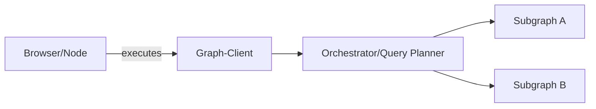
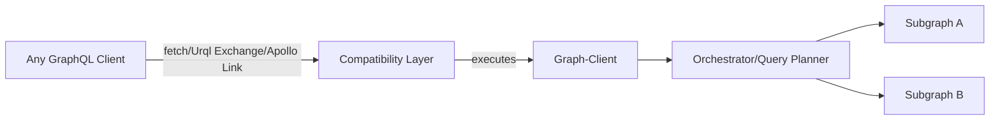
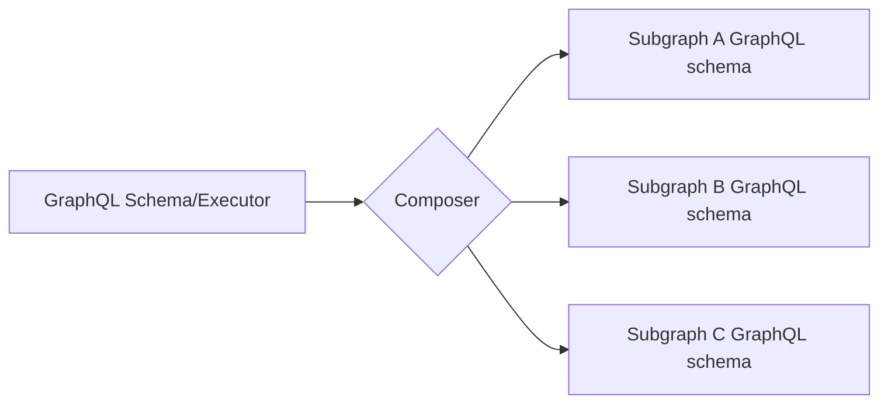
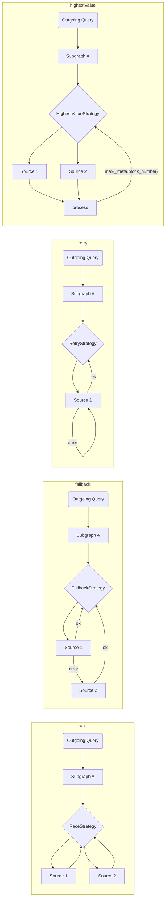
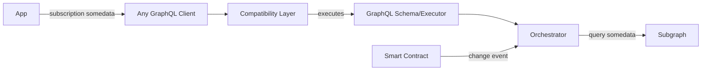

# L'architecture The Graph Client

Pour répondre à la nécessité de prendre en charge un réseau distribué, nous prévoyons de prendre plusieurs mesures pour faire en sorte que The Graph client fournisse tout ce dont l'application a besoin :

1. Composer plusieurs subgraphs (côté client)
2. Repli sur plusieurs Indexeurs/sources/services hébergés
3. Stratégie de prélèvement automatique/manuel à la source
4. Agnostic core, with the ability to run integrate with any GraphQL client

## Mode Standalone

## Avec n'importe quel client GraphQL

## Composition d'un subgraph

Pour permettre une composition simple et efficace côté client, nous allons utiliser [`graphql-tools`](https://graphql-tools.com) pour créer un schéma / Executor distant, qui peut ensuite être accroché au client GraphQL.

L'API peut être soit des transformateurs `graphql-tools` bruts, soit l'utilisation de l'[API déclarative GraphQL-Mesh](https://graphql-mesh.com/docs/transforms/transforms-introduction) pour composer le schéma.

## Stratégies d'exécution des subgraphs

Within every Subgraph defined as source, there will be a way to define it's source(s) indexer and the querying strategy, here are a few options:

> We can ship a several built-in strategies, along with a simple interfaces to allow developers to write their own.

Pour pousser le concept de stratégies à l'extrême, nous pouvons même construire une couche magique qui fait de l'abonnement en tant que requête, avec n'importe quel crochet, et fournit un DX fluide pour les dapps :

Avec ce mécanisme, les développeurs peuvent écrire et exécuter des `subscriptions` GraphQL, mais sous le capot, nous exécuterons une `requête` GraphQL vers les Indexeurs de The Graph, et nous permettrons de connecter n'importe quel hook/probe externe pour ré-exécuter l'opération.
De cette façon, nous pouvons surveiller les changements sur le Smart Contract lui-même, et le client GraphQL comblera l'écart sur le besoin de changements en temps réel de The Graph.
