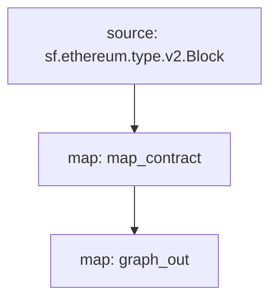

[Substreams](/substreams)は、StreamingFastがThe Graph Networkのために開発した、ブロックチェーンのデータを処理するための新しいフレームワークである。サブストリームモジュールは、サブグラフエンティティと互換性のあるエンティティの変更を出力することができます。サブグラフはこのようなサブストリームモジュールをデータソースとして使用することができ、サブストリームのインデックス作成速度と追加データをサブグラフ開発者にもたらします。

## 要件

このクックブックには、[yarn](https://yarnpkg.com/)、[ローカル サブストリーム開発に必要な依存関係](https://substreams.streamingfast.io/developers-guide/installation-requirements)、および Graph CLI の最新バージョン (>=0.52.0) が必要です。

```
npm install -g @graphprotocol/graph-cli
```

## 料理本を入手

> このクックブックでは、この [Substreams-powered subgraph を参考として](https://github.com/graphprotocol/graph-tooling/tree/main/examples/substreams-powered-subgraph) を使用します。

```
グラフ初期化 --from-example substreams-powered-subgraph
```

## サブストリームパッケージの定義

Substreamsパッケージは、型（[プロトコルバッファ](https://protobuf.dev/)として定義される）、モジュール（Rustで記述される）、および型を参照し、モジュールがどのようにトリガーされるかを指定する`substreams.yaml`ファイルで構成されます。[サブストリームの開発についての詳細はサブストリームのドキュメントを参照](/substreams)してください。また、[awesome-substreams](https://github.com/pinax-network/awesome-substreams)や[Substreams cookbook](https://github.com/pinax-network/substreams-cookbook)を参照してください。

問題の Substreams パッケージは、メインネット イーサリアム上のコントラクトのデプロイメントを検出し、新しくデプロイされたすべてのコントラクトの作成ブロックとタイムスタンプを追跡します。これを行うには、`/proto/example.proto` に専用の `Contract` タイプがあります ([プロトコル バッファーの定義の詳細](https://protobuf.dev/programming-guides/proto3/#simple)):

```proto
syntax = "proto3";

package example;

message Contracts {
  repeated Contract contracts = 1;
}

message Contract {
    string address = 1;
    uint64 blockNumber = 2;
    string timestamp = 3;
    uint64 ordinal = 4;
}
```

Substreams パッケージのコア ロジックは、`lib.rs` の `map_contract` モジュールです。これは、すべてのブロックを処理し、元に戻されなかった Create 呼び出しをフィルタリングして、`Contracts` を返します。

```
#[substreams::handlers::map]
fn map_contract(block: eth::v2::Block) -> Result<Contracts, substreams::errors::Error> {
    let contracts = block
        .transactions()
        .flat_map(|tx| {
            tx.calls
                .iter()
                .filter(|call| !call.state_reverted)
                .filter(|call| call.call_type == eth::v2::CallType::Create as i32)
                .map(|call| Contract {
                    address: format!("0x{}", Hex(&call.address)),
                    block_number: block.number,
                    timestamp: block.timestamp_seconds().to_string(),
                    ordinal: tx.begin_ordinal,
                })
        })
        .collect();
    Ok(Contracts { contracts })
```

Substreams パッケージは、互換性のあるエンティティの変更を出力するモジュールを持っている限り、サブグラフで使用できます。サンプルの Substreams パッケージには、「lib.rs」内に追加の「graph_out」モジュールがあり、グラフ ノードで処理できる「substreams_entity_change::pb::entity::EntityChanges」出力を返します。

> 「substreams_entity_change」クレートには、エンティティの変更を単純に生成するための専用の「Tables」関数もあります (\[[documentation](https://docs.rs/substreams-entity-change/1.2.2/substreams_entity_change/tables/index.html))。生成されたエンティティ変更は、対応するサブグラフの `subgraph.graphql` で定義された `schema.graphql` エンティティと互換性がある必要があります。

```
#[substreams::handlers::map]
pub fn graph_out(contracts: Contracts) -> Result<EntityChanges, substreams::errors::Error> {
    // hash map of name to a table
    let mut tables = Tables::new();

    for contract in contracts.contracts.into_iter() {
        tables
            .create_row("Contract", contract.address)
            .set("timestamp", contract.timestamp)
            .set("blockNumber", contract.block_number);
    }

    Ok(tables.to_entity_changes())
}
```

これらの型とモジュールは `substreams.yaml` にまとめられています。

```
specVersion: v0.1.0
package:
  name: 'substreams_test' # the name to be used in the .spkg
  version: v1.0.1 # the version to use when creating the .spkg

imports: # dependencies
  entity: https://github.com/streamingfast/substreams-entity-change/releases/download/v0.2.1/substreams-entity-change-v0.2.1.spkg

protobuf: # specifies custom types for use by Substreams modules
  files:
    - example.proto
  importPaths:
    - ./proto

binaries:
  default:
    type: wasm/rust-v1
    file: ./target/wasm32-unknown-unknown/release/substreams.wasm

modules: # specify modules with their inputs and outputs.
  - name: map_contract
    kind: map
    inputs:
      - source: sf.ethereum.type.v2.Block
    output:
      type: proto:test.Contracts

  - name: graph_out
    kind: map
    inputs:
      - map: map_contract
    output:
      type: proto:substreams.entity.v1.EntityChanges # this type can be consumed by Graph Node

```

`substreams chart` を実行することで、ブロックから `map_contract`、`graph_out` までの全体的な「フロー」を確認できます。



この Substreams パッケージをサブグラフで使用できるように準備するには、次のコマンドを実行する必要があります。

```bash
yarn substreams:protogen # generates types in /src/pb
yarn substreams:build # builds the substreams
yarn substreams:package # packages the substreams in a .spkg file

# alternatively, yarn substreams:prepare calls all of the above commands
```

> 基礎となるサブストリーム コマンドを理解したい場合は、これらのスクリプトは「package.json」ファイルで定義されます。

これにより、「substreams.yaml」のパッケージ名とバージョンに基づいて「spkg」ファイルが生成されます。 「spkg」ファイルには、グラフ ノードがこのサブストリーム パッケージを取り込むために必要なすべての情報が含まれています。

> Substreams パッケージを更新する場合、加えた変更に応じて、`spkg` を最新にするために上記のコマンドの一部またはすべてを実行する必要がある場合があります。

## サブストリームによって動作するサブグラフの定義

サブストリームによって動作するサブグラフは、新しい "substreams" というデータソースの kind を導入します。このようなサブグラフは、ただ1つのデータソースのみを持つことができます

このデータ ソースは、インデックス付きネットワーク、相対的なファイルの場所としての Substreams パッケージ (`spkg`)、およびサブグラフ互換のエンティティ変更を生成するその Substreams パッケージ内のモジュール (この場合は、上記の Substreams パッケージからの `map_entity_changes`) を指定する必要があります。マッピングは指定されていますが、単にマッピングの種類 (「サブストリーム/グラフ エンティティ」) と apiVersion を識別するだけです。

> 現在、Subgraph Studio と The Graph Network は、「メインネット」 (メインネット イーサリアム) にインデックスを付けるサブストリームを利用したサブグラフをサポートしています。

```yaml
specVersion: 0.0.4
description: Ethereum Contract Tracking Subgraph (powered by Substreams)
repository: https://github.com/graphprotocol/graph-tooling
schema:
  file: schema.graphql
dataSources:
  - kind: substreams
    name: substream_test
    network: mainnet
    source:
      package:
        moduleName: graph_out
        file: substreams-test-v1.0.1.spkg
    mapping:
      kind: substreams/graph-entities
      apiVersion: 0.0.5
```

`subgraph.yaml` もスキーマ ファイルを参照します。このファイルの要件は変更されていませんが、指定されたエンティティは、`subgraph.yaml` で参照される Substreams モジュールによって生成されるエンティティの変更と互換性がある必要があります。

```graphql
type Contract @entity {
  id: ID!

  "The timestamp when the contract was deployed"
  timestamp: String!

  "The block number of the contract deployment"
  blockNumber: BigInt!
}
```

上記を考慮すると、サブグラフ開発者は Graph CLI を使用して、このサブストリームを利用したサブグラフをデプロイできます。

> サブストリームを利用したサブグラフのインデックス作成メインネット Ethereum は、[Subgraph Studio](https://thegraph.com/studio/) にデプロイできます。

```bash
yarn install # install graph-cli
yarn subgraph:build # build the subgraph
yarn subgraph:deploy # deploy the subgraph
```

それでおしまい！サブストリームを利用したサブグラフを構築してデプロイしました。

## サブストリームを利用したサブグラフの提供

サブストリームを利用したサブグラフを提供するには、チェーン ヘッドを追跡するための Firehose または RPC だけでなく、関連するネットワークのサブストリーム プロバイダーを使用してグラフ ノードを構成する必要があります。これらのプロバイダーは、「config.toml」ファイル経由で設定できます。

```toml
[chains.mainnet]
shard = "main"
protocol = "ethereum"
provider = [
  { label = "substreams-provider-mainnet",
    details = { type = "substreams",
    url = "https://mainnet-substreams-url.grpc.substreams.io/",
    token = "exampletokenhere" }},
  { label = "firehose-provider-mainnet",
    details = { type = "firehose",
    url = "https://mainnet-firehose-url.grpc.firehose.io/",
    token = "exampletokenhere" }},
]
```
