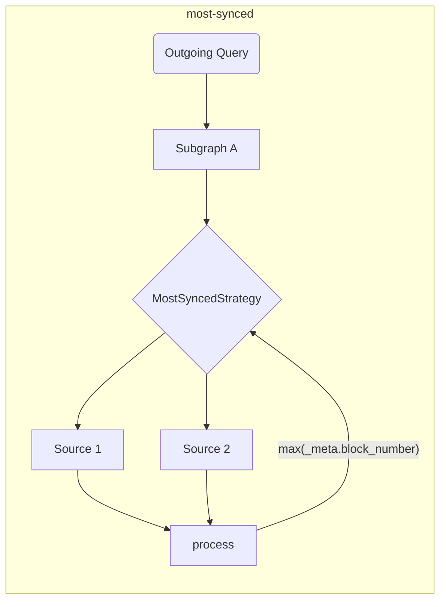

# Ferramentas do The Graph Client

Este repositório é o lar das ferramentas de lado do consumidor do [The Graph](https://thegraph.com) (para ambientes tanto de navegador quanto de NodeJS).

## Contexto

As ferramentas fornecidas neste repositório têm o propósito de enriquecer e ampliar o DX, e adicionar a camada necessária para dApps para a implementação de aplicações distribuídas.

Programadores que consomem dados da API GraphQL, do [The Graph](https://thegraph.com), geralmente precisam de periféricos para facilitar o consumo de dados, e também de ferramentas que permitem o uso simultâneo de vários indexadores.

## Funções e Objetivos

Esta biblioteca tem o intuito de simplificar o aspeto de rede do consumo de dados para dApps. As ferramentas fornecidas neste repositório devem ser executadas em tempo de compilação, para torná-las mais rápidas e eficientes durante o tempo de execução.

> As ferramentas fornecidas neste repositório podem ser usadas por si próprias, mas também podem ser usadas com qualquer cliente existente da GraphQL!

| Status | Característica                                                            | Notas                                                                                                                                           |
| :----: | ------------------------------------------------------------------------- | ----------------------------------------------------------------------------------------------------------------------------------------------- |
|    ✅   | Múltiplos indexadores                                                     | baseado em estratégias de busca                                                                                                                 |
|    ✅   | Estratégias de Busca                                                      | `timeout`, `retry`, `fallback`, `race`, `highestValue`                                                                                          |
|    ✅   | Validações e otimizações de tempo de compilação                           |                                                                                                                                                 |
|    ✅   | Composição de Lado do Cliente                                             | com planeador de execução (baseado em GraphQL-Mesh)                                                                          |
|    ✅   | Manuseamento de Subgraph em Várias Chains                                 | Usa subgraphs semelhantes como uma única fonte                                                                                                  |
|    ✅   | Execução Bruta (modo autónomo)                         | sem embrulho de cliente GraphQL                                                                                                                 |
|    ✅   | Mutações Locais (do lado do cliente)                   |                                                                                                                                                 |
|    ✅   | [Rastreamento Automático de Blocos](../packages/block-tracking/README.md) | rastreamento de números de bloco [conforme descrito aqui](https://thegraph.com/docs/en/developer/distributed-systems/#polling-for-updated-data) |
|    ✅   | [Paginação Automática](../packages/auto-pagination/README.md)             | faz várias solicitações numa única chamada para buscar mais do que o limite do indexador                                                        |
|    ✅   | Integração com `@apollo/client`                                           |                                                                                                                                                 |
|    ✅   | Integração com `urql`                                                     |                                                                                                                                                 |
|    ✅   | Apoio a TypeScript                                                        | com o gerador de código da GraphQL embutido e `TypedDocumentNode`                                                                               |
|    ✅   | [Queries `@live`](./live.md)                                              | Baseado em sondagem                                                                                                                             |

> Você pode encontrar um [esboço expandido de arquitetura aqui](./architecture.md)

## Como Começar

Você pode seguir o [Episódio 45 do `graphql.wtf`](https://graphql.wtf/episodes/45-the-graph-client) para saber mais sobre o Graph Client:

[](https://graphql.wtf/episodes/45-the-graph-client)

Para começar, instale a CLI do Graph Client no seu projeto:

```sh
yarn add -D @graphprotocol/client-cli
# ou, com NPM:
npm install --save-dev @graphprotocol/client-cli
```

> A CLI está instalada como dependência de programação, visto que estamos a usá-la para produzir artefactos otimizados de tempo de execução, que podem ser carregados diretamente do seu aplicativo!

Depois, crie um arquivo de configuração (chamado `.graphclientrc.yml`) e aponte aos seus endpoints GraphQL oferecidos pelo The Graph, por exemplo:

```yml
# .graphclientrc.yml
sources:
  - name: uniswapv2
    handler:
      graphql:
        endpoint: https://api.thegraph.com/subgraphs/name/uniswap/uniswap-v2
```

Agora, crie um artefacto de tempo de execução executando a CLI do Graph Client:

```sh
graphclient build
```

> Nota: é necessário executar isso com o prefixo `yarn`, ou adicioná-lo como um script no seu `package.json`.

Isto deve produzir uma função `execute` autónoma, pronta para uso, que serve para executar as operações do GraphQL. A saída deve ser semelhante ao seguinte:

```sh
GraphClient: A limpar artefactos existentes
GraphClient: A ler a configuração
🕸️: A gerar o schema unificado
🕸️: A gerar artefactos
🕸️: A gerar arquivo index no TypeScript
🕸️: A escrever index.ts para módulos ESM no disco.
🕸️: Limpeza
🕸️: Pronto! => .graphclient
```

Agora, o artefacto `.graphclient` está gerado para você, e pode ser importado diretamente do seu código. Você pode executar os seus queries assim:

```ts
import { execute } from '../.graphclient'

const myQuery = gql`
  query pairs {
    pair(id: "0x00004ee988665cdda9a1080d5792cecd16dc1220") {
      id
      token0 {
        id
        symbol
        name
      }
      token1 {
        id
        symbol
        name
      }
    }
  }
`

async function main() {
  const result = await execute(myQuery, {})
  console.log(result)
}

main()
```

### Usando o JavaScript Normal Em Vez do TypeScript

Normalmente, a CLI do GraphClient gera os artefactos do cliente como arquivos TypeScript, mas dá para configurar a CLI para gerar arquivos JavaScript e JSON junto com arquivos adicionais de definição de TypeScript, usando `--fileType js` ou `--fileType json`.

A flag `js` gera todos os arquivos como arquivos JavaScript com sintaxe ESM, e a flag `json` gera artefactos de origem como JSONs, enquanto um arquivo JavaScript de ponto inicial sai com a antiga sintaxe CommonJS, porque apenas a CommonJS suporta JSONs como módulos.

A menos que use especificamente CommonJS(`require`), recomendamos o uso da flag `js`.

`graphclient --fileType js`

- [Um exemplo de uso de JavaScript em sintaxe CommonJS com arquivos JSON](../examples/javascript-cjs)
- [Um exemplo de uso de JavaScript em sintaxe ESM](../examples/javascript-esm)

#### Ferramentas para Programadores do The Graph Client

A CLI do Graph Client vem com um GraphiQL interno, então é possível experimentar com queries em tempo real.

O schema da GraphQL servido nesse ambiente é o eventual schema baseado em todos os subgraphs compostos, e transformações, que você aplicou.

Para iniciar o GraphiQL, execute o seguinte comando:

```sh
graphclient serve-dev
```

E abra http://localhost:4000/ para usar o GraphiQL. Agora você pode experimentar o seu schema GraphQL do lado do cliente do The Graph, localmente! 🥳

#### Exemplos

Você também pode se referir ao [diretório de exemplos neste repositório](../examples), para exemplos mais avançados e alguns de integração:

- [Exemplo de TypeScript & React com `execute` bruto e gerador de código da GraphQL embutido](../examples/execute)
- [Modo avulso de TS/JS NodeJS](../examples/node)
- [Composição de GraphQL do lado do cliente](../examples/composition)
- [Integração com Urql e React](../examples/urql)
- [Integração com NextJS e TypeScript](../examples/nextjs)
- [Integração com Apollo-Client e React](../examples/apollo)
- [Integração com React-Query](../examples/react-query)
- _Mesclagem entre chains (mesmo Subgraph, chains diferentes)_
- - [Chamadas paralelas de SDK](../examples/cross-chain-sdk)
- - [Chamadas internas paralelas com extensões de schema](../examples/cross-chain-extension)
- [Personalize a execução com Transforms (paginação e rastreamento de bloco automáticos)](../examples/transforms)

### Exemplos Avançados e Funções

#### Como Personalizar Chamadas de Rede

A execução da rede pode ser personalizada (por exemplo, para adicionar cabeçalhos de autenticação) usando `operationHeaders`:

```yaml
sources:
  - name: uniswapv2
    handler:
      graphql:
        endpoint: https://api.thegraph.com/subgraphs/name/uniswap/uniswap-v2
        operationHeaders:
          Authorization: Bearer MY_TOKEN
```

Você também pode usar variáveis de tempo de execução se desejar, e especificá-las de forma declarativa:

```yaml
sources:
  - name: uniswapv2
    handler:
      graphql:
        endpoint: https://api.thegraph.com/subgraphs/name/uniswap/uniswap-v2
        operationHeaders:
          Authorization: Bearer {context.config.apiToken}
```

Então, será possível especificar que quando executar as operações:

```ts
execute(myQuery, myVariables, {
  config: {
    apiToken: 'MY_TOKEN',
  },
})
```

> A documentação completa do handler `graphql` está [aqui](https://graphql-mesh.com/docs/handlers/graphql#config-api-reference).

#### Interpolação de Variáveis de Ambiente

Se deseja usar variáveis de ambiente no seu arquivo de configuração do Graph Client, dá para usar a interpolação com o helper `env`:

```yaml
sources:
  - name: uniswapv2
    handler:
      graphql:
        endpoint: https://api.thegraph.com/subgraphs/name/uniswap/uniswap-v2
        operationHeaders:
          Authorization: Bearer {env.MY_API_TOKEN} # tempo de execução
```

Então, certifique-se que o `MY_API_TOKEN` está definido quando executar `process.env`.

Você também pode especificar variáveis de ambiente a serem preenchidas no tempo de compilação (durante a execução de `graphclient build`) com o uso direto do nome env-var:

```yaml
sources:
  - name: uniswapv2
    handler:
      graphql:
        endpoint: https://api.thegraph.com/subgraphs/name/uniswap/uniswap-v2
        operationHeaders:
          Authorization: Bearer ${MY_API_TOKEN} # tempo de compilação
```

> A documentação completa do handler `graphql` está [aqui](https://graphql-mesh.com/docs/handlers/graphql#config-api-reference).

#### Estratégias de Busca e Múltiplos Indexadores do The Graph

É comum usar mais de um indexador em dApps, então para alcançar a experiência ideal com The Graph, você pode especificar várias estratégias de `fetch` (busca) para torná-las mais suaves e simples.

Todas as estratégias de `fetch` podem ser combinadas para otimizar o fluxo de execução.

<details>
 <summary>`retry`</summary>

O mecanismo `retry` permite que você especifique as tentativas de repetição de um único ponto final/origem da GraphQL.

The retry flow will execute in both conditions: a netword error, or due to a runtime error (indexing issue/inavailability of the indexer).

```yaml
sources:
  - name: uniswapv2
    handler:
      graphql:
        endpoint: https://api.thegraph.com/subgraphs/name/uniswap/uniswap-v2
        retry: 2 # Especifique aqui, se tiver um indexador instável ou suscetível a erros
```

</details>

<details>
 <summary>`timeout`</summary>

O mecanismo `timeout` permite que especifique o `timeout` de um ponto final da GraphQL.

```yaml
sources:
  - name: uniswapv2
    handler:
      graphql:
        endpoint: https://api.thegraph.com/subgraphs/name/uniswap/uniswap-v2
        timeout: 5000 # 5 segundos
```

</details>

<details>
 <summary>`fallback`</summary>

O mecanismo `fallback` permite especificar o uso de mais de um ponto final da GraphQL, para a mesma fonte.

Isso é útil se quiser usar mais de um indexador para o mesmo Subgraph, e usar uma alternativa quando ocorrer um erro ou timeout. Você também pode usar esta estratégia para usar um indexador personalizado, mas permite que ele recorra ao [Serviço Hospedado do The Graph](https://thegraph.com/hosted-service).

```yaml
sources:
  - name: uniswapv2
    handler:
      graphql:
        strategy: fallback
        sources:
          - endpoint: https://bad-uniswap-v2-api.com
            retry: 2
            timeout: 5000
          - endpoint: https://api.thegraph.com/subgraphs/name/uniswap/uniswap-v2
```

</details>

<details>
 <summary>`race`</summary>

O mecanismo `race` permite especificar o uso de mais de um ponto final da GraphQL, para a mesma fonte, e "correr" (executar em simultâneo) em todas as execuções.

Isto é útil se quiser usar mais de um indexador para o mesmo Subgraph, e permitir que ambas as fontes corram pela resposta mais rápida de todos os indexadores especificados.

```yaml
sources:
  - name: uniswapv2
    handler:
      graphql:
        strategy: race
        sources:
          - endpoint: https://bad-uniswap-v2-api.com
          - endpoint: https://api.thegraph.com/subgraphs/name/uniswap/uniswap-v2
```

</details>

<details>
  <summary>`highestValue`</summary>

Esta estratégia permite enviar solicitações paralelas para diferentes pontos finais, para a mesma fonte, e escolher a mais atualizada.

Isso é útil se quiser escolher a maioria dos dados sincronizados para o mesmo Subgraph sobre diferentes indexadores/fontes.

```yaml
sources:
  - name: uniswapv2
    handler:
      graphql:
        strategy: highestValue
        strategyConfig:
          selectionSet: |
            {
              _meta {
                block {
                  number
                }
              }
            }
          value: '_meta.block.number'
        sources:
          - endpoint: https://api.thegraph.com/subgraphs/name/uniswap/uniswap-v2-1
          - endpoint: https://api.thegraph.com/subgraphs/name/uniswap/uniswap-v2-2
```



</details>

#### Rastreamento de Blocos

O Graph Client pode rastrear números de bloco e realizar os seguintes queries ao seguir [este padrão](https://thegraph.com/docs/en/developer/distributed-systems/#polling-for-updated-data) com o transformador `blockTracking`;

```yaml
sources:
  - name: uniswapv2
    handler:
      graphql:
        endpoint: https://api.thegraph.com/subgraphs/name/uniswap/uniswap-v2
    transforms:
      - blockTracking:
          # Se desativar a validação de schema, a inicialização pode ser mais rápida
          validateSchema: true
          # Ignore os campos que não quer que sejam rastreados
          ignoreFieldNames: [users, prices]
          # Exclua a operação com os seguintes nomes
          ignoreOperationNames: [NotFollowed]
```

[Experimente um exemplo funcional aqui](../examples/transforms)

#### Paginação Automática

Com a maioria dos subgraphs, o número de registos que podem ser retirados é limitado. Nesse caso, você tem que enviar várias solicitações com paginação.

```graphql
query {
  # Erro se o limite for 1000
  users(first: 2000) {
    id
    name
  }
}
```

Então, você tem que enviar as seguintes operações em sequência:

```graphql
query {
  # Erro se o limite for 1000
  users(first: 1000) {
    id
    name
  }
}
```

E após a primeira resposta:

```graphql
query {
  # Erro se o limite for 1000
  users(first: 1000, skip: 1000) {
    id
    name
  }
}
```

Após a segunda resposta, os resultados devem ser mesclados manualmente. Porém, em vez disso, o Graph Client permite fazer a primeira, e faz essas múltiplas solicitações para você automaticamente, em segundo plano.

Tudo o que você tem que fazer é:

```yaml
sources:
  - name: uniswapv2
    handler:
      graphql:
        endpoint: https://api.thegraph.com/subgraphs/name/uniswap/uniswap-v2
    transforms:
      - autoPagination:
          # Se desativar a validação de schema, a inicialização fica mais rápida
          validateSchema: true
```

[Experimente um exemplo funcional aqui](../examples/transforms)

#### Composição de Lado do Cliente

O Graph Client possui suporte integrado para Composição GraphQL no lado do cliente (movido a [Soldagem de Schema pelas Ferramentas da GraphQL](https://graphql-tools.com/docs/schema-stitching/stitch-combining-schemas)).

Você pode alavancar esse recurso para criar uma única camada do GraphQL a partir de vários Subgraphs, implantados em vários indexadores.

> 💡 Dica: Você pode compor quaisquer fontes da GraphQL, e não apenas Subgraphs!

A composição trivial pode ser feita ao adicionar mais de uma fonte da GraphQL ao seu arquivo `.graphclientrc.yml`. Veja um exemplo:

```yaml
sources:
  - name: uniswapv2
    handler:
      graphql:
        endpoint: https://api.thegraph.com/subgraphs/name/uniswap/uniswap-v2
  - name: compoundv2
    handler:
      graphql:
        endpoint: https://api.thegraph.com/subgraphs/name/graphprotocol/compound-v2
```

Enquanto não houver conflitos entre os schemas compostos, você pode compor e então executar um único query para ambos os Subgraphs:

```graphql
query myQuery {
  # este vem do compound-v2
  markets(first: 7) {
    borrowRate
  }
  # este vem do uniswap-v2
  pair(id: "0x00004ee988665cdda9a1080d5792cecd16dc1220") {
    id
    token0 {
      id
    }
    token1 {
      id
    }
  }
}
```

Você também pode resolver conflitos, renomear partes do schema, adicionar campos personalizados da GraphQL e modificar toda a fase de execução.

Para casos de uso avançados com composição, por favor consulte os seguintes recursos:

- [Exemplo Avançado de Composição](../examples/composition)
- [Transformações de Schema do Mesh da GraphQL](https://graphql-mesh.com/docs/transforms/transforms-introduction)
- [Documentação de Soldagem de Schema pelas Ferramentas da GraphQL](https://graphql-tools.com/docs/schema-stitching/stitch-combining-schemas)

#### Apoio a TypeScript

Se o seu projeto for escrito no TypeScript, você poderá aproveitar o poder de [`TypedDocumentNode`](https://the-guild.dev/blog/typed-document-node) e ter uma experiência de cliente GraphQL com tipos totalmente definidos.

O modo autónomo da GraphQL, assim como bibliotecas populares de clientes da GraphQL como Apollo-Client e urql, tem suporte integrado ao `TypedDocumentNode`!

A CLI do Graph Client vem com uma configuração pronta para o [Gerador de Código da GraphQL](https://graphql-code-generator.com), e pode gerar `TypedDocumentNode` com base nas suas operações da GraphQL.

Para começar, defina as suas operações GraphQL no código do seu aplicativo e aponte para esses arquivos usando a seção `documents` do `.graphclientrc.yml`:

```yaml
sources:
  -  # ... suas fontes de GQL/Subgraphs aqui

documents:
  - ./src/example-query.graphql
```

Você também pode usar expressões Glob, ou até mesmo apontar para arquivos de código, e a CLI vai encontrar os seus queries da GraphQL automaticamente:

```yaml
documents:
  - './src/**/*.graphql'
  - './src/**/*.{ts,tsx,js,jsx}'
```

Agora, execute o comando `build` na CLI da GraphQL novamente; a CLI gerará um objeto `TypedDocumentNode` sob `.graphclient` para cada operação encontrada.

> Nomeie as suas operações da GraphQL; caso contrário, a ação será ignorada!

Por exemplo, uma query chamada `query ExampleQuery` terá o `ExampleQueryDocument` correspondente gerado no `.graphclient`. Agora dá para importá-lo e usá-lo para as suas chamadas do GraphQL, e você terá uma experiência com tipos definidos sem escrever ou especificar nenhum TypeScript manualmente:

```ts
import { ExampleQueryDocument, execute } from '../.graphclient'

async function main() {
  // o valor "result" tem tipo definido, e representa a estrutura exata dos campos selecionados no seu query.
  const result = await execute(ExampleQueryDocument, {})
  console.log(result)
}
```

> Veja um [exemplo de projeto do TypeScript aqui](../examples/urql).

#### Mutações de Lado do Cliente

Devido à natureza da configuração do Graph Client, é possível adicionar schemas do lado do cliente, para poder fazer depois um bridge para executar qualquer código arbitrário.

Isto é útil, já que você pode implementar códigos personalizados como parte do seu schema GraphQL e tê-los como um schema unificado de aplicativo que é mais fácil de rastrear e se desenvolver.

> Este documento explica como adicionar mutações personalizadas, mas na verdade, você pode adicionar qualquer operação da GraphQL (query/mutação/assinaturas). Veja [Como estender o artigo do schema unificado](https://graphql-mesh.com/docs/guides/extending-unified-schema) para mais informações sobre este recurso.

Para começar, defina uma seção `additionalTypeDefs` no seu arquivo de configuração:

```yaml
additionalTypeDefs: |
  # Definir o tipo `Mutation` que falta
  extend schema {
    mutation: Mutation
  }

  type Mutation {
    doSomething(input: SomeCustomInput!): Boolean!
  }

  input SomeCustomInput {
    field: String!
  }
```

Em seguida, adicione um ponteiro para um arquivo `resolver` personalizado da GraphQL:

```yaml
additionalResolvers:
  - './resolvers'
```

Agora, crie `resolver.js` (ou `resolvers.ts`) no seu projeto e implemente a sua mutação personalizada:

```js
module.exports = {
  Mutation: {
    async doSomething(root, args, context, info) {
      // Aqui, você pode executar o que quiser.
      // Por exemplo, usar a biblio `web3`, conectar uma carteira, e por aí vai.

      return true
    },
  },
}
```

Se usar o TypeScript, você também pode obter uma assinatura totalmente segura com:

```ts
import { Resolvers } from './.graphclient'

// Totalmente definido!
const resolvers: Resolvers = {
  Mutation: {
    async doSomething(root, args, context, info) {
      // Aqui, você pode executar o que quiser.
      // Por exemplo, usar a biblio `web3`, conectar uma carteira, e por aí vai.

      return true
    },
  },
}
```

Se precisar injetar variáveis de tempo de execução no seu `context` de execução da GraphQL, você pode usar o seguinte trecho:

```ts
execute(
  MY_QUERY,
  {},
  {
    myHelper: {}, // isto estará disponível no seu resolver de Mutação como `context.myHelper`
  },
)
```

> [Você pode ler mais sobre extensões de schema do lado do cliente aqui](https://graphql-mesh.com/docs/guides/extending-unified-schema)

> [Você também pode delegar e chamar campos de Query como parte da sua mutação](https://graphql-mesh.com/docs/guides/extending-unified-schema#using-the-sdk-to-fetch-sources)

## Licença

Lançado sob a [licença da MIT](../LICENSE).
