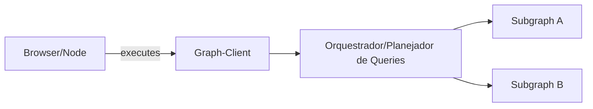
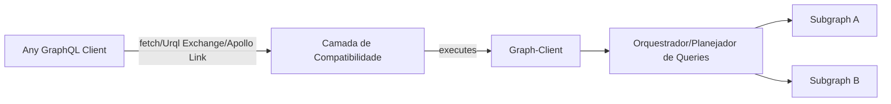
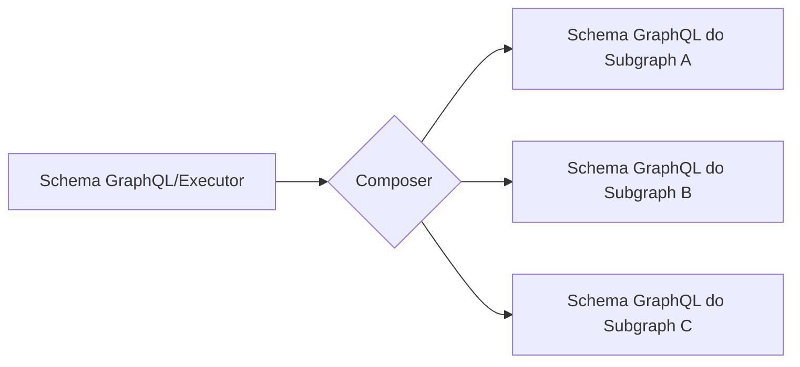
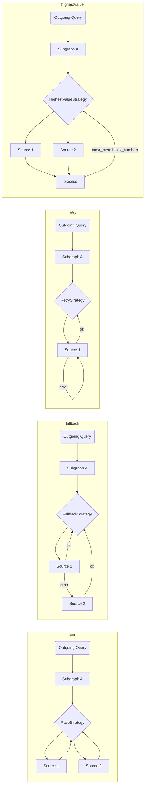
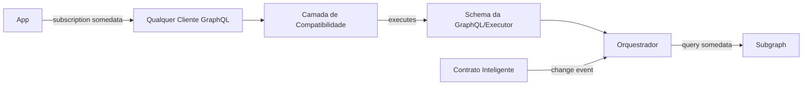

# Arquitetura do The Graph Client

Para resolver a necessidade de oferecer apoio a uma rede distribuída, temos planos para garantir que o Graph Client forneça tudo que o aplicativo precisa:

1. Composição de múltiplos subgraphs (no lado do cliente)
2. Retorno a múltiplos indexadores/fontes de dados/serviços hospedados
3. Estratégia de seleção de fonte: automática/manual
4. Núcleo agnóstico, capaz de integrar com qualquer cliente GraphQL

## Modo avulso

## Com qualquer cliente GraphQL

## Composição de Subgraph

Para permitir uma composição simples e eficiente do lado do cliente, utilizaremos [`graphql-tools`](https://graphql-tools.com) para criar um esquema remoto / Executor, que pode ser ligado ao cliente GraphQL.

A API poderia consistir de transformadores brutos `graphql-tools`, ou usar a [API declarativa da GraphQL-Mesh](https://graphql-mesh.com/docs/transforms/transforms-introduction) para compor o esquema.

## Estratégias de Execução de Subgraph

Dentro de cada Subgraph definido como fonte, haverá uma maneira de definir o seu indexador(es) de fontes e a estratégia de queries; veja algumas opções:

> Podemos enviar várias estratégias embutidas, junto a uma interface simples para permitir que os programadores escrevam as suas próprias.

Para levar o conceito de estratégias ao extremo, podemos até construir uma camada mágica com um modelo de assinatura-como-query, com qualquer gancho, e fornecer um DX suave para dapps:

Com este mecanismo, os programadores podem escrever e executar o `subscription` da GraphQL, mas em segundo plano, executaremos um `query` da GraphQL para os indexadores do The Graph e vamos conectar qualquer gancho/sonda externa para executar a operação novamente.
Assim, poderemos procurar mudanças no Contrato Inteligente, e o cliente da GraphQL preencherá o vazio da necessidade de fazer mudanças em tempo real a partir do The Graph.
