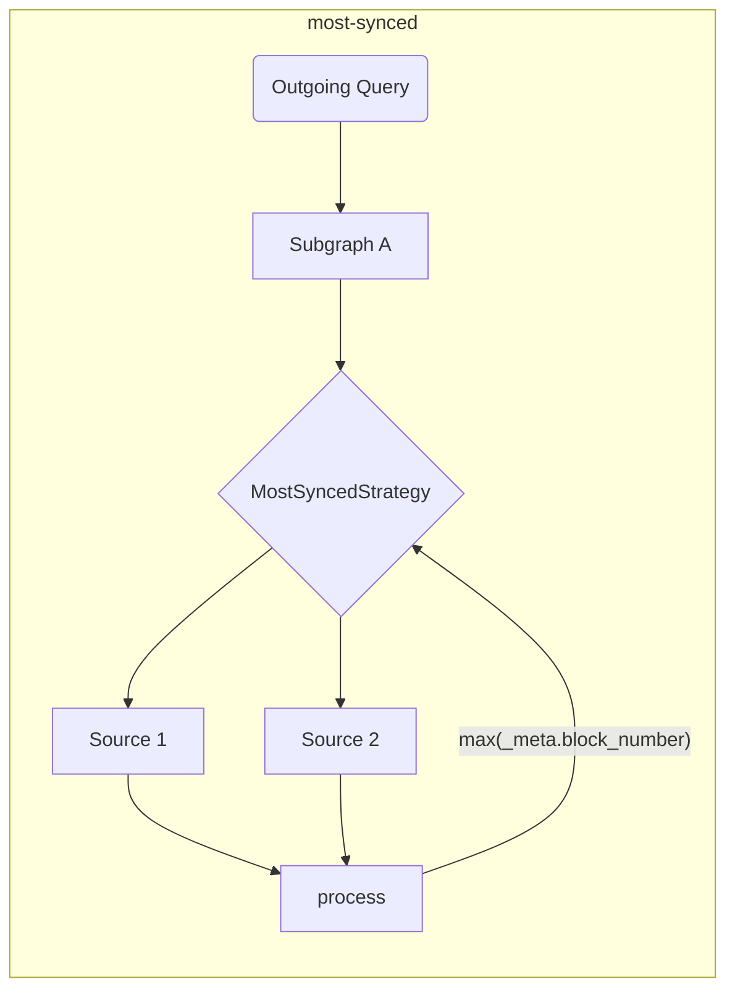

# Инструменты клиента The Graph

Этот репозиторий является домом для потребительских инструментов [The Graph](https://thegraph.com) (как для браузерных, так и для NodeJS сред).

## Предисловие

Инструменты, предоставленные в этом репозитории, предназначены для улучшения и расширения разработческого опыта (DX), а также для добавления дополнительного слоя, необходимого для децентрализованных приложений (dApps), чтобы реализовать распределенные приложения.

Разработчики, которые потребляют данные через GraphQL API от [The Graph](https://thegraph.com), часто нуждаются в периферийных инструментах для облегчения потребления данных, а также в инструментах, которые позволяют использовать несколько индексаторов одновременно.

## Функции и цели

Эта библиотека предназначена для упрощения сетевого аспекта потребления данных для децентрализованных приложений (dApps). Инструменты, предоставленные в этом репозитории, предназначены для работы во время сборки, чтобы сделать выполнение более быстрым и производительным в момент выполнения.

> Инструменты, предоставленные в этом репозитории, могут использоваться как самостоятельно, так и в сочетании с любым существующим GraphQL клиентом!

| Статус | Функция                                                                    | Примечания                                                                                                                            |
| :----: | -------------------------------------------------------------------------- | ------------------------------------------------------------------------------------------------------------------------------------- |
|    ✅   | Несколько индексаторов                                                     | основано на стратегиях выборки                                                                                                        |
|    ✅   | Стратегия выборки                                                          | timeout, retry, fallback, race, highestValue                                                                                          |
|    ✅   | Валидации и оптимизации во время сборки                                    |                                                                                                                                       |
|    ✅   | Композиция на стороне клиента                                              | с улучшенным планировщиком выполнения (на основе GraphQL-Mesh)                                                     |
|    ✅   | Кросс-чейн обработка субграфа                                              | Использование схожих субграфов как единого источника                                                                                  |
|    ✅   | Выполнение сырых данных (автономный режим)              | напрямую, без GraphQL-клиента                                                                                                         |
|    ✅   | Местные (клиентские) мутации                            |                                                                                                                                       |
|    ✅   | [Отслеживание автоматического блока](../packages/block-tracking/README.md) | отслеживание номеров блоков [как описано здесь](https://thegraph.com/docs/en/developer/distributed-systems/#polling-for-updated-data) |
|    ✅   | [Автоматическая пагинация](../packages/auto-pagination/README.md)          | выполнение нескольких запросов в одном вызове для получения больше лимита индексатора                                                 |
|    ✅   | Интеграция с `@apollo/client`                                              |                                                                                                                                       |
|    ✅   | Интеграция с `urql`                                                        |                                                                                                                                       |
|    ✅   | Поддержка TypeScript                                                       | со встроенным GraphQL Codegen и `TypedDocumentNode`                                                                                   |
|    ✅   | [`@live` запросы](./live.md)                                               | На основе опроса                                                                                                                      |

> Вы можете найти [расширенный архитектурный дизайн здесь](./architecture.md)

## Начало работы

Вы можете подписаться на [Episode 45 из `graphql.wtf`](https://graphql.wtf/episodes/45-the-graph-client), чтобы узнать больше о Graph Client:

[](https://graphql.wtf/episodes/45-the-graph-client)

Чтобы начать, убедитесь, что установили [The Graph Client CLI] в свой проект:

```sh
yarn add -D @graphprotocol/client-cli
# или, с NPM:
npm install --save-dev @graphprotocol/client-cli
```

> CLI устанавливается как зависимость для разработки, поскольку мы используем его для создания оптимизированных артефактов времени выполнения, которые могут быть загружены непосредственно из Вашего приложения!

Создайте конфигурационный файл (под названием `.graphclientrc.yml`) и укажите Ваши GraphQL конечные точки, предоставленные The Graph, например:

```yml
# .graphclientrc.yml
sources:
  - name: uniswapv2
    handler:
      graphql:
        endpoint: https://api.thegraph.com/subgraphs/name/uniswap/uniswap-v2
```

Теперь создайте артефакт времени выполнения, запустив The Graph Client CLI:

```sh
graphclient build
```

> Примечание: Вам нужно выполнить это с префиксом `yarn`, или добавить это как скрипт в свой `package.json`.

Это должно создать готовую к использованию автономную функцию `execute`, которую Вы сможете использовать для выполнения операций GraphQL в своем приложении. Вы должны получить вывод, похожий на следующий:

```sh
GraphClient: Очистка существующих артефактов 
GraphClient: Чтение конфигурации 
🕸️: Генерация унифицированной схемы 
🕸️: Генерация артефактов 
🕸️: Генерация индекса в TypeScript 
🕸️: Запись index.ts для ESM на диск 
🕸️: Очистка 
🕸️: Готово! => .graphclient
```

Теперь артефакт `.graphclient` для Вас сгенерирован, и Вы можете импортировать его напрямую в свой код и выполнять запросы:

```ts
import { execute } from '../.graphclient'

const myQuery = gql`
  query pairs {
    pair(id: "0x00004ee988665cdda9a1080d5792cecd16dc1220") {
      id
      token0 {
        id
        symbol
        name
      }
      token1 {
        id
        symbol
        name
      }
    }
  }
`

async function main() {
  const result = await execute(myQuery, {})
  console.log(result)
}

main()
```

### Использование Vanilla JavaScript вместо TypeScript

По умолчанию, GraphClient CLI генерирует артефакты клиента в виде файлов TypeScript, но Вы можете настроить CLI для генерации файлов JavaScript и JSON вместе с дополнительными файлами определений TypeScript, используя `--fileType js` или `--fileType json`.

Флаг `js` генерирует все файлы как JavaScript файлы с синтаксисом ESM, а флаг `json` генерирует исходные артефакты как JSON файлы, при этом файл точки входа будет на старом синтаксисе CommonJS, поскольку только CommonJS поддерживает JSON файлы как модули.

Если Вы специально не используете CommonJS (`require`), мы рекомендуем использовать флаг `js`.

`graphclient --fileType js`

- [Пример использования JavaScript в синтаксисе CommonJS с JSON файлами](../examples/javascript-cjs)
- [Пример использования JavaScript в синтаксисе ESM](../examples/javascript-esm)

#### Инструменты разработки The Graph Client

The Graph Client CLI включает встроенный GraphiQL, который позволяет Вам экспериментировать с запросами в реальном времени.

GraphQL-схема, обслуживаемая в этой среде, представляет собой итоговую схему, основанную на всех составленных субграфах и примененных преобразованиях.

Чтобы запустить DevTool GraphiQL, выполните следующую команду:

```sh
graphclient serve-dev
```

А затем откройте [http://localhost:4000/](http://localhost:4000/), чтобы использовать GraphiQL. Теперь Вы можете экспериментировать со своей GraphQL-схемой на стороне клиента локально! 🥳

#### Примеры

Вы также можете обратиться к [каталогу с примерами в этом репозитории](../examples) для более продвинутых примеров и примеров интеграции:

- [Пример TypeScript и React с использованием `execute` и встроенного GraphQL-Codegen](../examples/execute)
- [Автономный режим TS/JS NodeJS](../examples/node)
- [Клиентская композиция GraphQL](../examples/composition)
- [Интеграция с Urql и React](../examples/urql)
- [Интеграция с NextJS и TypeScript](../examples/nextjs)
- [Интеграция с Apollo-Client и React](../examples/apollo)
- [Интеграция с React-Query](../examples/react-query)
- _Кросс-чейн слияние (тот же субграф, разные чейны)_
- - [Параллельные вызовы SDK](../examples/cross-chain-sdk)
- - [Параллельные внутренние вызовы с расширениями схемы](../examples/cross-chain-extension)
- [Настройка выполнения с помощью трансформаций (автоматическая пагинация и автоматический отслеживание блоков)](../examples/transforms)

### Продвинутые примеры/функции

#### Настройка сетевых вызовов

Вы можете настроить выполнение сетевых запросов (например, для добавления заголовков аутентификации), используя `operationHeaders`:

```yaml
sources:
  - name: uniswapv2
    handler:
      graphql:
        endpoint: https://api.thegraph.com/subgraphs/name/uniswap/uniswap-v2
        operationHeaders:
          Authorization: Bearer MY_TOKEN
```

Вы также можете использовать переменные времени выполнения, если хотите, и указать их декларативным способом:

```yaml
sources:
  - name: uniswapv2
    handler:
      graphql:
        endpoint: https://api.thegraph.com/subgraphs/name/uniswap/uniswap-v2
        operationHeaders:
          Authorization: Bearer {context.config.apiToken}
```

Затем Вы можете указать следующее, когда выполняете операции:

```ts
execute(myQuery, myVariables, {
  config: {
    apiToken: 'MY_TOKEN',
  },
})
```

> Полную документацию по обработчику `graphql` можно найти [здесь](https://graphql-mesh.com/docs/handlers/graphql#config-api-reference).

#### Интерполяция переменных среды

Если Вы хотите использовать переменные среды в конфигурационном файле своего Graph Client, Вы можете использовать интерполяцию с помощью помощника `env`:

```yaml
sources:
  - name: uniswapv2
    handler:
      graphql:
        endpoint: https://api.thegraph.com/subgraphs/name/uniswap/uniswap-v2
        operationHeaders:
          Authorization: Bearer {env.MY_API_TOKEN} # время выполнения
```

Затем убедитесь, что `MY_API_TOKEN` определён, когда Вы выполняете `process.env` во время выполнения программы.

Вы также можете указать переменные среды, которые будут заполняться во время сборки (при запуске `graphclient build`), используя непосредственно имя переменной средв:

```yaml
sources:
  - name: uniswapv2
    handler:
      graphql:
        endpoint: https://api.thegraph.com/subgraphs/name/uniswap/uniswap-v2
        operationHeaders:
          Authorization: Bearer ${MY_API_TOKEN} # время разработки
```

> Полную документацию по обработчику `graphql` можно найти [здесь](https://graphql-mesh.com/docs/handlers/graphql#config-api-reference).

#### Стратегии выборки данных и работа с несколькими Graph-индексаторами

Это обычная практика — использовать несколько индексаторов в децентрализованных приложениях (dApps), поэтому для достижения наилучшего опыта работы с The Graph Вы можете указать несколько стратегий `fetch`, чтобы сделать процесс более плавным и простым.

Все стратегии`fetch` можно комбинировать для создания идеального потока выполнения.

<details>
 <summary>`retry`</summary>

Механизм `retry` позволяет указать количество попыток повторного запроса для одной GraphQL конечной точки/источника.

Механизм повторных попыток будет выполняться в обоих случаях: при ошибке сети или при ошибке выполнения (проблемы с индексированием/недоступность индексатора).

```yaml
sources:
  - name: uniswapv2
    handler:
      graphql:
        endpoint: https://api.thegraph.com/subgraphs/name/uniswap/uniswap-v2
        retry: 2 # укажите здесь, если у вас нестабильный/подверженный ошибкам индексатор
```

</details>

<details>
 <summary>`timeout`</summary>

Механизм `timeout` позволяет задать `timeout` для указанной конечной точки GraphQL.

```yaml
sources:
  - name: uniswapv2
    handler:
      graphql:
        endpoint: https://api.thegraph.com/subgraphs/name/uniswap/uniswap-v2
        timeout: 5000 # 5 секунд
```

</details>

<details>
 <summary>`fallback`</summary>

Механизм `fallback` позволяет указать несколько конечных точек GraphQL для одного и того же источника.

Это полезно, если Вы хотите использовать более одного индексатора для одного и того же субграфа и переключаться на другой в случае ошибки или тайм-аута. Вы также можете использовать эту стратегию для использования кастомного индексатора, но в случае необходимости переключаться на [The Graph Hosted Service](https://thegraph.com/hosted-service).

```yaml
sources:
  - name: uniswapv2
    handler:
      graphql:
        strategy: fallback
        sources:
          - endpoint: https://bad-uniswap-v2-api.com
            retry: 2
            timeout: 5000
          - endpoint: https://api.thegraph.com/subgraphs/name/uniswap/uniswap-v2
```

</details>

<details>
 <summary>`race`</summary>

Механизм `race` позволяет указать несколько GraphQL-эндпоинтов для одного источника данных, выполняя их конкурентный опрос при каждом запросе.

Это полезно, если вы хотите использовать несколько индексаторов для одного субграфа и позволить им конкурировать за получение самого быстрого ответа от всех указанных индексаторов.

```yaml
sources:
  - name: uniswapv2
    handler:
      graphql:
        strategy: race
        sources:
          - endpoint: https://bad-uniswap-v2-api.com
          - endpoint: https://api.thegraph.com/subgraphs/name/uniswap/uniswap-v2
```

</details>

<details>
  <summary>`highestValue`</summary>

Эта стратегия позволяет отправлять параллельные запросы к различным конечным точкам для одного и того же источника и выбирать наиболее актуальный ответ.

Это полезно, если Вы хотите выбрать наиболее синхронизированные данные для одного субграфа среди нескольких индексаторов/источников.

```yaml
sources:
  - name: uniswapv2
    handler:
      graphql:
        strategy: highestValue
        strategyConfig:
          selectionSet: |
            {
              _meta {
                block {
                  number
                }
              }
            }
          value: '_meta.block.number'
        sources:
          - endpoint: https://api.thegraph.com/subgraphs/name/uniswap/uniswap-v2-1
          - endpoint: https://api.thegraph.com/subgraphs/name/uniswap/uniswap-v2-2
```



</details>

#### Block Tracking

The Graph Client can track block numbers and do the following queries by following [this pattern](https://thegraph.com/docs/en/developer/distributed-systems/#polling-for-updated-data) with `blockTracking` transform;

```yaml
sources:
  - name: uniswapv2
    handler:
      graphql:
        endpoint: https://api.thegraph.com/subgraphs/name/uniswap/uniswap-v2
    transforms:
      - blockTracking:
          # You might want to disable schema validation for faster startup
          validateSchema: true
          # Ignore the fields that you don't want to be tracked
          ignoreFieldNames: [users, prices]
          # Exclude the operation with the following names
          ignoreOperationNames: [NotFollowed]
```

[You can try a working example here](../examples/transforms)

#### Automatic Pagination

With most subgraphs, the number of records you can fetch is limited. In this case, you have to send multiple requests with pagination.

```graphql
query {
  # Will throw an error if the limit is 1000
  users(first: 2000) {
    id
    name
  }
}
```

So you have to send the following operations one after the other:

```graphql
query {
  # Will throw an error if the limit is 1000
  users(first: 1000) {
    id
    name
  }
}
```

Then after the first response:

```graphql
query {
  # Will throw an error if the limit is 1000
  users(first: 1000, skip: 1000) {
    id
    name
  }
}
```

After the second response, you have to merge the results manually. But instead The Graph Client allows you to do the first one and automatically does those multiple requests for you under the hood.

All you have to do is:

```yaml
sources:
  - name: uniswapv2
    handler:
      graphql:
        endpoint: https://api.thegraph.com/subgraphs/name/uniswap/uniswap-v2
    transforms:
      - autoPagination:
          # You might want to disable schema validation for faster startup
          validateSchema: true
```

[You can try a working example here](../examples/transforms)

#### Client-side Composition

The Graph Client has built-in support for client-side GraphQL Composition (powered by [GraphQL-Tools Schema-Stitching](https://graphql-tools.com/docs/schema-stitching/stitch-combining-schemas)).

You can leverage this feature in order to create a single GraphQL layer from multiple Subgraphs, deployed on multiple indexers.

> 💡 Tip: You can compose any GraphQL sources, and not only Subgraphs!

Trivial composition can be done by adding more than one GraphQL source to your `.graphclientrc.yml` file, here's an example:

```yaml
sources:
  - name: uniswapv2
    handler:
      graphql:
        endpoint: https://api.thegraph.com/subgraphs/name/uniswap/uniswap-v2
  - name: compoundv2
    handler:
      graphql:
        endpoint: https://api.thegraph.com/subgraphs/name/graphprotocol/compound-v2
```

As long as there a no conflicts across the composed schemas, you can compose it, and then run a single query to both Subgraphs:

```graphql
query myQuery {
  # this one is coming from compound-v2
  markets(first: 7) {
    borrowRate
  }
  # this one is coming from uniswap-v2
  pair(id: "0x00004ee988665cdda9a1080d5792cecd16dc1220") {
    id
    token0 {
      id
    }
    token1 {
      id
    }
  }
}
```

You can also resolve conflicts, rename parts of the schema, add custom GraphQL fields, and modify the entire execution phase.

For advanced use-cases with composition, please refer to the following resources:

- [Advanced Composition Example](../examples/composition)
- [GraphQL-Mesh Schema transformations](https://graphql-mesh.com/docs/transforms/transforms-introduction)
- [GraphQL-Tools Schema-Stitching documentation](https://graphql-tools.com/docs/schema-stitching/stitch-combining-schemas)

#### TypeScript Support

If your project is written in TypeScript, you can leverage the power of [`TypedDocumentNode`](https://the-guild.dev/blog/typed-document-node) and have a fully-typed GraphQL client experience.

The standalone mode of The GraphQL, and popular GraphQL client libraries like Apollo-Client and urql has built-in support for `TypedDocumentNode`!

The Graph Client CLI comes with a ready-to-use configuration for [GraphQL Code Generator](https://graphql-code-generator.com), and it can generate `TypedDocumentNode` based on your GraphQL operations.

To get started, define your GraphQL operations in your application code, and point to those files using the `documents` section of `.graphclientrc.yml`:

```yaml
sources:
  -  # ... your Subgraphs/GQL sources here

documents:
  - ./src/example-query.graphql
```

You can also use Glob expressions, or even point to code files, and the CLI will find your GraphQL queries automatically:

```yaml
documents:
  - './src/**/*.graphql'
  - './src/**/*.{ts,tsx,js,jsx}'
```

Now, run the GraphQL CLI `build` command again, the CLI will generate a `TypedDocumentNode` object under `.graphclient` for every operation found.

> Make sure to name your GraphQL operations, otherwise it will be ignored!

For example, a query called `query ExampleQuery` will have the corresponding `ExampleQueryDocument` generated in `.graphclient`. You can now import it and use that for your GraphQL calls, and you'll have a fully typed experience without writing or specifying any TypeScript manually:

```ts
import { ExampleQueryDocument, execute } from '../.graphclient'

async function main() {
  // "result" variable is fully typed, and represents the exact structure of the fields you selected in your query.
  const result = await execute(ExampleQueryDocument, {})
  console.log(result)
}
```

> You can find a [TypeScript project example here](../examples/urql).

#### Client-Side Mutations

Due to the nature of Graph-Client setup, it is possible to add client-side schema, that you can later bridge to run any arbitrary code.

This is helpful since you can implement custom code as part of your GraphQL schema, and have it as unified application schema that is easier to track and develop.

> This document explains how to add custom mutations, but in fact you can add any GraphQL operation (query/mutation/subscriptions). See [Extending the unified schema article](https://graphql-mesh.com/docs/guides/extending-unified-schema) for more information about this feature.

To get started, define a `additionalTypeDefs` section in your config file:

```yaml
additionalTypeDefs: |
  # We should define the missing `Mutation` type
  extend schema {
    mutation: Mutation
  }

  type Mutation {
    doSomething(input: SomeCustomInput!): Boolean!
  }

  input SomeCustomInput {
    field: String!
  }
```

Then, add a pointer to a custom GraphQL resolvers file:

```yaml
additionalResolvers:
  - './resolvers'
```

Now, create `resolver.js` (or, `resolvers.ts`) in your project, and implement your custom mutation:

```js
module.exports = {
  Mutation: {
    async doSomething(root, args, context, info) {
      // Here, you can run anything you wish.
      // For example, use `web3` lib, connect a wallet and so on.

      return true
    },
  },
}
```

If you are using TypeScript, you can also get fully type-safe signature by doing:

```ts
import { Resolvers } from './.graphclient'

// Now it's fully typed!
const resolvers: Resolvers = {
  Mutation: {
    async doSomething(root, args, context, info) {
      // Here, you can run anything you wish.
      // For example, use `web3` lib, connect a wallet and so on.

      return true
    },
  },
}

export default resolvers
```

If you need to inject runtime variables into your GraphQL execution `context`, you can use the following snippet:

```ts
execute(
  MY_QUERY,
  {},
  {
    myHelper: {}, // this will be available in your Mutation resolver as `context.myHelper`
  },
)
```

> [You can read more about client-side schema extensions here](https://graphql-mesh.com/docs/guides/extending-unified-schema)

> [You can also delegate and call Query fields as part of your mutation](https://graphql-mesh.com/docs/guides/extending-unified-schema#using-the-sdk-to-fetch-sources)

## License

Released under the [MIT license](../LICENSE).
