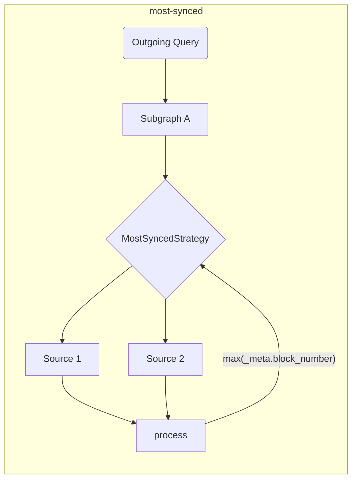

# Инструменты клиента The Graph

Этот репозиторий является домом для потребительских инструментов [The Graph](https://thegraph.com) (как для браузерных, так и для NodeJS сред).

## Предисловие

Инструменты, предоставленные в этом репозитории, предназначены для улучшения и расширения разработческого опыта (DX), а также для добавления дополнительного слоя, необходимого для децентрализованных приложений (dApps), чтобы реализовать распределенные приложения.

Разработчики, которые потребляют данные через GraphQL API от [The Graph](https://thegraph.com), часто нуждаются в периферийных инструментах для облегчения потребления данных, а также в инструментах, которые позволяют использовать несколько индексаторов одновременно.

## Функции и цели

Эта библиотека предназначена для упрощения сетевого аспекта потребления данных для децентрализованных приложений (dApps). Инструменты, предоставленные в этом репозитории, предназначены для работы во время сборки, чтобы сделать выполнение более быстрым и производительным в момент выполнения.

> Инструменты, предоставленные в этом репозитории, могут использоваться как самостоятельно, так и в сочетании с любым существующим GraphQL клиентом!

| Статус | Функция                                                                    | Примечания                                                                                                                            |
| :----: | -------------------------------------------------------------------------- | ------------------------------------------------------------------------------------------------------------------------------------- |
|    ✅   | Несколько индексаторов                                                     | основано на стратегиях выборки                                                                                                        |
|    ✅   | Стратегия выборки                                                          | timeout, retry, fallback, race, highestValue                                                                                          |
|    ✅   | Валидации и оптимизации во время сборки                                    |                                                                                                                                       |
|    ✅   | Композиция на стороне клиента                                              | с улучшенным планировщиком выполнения (на основе GraphQL-Mesh)                                                     |
|    ✅   | Кросс-чейн обработка субграфа                                              | Использование схожих субграфов как единого источника                                                                                  |
|    ✅   | Выполнение сырых данных (автономный режим)              | напрямую, без GraphQL-клиента                                                                                                         |
|    ✅   | Местные (клиентские) мутации                            |                                                                                                                                       |
|    ✅   | [Отслеживание автоматического блока](../packages/block-tracking/README.md) | отслеживание номеров блоков [как описано здесь](https://thegraph.com/docs/en/developer/distributed-systems/#polling-for-updated-data) |
|    ✅   | [Автоматическая пагинация](../packages/auto-pagination/README.md)          | выполнение нескольких запросов в одном вызове для получения больше лимита индексатора                                                 |
|    ✅   | Интеграция с `@apollo/client`                                              |                                                                                                                                       |
|    ✅   | Интеграция с `urql`                                                        |                                                                                                                                       |
|    ✅   | Поддержка TypeScript                                                       | со встроенным GraphQL Codegen и `TypedDocumentNode`                                                                                   |
|    ✅   | [`@live` запросы](./live.md)                                               | На основе опроса                                                                                                                      |

> Вы можете найти [расширенный архитектурный дизайн здесь](./architecture.md)

## Начало работы

Вы можете подписаться на [Episode 45 из `graphql.wtf`](https://graphql.wtf/episodes/45-the-graph-client), чтобы узнать больше о Graph Client:

[](https://graphql.wtf/episodes/45-the-graph-client)

Чтобы начать, убедитесь, что установили [The Graph Client CLI] в свой проект:

```sh
yarn add -D @graphprotocol/client-cli
# или, с NPM:
npm install --save-dev @graphprotocol/client-cli
```

> CLI устанавливается как зависимость для разработки, поскольку мы используем его для создания оптимизированных артефактов времени выполнения, которые могут быть загружены непосредственно из Вашего приложения!

Создайте конфигурационный файл (под названием `.graphclientrc.yml`) и укажите Ваши GraphQL конечные точки, предоставленные The Graph, например:

```yml
# .graphclientrc.yml
sources:
  - name: uniswapv2
    handler:
      graphql:
        endpoint: https://api.thegraph.com/subgraphs/name/uniswap/uniswap-v2
```

Теперь создайте артефакт времени выполнения, запустив The Graph Client CLI:

```sh
graphclient build
```

> Примечание: Вам нужно выполнить это с префиксом `yarn`, или добавить это как скрипт в свой `package.json`.

Это должно создать готовую к использованию автономную функцию `execute`, которую Вы сможете использовать для выполнения операций GraphQL в своем приложении. Вы должны получить вывод, похожий на следующий:

```sh
GraphClient: Очистка существующих артефактов 
GraphClient: Чтение конфигурации 
🕸️: Генерация унифицированной схемы 
🕸️: Генерация артефактов 
🕸️: Генерация индекса в TypeScript 
🕸️: Запись index.ts для ESM на диск 
🕸️: Очистка 
🕸️: Готово! => .graphclient
```

Теперь артефакт `.graphclient` для Вас сгенерирован, и Вы можете импортировать его напрямую в свой код и выполнять запросы:

```ts
import { execute } from '../.graphclient'

const myQuery = gql`
  query pairs {
    pair(id: "0x00004ee988665cdda9a1080d5792cecd16dc1220") {
      id
      token0 {
        id
        symbol
        name
      }
      token1 {
        id
        symbol
        name
      }
    }
  }
`

async function main() {
  const result = await execute(myQuery, {})
  console.log(result)
}

main()
```

### Использование Vanilla JavaScript вместо TypeScript

По умолчанию, GraphClient CLI генерирует артефакты клиента в виде файлов TypeScript, но Вы можете настроить CLI для генерации файлов JavaScript и JSON вместе с дополнительными файлами определений TypeScript, используя `--fileType js` или `--fileType json`.

Флаг `js` генерирует все файлы как JavaScript файлы с синтаксисом ESM, а флаг `json` генерирует исходные артефакты как JSON файлы, при этом файл точки входа будет на старом синтаксисе CommonJS, поскольку только CommonJS поддерживает JSON файлы как модули.

Если Вы специально не используете CommonJS (`require`), мы рекомендуем использовать флаг `js`.

`graphclient --fileType js`

- [Пример использования JavaScript в синтаксисе CommonJS с JSON файлами](../examples/javascript-cjs)
- [Пример использования JavaScript в синтаксисе ESM](../examples/javascript-esm)

#### Инструменты разработки The Graph Client

The Graph Client CLI включает встроенный GraphiQL, который позволяет Вам экспериментировать с запросами в реальном времени.

GraphQL-схема, обслуживаемая в этой среде, представляет собой итоговую схему, основанную на всех составленных субграфах и примененных преобразованиях.

Чтобы запустить DevTool GraphiQL, выполните следующую команду:

```sh
graphclient serve-dev
```

А затем откройте [http://localhost:4000/](http://localhost:4000/), чтобы использовать GraphiQL. Теперь Вы можете экспериментировать со своей GraphQL-схемой на стороне клиента локально! 🥳

#### Примеры

Вы также можете обратиться к [каталогу с примерами в этом репозитории](../examples) для более продвинутых примеров и примеров интеграции:

- [Пример TypeScript и React с использованием `execute` и встроенного GraphQL-Codegen](../examples/execute)
- [Автономный режим TS/JS NodeJS](../examples/node)
- [Клиентская композиция GraphQL](../examples/composition)
- [Интеграция с Urql и React](../examples/urql)
- [Интеграция с NextJS и TypeScript](../examples/nextjs)
- [Интеграция с Apollo-Client и React](../examples/apollo)
- [Интеграция с React-Query](../examples/react-query)
- _Кросс-чейн слияние (тот же субграф, разные чейны)_
- - [Параллельные вызовы SDK](../examples/cross-chain-sdk)
- - [Параллельные внутренние вызовы с расширениями схемы](../examples/cross-chain-extension)
- [Настройка выполнения с помощью трансформаций (автоматическая пагинация и автоматический отслеживание блоков)](../examples/transforms)

### Продвинутые примеры/функции

#### Настройка сетевых вызовов

Вы можете настроить выполнение сетевых запросов (например, для добавления заголовков аутентификации), используя `operationHeaders`:

```yaml
sources:
  - name: uniswapv2
    handler:
      graphql:
        endpoint: https://api.thegraph.com/subgraphs/name/uniswap/uniswap-v2
        operationHeaders:
          Authorization: Bearer MY_TOKEN
```

Вы также можете использовать переменные времени выполнения, если хотите, и указать их декларативным способом:

```yaml
sources:
  - name: uniswapv2
    handler:
      graphql:
        endpoint: https://api.thegraph.com/subgraphs/name/uniswap/uniswap-v2
        operationHeaders:
          Authorization: Bearer {context.config.apiToken}
```

Затем Вы можете указать следующее, когда выполняете операции:

```ts
execute(myQuery, myVariables, {
  config: {
    apiToken: 'MY_TOKEN',
  },
})
```

> Полную документацию по обработчику `graphql` можно найти [здесь](https://graphql-mesh.com/docs/handlers/graphql#config-api-reference).

#### Интерполяция переменных среды

Если Вы хотите использовать переменные среды в конфигурационном файле своего Graph Client, Вы можете использовать интерполяцию с помощью помощника `env`:

```yaml
sources:
  - name: uniswapv2
    handler:
      graphql:
        endpoint: https://api.thegraph.com/subgraphs/name/uniswap/uniswap-v2
        operationHeaders:
          Authorization: Bearer {env.MY_API_TOKEN} # время выполнения
```

Затем убедитесь, что `MY_API_TOKEN` определён, когда Вы выполняете `process.env` во время выполнения программы.

Вы также можете указать переменные среды, которые будут заполняться во время сборки (при запуске `graphclient build`), используя непосредственно имя переменной средв:

```yaml
sources:
  - name: uniswapv2
    handler:
      graphql:
        endpoint: https://api.thegraph.com/subgraphs/name/uniswap/uniswap-v2
        operationHeaders:
          Authorization: Bearer ${MY_API_TOKEN} # время разработки
```

> Полную документацию по обработчику `graphql` можно найти [здесь](https://graphql-mesh.com/docs/handlers/graphql#config-api-reference).

#### Стратегии выборки данных и работа с несколькими Graph-индексаторами

Это обычная практика — использовать несколько индексаторов в децентрализованных приложениях (dApps), поэтому для достижения наилучшего опыта работы с The Graph Вы можете указать несколько стратегий `fetch`, чтобы сделать процесс более плавным и простым.

Все стратегии`fetch` можно комбинировать для создания идеального потока выполнения.

<details>
 <summary>`retry`</summary>

Механизм `retry` позволяет указать количество попыток повторного запроса для одной GraphQL конечной точки/источника.

Механизм повторных попыток будет выполняться в обоих случаях: при ошибке сети или при ошибке выполнения (проблемы с индексированием/недоступность индексатора).

```yaml
sources:
  - name: uniswapv2
    handler:
      graphql:
        endpoint: https://api.thegraph.com/subgraphs/name/uniswap/uniswap-v2
        retry: 2 # укажите здесь, если у вас нестабильный/подверженный ошибкам индексатор
```

</details>

<details>
 <summary>`timeout`</summary>

Механизм `timeout` позволяет задать `timeout` для указанной конечной точки GraphQL.

```yaml
sources:
  - name: uniswapv2
    handler:
      graphql:
        endpoint: https://api.thegraph.com/subgraphs/name/uniswap/uniswap-v2
        timeout: 5000 # 5 секунд
```

</details>

<details>
 <summary>`fallback`</summary>

Механизм `fallback` позволяет указать несколько конечных точек GraphQL для одного и того же источника.

Это полезно, если Вы хотите использовать более одного индексатора для одного и того же субграфа и переключаться на другой в случае ошибки или тайм-аута. Вы также можете использовать эту стратегию для использования кастомного индексатора, но в случае необходимости переключаться на [The Graph Hosted Service](https://thegraph.com/hosted-service).

```yaml
sources:
  - name: uniswapv2
    handler:
      graphql:
        strategy: fallback
        sources:
          - endpoint: https://bad-uniswap-v2-api.com
            retry: 2
            timeout: 5000
          - endpoint: https://api.thegraph.com/subgraphs/name/uniswap/uniswap-v2
```

</details>

<details>
 <summary>`race`</summary>

Механизм `race` позволяет указать несколько GraphQL-эндпоинтов для одного источника данных, выполняя их конкурентный опрос при каждом запросе.

Это полезно, если вы хотите использовать несколько индексаторов для одного субграфа и позволить им конкурировать за получение самого быстрого ответа от всех указанных индексаторов.

```yaml
sources:
  - name: uniswapv2
    handler:
      graphql:
        strategy: race
        sources:
          - endpoint: https://bad-uniswap-v2-api.com
          - endpoint: https://api.thegraph.com/subgraphs/name/uniswap/uniswap-v2
```

</details>

<details>
  <summary>`highestValue`</summary>

Эта стратегия позволяет отправлять параллельные запросы к различным конечным точкам для одного и того же источника и выбирать наиболее актуальный ответ.

Это полезно, если Вы хотите выбрать наиболее синхронизированные данные для одного субграфа среди нескольких индексаторов/источников.

```yaml
sources:
  - name: uniswapv2
    handler:
      graphql:
        strategy: highestValue
        strategyConfig:
          selectionSet: |
            {
              _meta {
                block {
                  number
                }
              }
            }
          value: '_meta.block.number'
        sources:
          - endpoint: https://api.thegraph.com/subgraphs/name/uniswap/uniswap-v2-1
          - endpoint: https://api.thegraph.com/subgraphs/name/uniswap/uniswap-v2-2
```



</details>

#### Отслеживание блоков

Graph Client может отслеживать номера блоков и выполнять следующие запросы, следуя [этой схеме](https://thegraph.com/docs/en/developer/distributed-systems/#polling-for-updated-data) с использованием преобразования `blockTracking`;

```yaml
sources:
  - name: uniswapv2
    handler:
      graphql:
        endpoint: https://api.thegraph.com/subgraphs/name/uniswap/uniswap-v2
    transforms:
      - blockTracking:
          # Вы можете отключить проверку схемы для более быстрого старта
          validateSchema: true
          # Игнорируйте поля, которые вы не хотите отслеживать
          ignoreFieldNames: [users, prices]
          # Исключите операции с указанными именами
          ignoreOperationNames: [NotFollowed]
```

[Здесь Вы можете попробовать рабочий пример](../examples/transforms)

#### Автоматическая пагинация

Для большинства субграфов количество записей, которые Вы можете извлечь, ограничено. В этом случае Вам нужно отправить несколько запросов с пагинацией.

```graphql
query {
  # Выдаст ошибку, если лимит равен 1000
  users(first: 2000) {
    id
    name
  }
}
```

Таким образом, Вам нужно отправить следующие операции одну за другой:

```graphql
query {
  # Выдаст ошибку, если лимит равен 1000
  users(first: 1000) {
    id
    name
  }
}
```

Затем после первого ответа:

```graphql
query {
  # Выдаст ошибку, если лимит равен 1000
  users(first: 1000, skip: 1000) {
    id
    name
  }
}
```

После второго ответа Вам пришлось бы вручную объединять результаты. Однако Graph Client позволяет выполнить первый запрос, а затем в фоновом режиме обрабатывает все остальные.

Всё, что Вам нужно сделать, это:

```yaml
sources:
  - name: uniswapv2
    handler:
      graphql:
        endpoint: https://api.thegraph.com/subgraphs/name/uniswap/uniswap-v2
    transforms:
      - autoPagination:
          # Вы можете отключить проверку схемы для более быстрого старта
          validateSchema: true
```

[Здесь Вы можете попробовать рабочий пример](../examples/transforms)

#### Композиция на стороне клиента

Graph Client имеет встроенную поддержку композиции GraphQL на стороне клиента (реализованную с помощью [GraphQL-Tools Schema-Stitching](https://graphql-tools.com/docs/schema-stitching/stitch-combining-schemas)).

Вы можете использовать эту функцию для создания единого слоя GraphQL из нескольких субграфов, развернутых на нескольких индексаторах.

> 💡 Совет: Вы можете комбинировать любые источники GraphQL, а не только субграфы!

Тривиальную композицию можно выполнить, добавив более одного источника GraphQL в Ваш файл `.graphclientrc.yml`, вот пример:

```yaml
sources:
  - name: uniswapv2
    handler:
      graphql:
        endpoint: https://api.thegraph.com/subgraphs/name/uniswap/uniswap-v2
  - name: compoundv2
    handler:
      graphql:
        endpoint: https://api.thegraph.com/subgraphs/name/graphprotocol/compound-v2
```

Пока нет конфликтов между объединёнными схемами, Вы можете их составлять, а затем выполнить один запрос ко всем субграфам:

```graphql
query myQuery {
  # этот запрос поступает от compound-v2
  markets(first: 7) {
    borrowRate
  }
  # этот запрос поступает от uniswap-v2
  pair(id: "0x00004ee988665cdda9a1080d5792cecd16dc1220") {
    id
    token0 {
      id
    }
    token1 {
      id
    }
  }
}
```

Вы также можете разрешать конфликты, переименовывать части схемы, добавлять пользовательские поля GraphQL и изменять всю фазу выполнения.

Для сложных сценариев использования композиций обратитесь к следующим ресурсам:

- [Пример сложной композиции](../examples/composition)
- [Преобразования схемы GraphQL-Mesh](https://graphql-mesh.com/docs/transforms/transforms-introduction)
- [Документация по объединению схем с помощью GraphQL-Tools](https://graphql-tools.com/docs/schema-stitching/stitch-combining-schemas)

#### Поддержка TypeScript

Если Ваш проект написан на TypeScript, Вы можете использовать возможности [`TypedDocumentNode`](https://the-guild.dev/blog/typed-document-node) и получить полностью типизированный опыт работы с GraphQL-клиентом.

Автономный режим The GraphQL, а также популярные библиотеки GraphQL-клиентов, такие как Apollo-Client и urql, имеют встроенную поддержку `TypedDocumentNode`!

CLI Graph Client поставляется с готовой конфигурацией для [GraphQL Code Generator](https://graphql-code-generator.com) и может генерировать `TypedDocumentNode` на основе Ваших GraphQL-операций.

Чтобы начать, определите Ваши GraphQL-операции в коде приложения и укажите пути к этим файлам в разделе `documents` файла `.graphclientrc.yml`:

```yaml
sources:
  -  # ... Ваши Субграфы/источники GQL здесь

documents:
  - ./src/example-query.graphql
```

Вы также можете использовать выражения Glob или даже указывать файлы кода, и CLI автоматически найдет Ваши GraphQL-запросы:

```yaml
documents:
  - './src/**/*.graphql'
  - './src/**/*.{ts,tsx,js,jsx}'
```

Теперь снова выполните команду `build` в GraphQL CLI, и CLI сгенерирует объект `TypedDocumentNode` в `.graphclient` для каждой найденной операции.

> Обязательно давайте имена Вашим GraphQL-операциям, иначе они будут проигнорированы!

Например, для запроса с именем `query ExampleQuery` будет сгенерирован соответствующий `ExampleQueryDocument` в `.graphclient`. Теперь вы можете импортировать его и использовать для GraphQL-запросов, получая полностью типизированный опыт без необходимости вручную писать или указывать TypeScript:

```ts
import { ExampleQueryDocument, execute } from '../.graphclient'

async function main() {
  // переменная "result" полностью типизирована и представляет точную структуру полей, которые вы выбрали в вашем запросе.
  const result = await execute(ExampleQueryDocument, {})
  console.log(result)
}
```

> Вы можете найти [пример проекта на TypeScript здесь](../examples/urql).

#### Мутации на стороне клиента

Из-за особенностей настройки Graph-Client, возможно добавление схемы на стороне клиента, которую затем можно использовать для выполнения произвольного кода.

Это полезно, потому что Вы можете внедрить пользовательский код в часть своей схемы GraphQL и использовать его как единую схему приложения, что облегчает отслеживание и разработку.

> Этот документ объясняет, как добавить пользовательские мутации, но на самом деле Вы можете добавить любую операцию GraphQL (запросы/мутации/подписки). Для получения дополнительной информации о данной функции, см. статью [Расширение единой схемы](https://graphql-mesh.com/docs/guides/extending-unified-schema).

Чтобы начать, определите раздел `additionalTypeDefs` в Вашем конфигурационном файле:

```yaml
additionalTypeDefs: |
  # Мы должны определить отсутствующий тип `Mutation`
  extend schema {
    mutation: Mutation
  }

  type Mutation {
    doSomething(input: SomeCustomInput!): Boolean!
  }

  input SomeCustomInput {
    field: String!
  }
```

Затем добавьте указатель на файл с пользовательскими GraphQL-ресолверами:

```yaml
additionalResolvers:
  - './resolvers'
```

Теперь создайте файл `resolver.js` (или `resolvers.ts`) в своем проекте и внедрите свою пользовательскую мутацию:

```js
module.exports = {
  Mutation: {
    async doSomething(root, args, context, info) {
      // Здесь Вы можете выполнить все, что хотите.
      // Например, использовать библиотеку `web3`, подключить кошелек и так далее.

      return true
    },
  },
}
```

Если Вы используете TypeScript, Вы также можете получить полностью безопасную типизацию подписей, сделав следующее:

```ts
import { Resolvers } from './.graphclient'

// Теперь всё написано!
const resolvers: Resolvers = {
  Mutation: {
    async doSomething(root, args, context, info) {
      // Здесь Вы можете выполнить любые операции, которые хотите.
      // Например, использовать библиотеку `web3`, подключить кошелек и так далее.

      return true
    },
  },
}

export default resolvers
```

Если Вам нужно внедрить переменные времени выполнения в Ваш `context` выполнения GraphQL, вы можете использовать следующий сниппет:

```ts
execute(
  MY_QUERY,
  {},
  {
    myHelper: {}, // это будет доступно в Вашем ресолвере мутации как `context.myHelper`
  },
)
```

> [Вы можете прочитать больше о расширениях схемы на стороне клиента здесь](https://graphql-mesh.com/docs/guides/extending-unified-schema)

> [Вы также можете делегировать и вызывать поля Query в рамках Вашей мутации](https://graphql-mesh.com/docs/guides/extending-unified-schema#using-the-sdk-to-fetch-sources)

## Лицензия

Выпущена под [лицензией MIT](../LICENSE).
