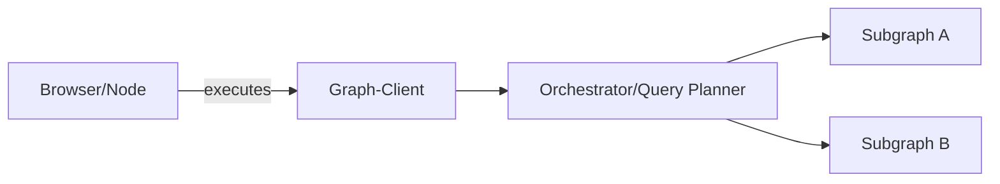
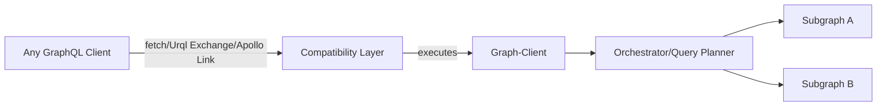
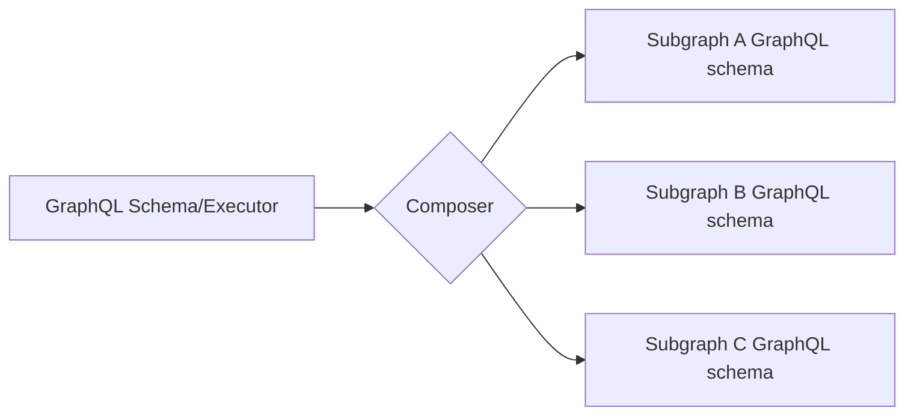
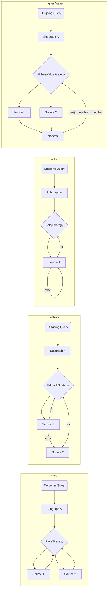
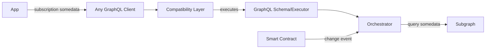

# The Graph İstemcisi Mimarisi

Dağıtık bir ağı destekleme ihtiyacını karşılamak için, The Graph istemcisinin uygulamaların ihtiyaç duyduğu her şeyi temin etmesini sağlayacak çeşitli adımlar atmayı planlıyoruz:

1. Birden fazla Subgraph'i (istemci tarafında) birleştirme
2. Birden fazla endeksleyici/kaynak/sağlayıcı hizmetine geri dönüş (fallback) mekanizması
3. Otomatik/Manuel kaynak seçme stratejisi
4. Herhangi bir GraphQL istemcisiyle entegre olabilen, bağımsız (agnostik) çekirdek yapısı

## Bağımsız (standalone) mod

## Herhangi bir GraphQL istemcisiyle

## Subgraph Bileşimi (Subgraph Composition)

Basit ve verimli istemci tarafı bileşimini mümkün kılmak için [`graphql-tools`](https://graphql-tools.com) kullanarak uzak bir şema / Executor oluşturacağız ve bu yapı daha sonra GraphQL istemcisine entegre edilebilecek.

API, şema bileşimi için ya doğrudan `graphql-tools` dönüştürücüleri (transformers) ile ya da [GraphQL-Mesh declarative API](https://graphql-mesh.com/docs/transforms/transforms-introduction) ile kullanılabilir.

## Subgraph Yürütme Stratejileri

Kaynak olarak tanımlanan her bir Subgraph içerisinde, o Subgraph'in bağlı olduğu kaynak(lar)ın endeksleyicisini ve sorgulama stratejisini tanımlamak mümkündür. İşte bazı seçenekler:

> Geliştiricilerin kendi stratejilerini yazabilmeleri için basit arayüzlerle birlikte, birkaç hazır strateji sunabiliriz.

Strateji kavramını en uç noktaya taşımak adına, herhangi bir hook ile çalışan ve abonelik modeliyle sorgu (subscription-as-query) yapan sihirli bir katman bile oluşturabiliriz. Bu sayede dapp’ler için akıcı bir geliştirici deneyimi (DX) sunabiliriz:

Bu mekanizma sayesinde geliştiriciler GraphQL `subscription`ı yazıp çalıştırabilir, ancak arka planda The Graph endeksleyicilerine bir GraphQL `query`si gönderilir ve işlemin yeniden çalıştırılmasını sağlayacak harici bir hook/probe bağlantısına izin verilir. Bu sayede, doğrudan Akıllı Sözleşme üzerindeki değişiklikler izlenebilir ve GraphQL istemcisi, The Graph'ten gerçek zamanlı değişiklik ihtiyacını karşılayacak şekilde devreye girer.
