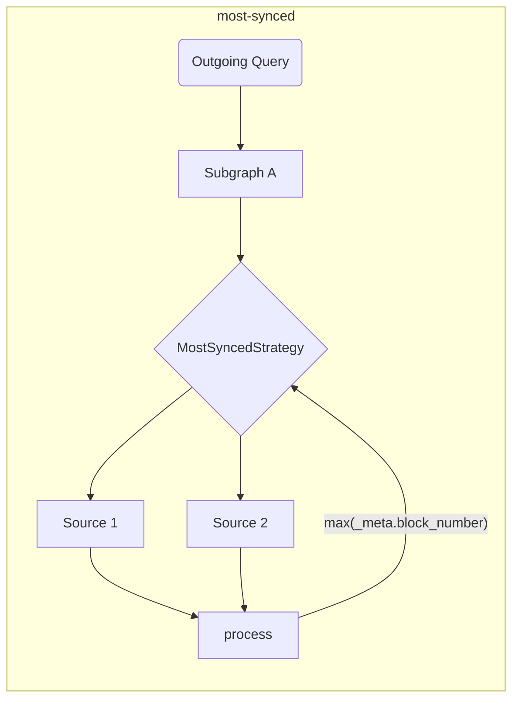

# The Graph客户端工具

这个仓库是[The Graph](https://thegraph.com)消费者端工具（适用于浏览器和NodeJS环境）的家。

## 背景

本节提供的工具旨在丰富和扩展DX, 并添加 dApp 所需的附加层以实现分布式应用程序。

从GraphQL API 上[[The Graph](https://thegraph.com) 消耗数据的开发者常常需要外观才能使数据消耗更加容易， 而且还可以同时使用多个索引人的工具。

## 特征和目标

这个库旨在简化dApp数据消耗的网络方面。 这个仓库中提供的工具是为了在构建时运行，以便在运行时更快地执行和运行。

> 在这个仓库中提供的工具可以单独使用，但你也可以和任何现有的 GraphQL 客户端一起使用！

|  状态 | 特征                                             | 注意：                                                                                                   |
| :-: | ---------------------------------------------- | ----------------------------------------------------------------------------------------------------- |
|  ✅  | 多个索引人                                          | 基于获取策略                                                                                                |
|  ✅  | 获取策略                                           | 超时、 重试、 回退、 种族，最高值                                                                                    |
|  ✅  | 构建时间验证和优化                                      |                                                                                                       |
|  ✅  | 客户端组成                                          | 改进执行规划程序(基于 GraphQL-Mesh)                                                          |
|  ✅  | 跨链子图处理                                         | 使用相似子图作为单个源                                                                                           |
|  ✅  | 原始执行 (独立模式)                 | 没有包装GraphQL客户端                                                                                        |
|  ✅  | 本地(客户端) 突变                  |                                                                                                       |
|  ✅  | [自动区块跟踪](../packages/block-tracking/README.md) | 跟踪区块编号 [如这里描述的](https://thegraph.com/docs/en/developer/distributed-systems/#polling-for-updated-data) |
|  ✅  | [自动分页](../packages/auto-pagination/README.md)  | 在单次调用中执行多个请求以获取超过索引人限制的数据                                                                             |
|  ✅  | 与 `@apollo/client` 集成                          |                                                                                                       |
|  ✅  | 与 `urql` 集成                                    |                                                                                                       |
|  ✅  | TypeScript 支持                                  | 具有内置的 GraphQL Codegen 和 `TypedDocumentNode`                                                           |
|  ✅  | [`@live` 查询](./live.md)                        | 基于投票                                                                                                  |

> 您可以在这里找到一个[扩展架构设计](./architecture.md)。

## 开始

您可以关注 [Episode 45 of `graphql.wtf`](https://graphql.wtf/episodes/45-the-graph-client) 来了解更多关于Graph客户端的信息：

[](https://graphql.wtf/episodes/45-the-graph-client)

若要启动，请确保在您的项目中安装 [The Graph客户端CLI] ：

```sh
yarn add -D @graphprotocol/client-cli
# or, with NPM:
npm install --save-dev @graphprotocol/client-cli
```

> CLI 是作为dev 依赖安装的，因为我们正在使用它来产生优化的运行时工件，这些工件可以直接从您的应用中加载！

创建一个配置文件 (名为 `.graphclientrc.yml`) 并指向您的由The Graph提供的GraphQL 端点, 例如：

```yml
# .graphclientrc.yml
sources:
  - name: uniswapv2
    handler:
      graphql:
        endpoint: https://api.thegraph.com/subgraphs/name/uniswap/uniswap-v2
```

现在，通过运行 The Graph客户端 CLI 创建运行时的工件：

```sh
graphclient build
```

> 注意：您需要使用 `yarn` 前缀运行此操作，或者在您的 `package.json` 中添加一个脚本。

这将产生一个可随时使用的独立`执行`函数。 你可以用来运行你的应用程序 GraphQL 操作，你应该有一个类似于以下的输出：

```sh
GraphClient: Cleaning existing artifacts
GraphClient: Reading the configuration
🕸️: Generating the unified schema
🕸️: Generating artifacts
🕸️: Generating index file in TypeScript
🕸️: Writing index.ts for ESM to the disk.
🕸️: Cleanup
🕸️: Done! => .graphclient
```

现在，`.graphclient`的艺术品是为你生成的，你可以直接从你的代码中导入它，并运行你的查询：

```ts
import { execute } from '../.graphclient'

const myQuery = gql`
  query pairs {
    pair(id: "0x00004ee988665cdda9a1080d5792cecd16dc1220") {
      id
      token0 {
        id
        symbol
        name
      }
      token1 {
        id
        symbol
        name
      }
    }
  }
`

async function main() {
  const result = await execute(myQuery, {})
  console.log(result)
}

main()
```

### 使用 Vanilla JavaScript 而不是 TypeScript

GraphClient CLI 默认情况下以 TypeScript 文件生成客户端工件， 但您可以使用 `--fileType js` 或 `--fileType js` 或 `--fileType json` 来配置 CLI 以生成JavaScript 和 JSON 文件以及额外的 TypeScript 定义文件。

`js` 标志生成了所有使用 JavaScript 文件的文件，其中含有ESM 语法和 `json` 标志作为JSON 文件生成了源代码，同时也生成了旧的 CommonJS 语法的 JavaScript 文件，因为只有CommonJS支持 JSON 文件作为模块。

除非您使用CommonJS(`require`)，否则我们建议您使用`js`标记。

`graphclient --fileType js`

- [使用JSON文件在CommonJS语法中使用JavaScript的示例](../examples/javascript-cjs)
- [一个 JavaScript 在ESM 语法中的使用示例](../examples/javascript-esm)

#### The Graph客户端开发工具

The Graph客户端CLI 带有内置的 GraphiQL，因此您可以实时尝试查询。

在这种环境下服务的 GraphQL 模式是基于您应用的所有构成子图和转换的最终模式 。

要启动DevTool GraphiQL，请运行以下命令：

```sh
graphclient serve-dev
```

然后打开 http://localhost:4000/以使用 GraphiQL。您现在可以在本地试用您的Graph客户端GraphQL 模式！🥳

#### 例子

您还可以参考[此仓库中的示例目录](../examples)，了解更高级的示例和集成示例：

- [[TypeScript & React示例与原始的 `execute` 和内置的 GraphQL-Codegen](../examples/execute)
- [TS/JS NodeJS独立模式](../examples/node)
- [客户端 GraphQL 组合](../examples/composition)
- [与Urql 和 React集成](../examples/urql)
- [与NextJS 和 TypeScript集成](../examples/nextjs)
- [与Apollo-Client 和 React集成](../examples/apollo)
- [与React-Query集成](../examples/react-query)
- _跨链合并 (相同的子图，不同的链)_
- - [并行的 SDK 调用](../examples/cross-chain-sdk)
- - [具有模式扩展的并行内部调用](../examples/cross-chain-extension)
- [使用Transforms（自动分页和自动块跟踪）自定义执行](../examples/transforms)

### 高级示例/功能

#### 自定义网络调用

您可以使用`operationHeaders`自定义网络执行 (例如，添加身份验证头)：

```yaml
sources:
  - name: uniswapv2
    handler:
      graphql:
        endpoint: https://api.thegraph.com/subgraphs/name/uniswap/uniswap-v2
        operationHeaders:
          Authorization: Bearer MY_TOKEN
```

如果您愿意，您也可以使用运行时变量，并以声明方式指定：

```yaml
sources:
  - name: uniswapv2
    handler:
      graphql:
        endpoint: https://api.thegraph.com/subgraphs/name/uniswap/uniswap-v2
        operationHeaders:
          Authorization: Bearer {context.config.apiToken}
```

然后，您可以指定当您执行操作时：

```ts
execute(myQuery, myVariables, {
  config: {
    apiToken: 'MY_TOKEN',
  },
})
```

> 您可以在这里找到 [`graphql` 处理程序的完整文档](https://graphql-mesh.com/docs/handlers/graphql#config-api-reference)。

#### 环境变量内插值

如果你想要在你的Graph客户端配置文件中使用环境变量，你可以使用 `env` 助手的插值：

```yaml
sources:
  - name: uniswapv2
    handler:
      graphql:
        endpoint: https://api.thegraph.com/subgraphs/name/uniswap/uniswap-v2
        operationHeaders:
          Authorization: Bearer {env.MY_API_TOKEN} # runtime
```

然后，请确保在运行`process.env`时定义`MY_API_TOKEN`。

您还可以直接使用 Env-var 名称指定要在构建时间(在 `graphclient build` 运行时) 填充的环境变量：

```yaml
sources:
  - name: uniswapv2
    handler:
      graphql:
        endpoint: https://api.thegraph.com/subgraphs/name/uniswap/uniswap-v2
        operationHeaders:
          Authorization: Bearer ${MY_API_TOKEN} # build time
```

> 您可以在这里找到 [`graphql` 处理程序的完整文档](https://graphql-mesh.com/docs/handlers/graphql#config-api-reference)。

#### 获取策略和多图索引人

在dApp中使用多个索引人是一种常见的做法，以便实现理想的The Graph体验， 你可以指定 `fetch` 的几种策略来使它更加顺畅和简单。

所有的 `fetch` 策略可以合并来创建最终的执行流程。

<details>
 <summary>"重试"</summary>

`重试`机制允许您指定重试单个GraphQL端点/源的尝试。

重试将在两个条件下执行：网络错误或运行时错误(索引问题/索引人不可用)。

```yaml
sources:
  - name: uniswapv2
    handler:
      graphql:
        endpoint: https://api.thegraph.com/subgraphs/name/uniswap/uniswap-v2
        retry: 2 # specify here, if you have an unstable/error prone indexer
```

</details>

<details>
 <summary>"超时"</summary>

`超时`机制允许您为给定的 GraphQL 端点指定`超时` 。

```yaml
sources:
  - name: uniswapv2
    handler:
      graphql:
        endpoint: https://api.thegraph.com/subgraphs/name/uniswap/uniswap-v2
        timeout: 5000 # 5 seconds
```

</details>

<details>
 <summary>“fallback”</summary>

`fallback`机制允许您为同一来源指定多个GraphQL端点。

如果您想要为同一个子图使用多个索引人，并在发生错误/超时时时进行回退，这是有用的。 您也可以使用此策略来使用自定义索引人，但允许它回退到 [The Graph托管服务](https://thegraph.com/hosted-service)。

```yaml
sources:
  - name: uniswapv2
    handler:
      graphql:
        strategy: fallback
        sources:
          - endpoint: https://bad-uniswap-v2-api.com
            retry: 2
            timeout: 5000
          - endpoint: https://api.thegraph.com/subgraphs/name/uniswap/uniswap-v2
```

</details>

<details>
 <summary>"竞技"</summary>

“种族”机制允许您为同一源指定多个GraphQL端点，以及每次执行时的竞赛。

如果你想要在同一个子图中使用多个索引人，这是有用的， 并且允许这两个来源进行竞赛，并从所有指定的索引人获得最快的响应。

```yaml
sources:
  - name: uniswapv2
    handler:
      graphql:
        strategy: race
        sources:
          - endpoint: https://bad-uniswap-v2-api.com
          - endpoint: https://api.thegraph.com/subgraphs/name/uniswap/uniswap-v2
```

</details>

<details>
  <summary>"最高值"</summary>

此策略允许您将并行请求发送到同一源的不同端点并选择最先进的端点。

如果您想要从不同的索引人/源选择同一子图中最常同步的数据，这是有用的。

```yaml
sources:
  - name: uniswapv2
    handler:
      graphql:
        strategy: highestValue
        strategyConfig:
          selectionSet: |
            {
              _meta {
                block {
                  number
                }
              }
            }
          value: '_meta.block.number'
        sources:
          - endpoint: https://api.thegraph.com/subgraphs/name/uniswap/uniswap-v2-1
          - endpoint: https://api.thegraph.com/subgraphs/name/uniswap/uniswap-v2-2
```



</details>

#### 区块跟踪

Graph客户端可以跟踪块号码并通过 `blockTracking` 转换通过 [此模式](https://thegraph.com/docs/en/developer/distributed-systems/#polling-for-updated-data)进行以下查询:

```yaml
sources:
  - name: uniswapv2
    handler:
      graphql:
        endpoint: https://api.thegraph.com/subgraphs/name/uniswap/uniswap-v2
    transforms:
      - blockTracking:
          # You might want to disable schema validation for faster startup
          validateSchema: true
          # Ignore the fields that you don't want to be tracked
          ignoreFieldNames: [users, prices]
          # Exclude the operation with the following names
          ignoreOperationNames: [NotFollowed]
```

[您可以在此尝试一个工作示例](../examples/transforms)。

#### 自动分页

对大多数子图，您可以获取的记录数量是有限的。在这种情况下，您必须发送多个带分页的请求。

```graphql
query {
  # Will throw an error if the limit is 1000
  users(first: 2000) {
    id
    name
  }
}
```

所以你必须一个接一个的发送操作：

```graphql
query {
  # Will throw an error if the limit is 1000
  users(first: 1000) {
    id
    name
  }
}
```

然后在第一个响应之后：

```graphql
query {
  # Will throw an error if the limit is 1000
  users(first: 1000, skip: 1000) {
    id
    name
  }
}
```

在第二个响应后，您必须手动合并结果。 但是The Graph客户端允许您做第一个，并自动为您在场景下执行这些多个请求。

您必须做的是：

```yaml
sources:
  - name: uniswapv2
    handler:
      graphql:
        endpoint: https://api.thegraph.com/subgraphs/name/uniswap/uniswap-v2
    transforms:
      - autoPagination:
          # You might want to disable schema validation for faster startup
          validateSchema: true
```

[您可以在此尝试一个工作示例](../examples/transforms)。

#### 客户端组成

The Graph客户端内置支持客户端GraphQL组成(由 [GraphQL-Tools Schema-Stitching](https://graphql-tools.com/docs/schema-stitching/stitch-combining-schemas)驱动)。

您可以利用此功能，从多个子图中创建一个单一的 GraphQL 层，部署在多个索引人。

> 💡 提示: 你可以创建任何GraphQL源, 而不仅仅是子图！

可通过将多个GraphQL源添加到您的 `.graphclientrc.yml` 文件来完成三角合成，下面是一个示例：

```yaml
sources:
  - name: uniswapv2
    handler:
      graphql:
        endpoint: https://api.thegraph.com/subgraphs/name/uniswap/uniswap-v2
  - name: compoundv2
    handler:
      graphql:
        endpoint: https://api.thegraph.com/subgraphs/name/graphprotocol/compound-v2
```

只要在合成模式之间没有冲突，您就可以编写它，然后对两个子图执行一个查询：

```graphql
query myQuery {
  # this one is coming from compound-v2
  markets(first: 7) {
    borrowRate
  }
  # this one is coming from uniswap-v2
  pair(id: "0x00004ee988665cdda9a1080d5792cecd16dc1220") {
    id
    token0 {
      id
    }
    token1 {
      id
    }
  }
}
```

您也可以解决冲突，重命名模式的一部分，添加自定义 GraphQL 字段，并修改整个执行阶段。

关于由人员组成的高级使用案例，请参考以下资源：

- [Advanced Composition Example](../examples/composition)
- [GraphQL-Mesh Schema transformations](https://graphql-mesh.com/docs/transforms/transforms-introduction)
- [GraphQL-Tools Schema-Stitching documentation](https://graphql-tools.com/docs/schema-stitching/stitch-combining-schemas)

#### TypeScript 支持

如果你的项目是在TypeScript写的，你可以利用[`TypedDocumentNode`](https://the-guild.dev/blog/typed-document-node)的力量，并且拥有一个完整的GraphQL客户端体验。

The standalone mode of The GraphQL, and popular GraphQL client libraries like Apollo-Client and urql has built-in support for `TypedDocumentNode`!

The Graph客户端CLI带有一个现成配置的 [GraphQL 代码生成器](https://graphql-code-generator.com)，它可以根据您的 GraphQL 操作生成`TypedDocumentNode` 。

要启动，请在应用程序代码中定义您的 GraphQL 操作，并指向使用 `.graphclientrc.yml` 中的 `documents` 部分的文件：

```yaml
sources:
  -  # ... your Subgraphs/GQL sources here

documents:
  - ./src/example-query.graphql
```

您也可以使用 Glob 表达式，甚至指向代码文件，CLI 会自动找到您的 GraphQL 查询：

```yaml
documents:
  - './src/**/*.graphql'
  - './src/**/*.{ts,tsx,js,jsx}'
```

现在，再次运行 GraphQL CLI `build` 命令，CLI 将在`.graphclient`下为找到的每个操作生成一个 `TypedDocumentNode` 对象。

> 请务必命名您的 GraphQL 操作，否则将被忽略！

例如，一个叫做`query ExampleQuery`的查询将在`.graphclient`中生成相应的`ExampleQueryDocument`。 您现在可以导入它并用于您的 GraphQL 调用， 您将拥有完整类型的体验，无需手动写入或指定任何类型脚本：

```ts
import { ExampleQueryDocument, execute } from '../.graphclient'

async function main() {
  // "result" variable is fully typed, and represents the exact structure of the fields you selected in your query.
  const result = await execute(ExampleQueryDocument, {})
  console.log(result)
}
```

> 你可以在这里找到一个[TypeScript项目示例](../examples/urql)。

#### 客户端突变

由于Graph-客户端设置的性质，可以添加客户端模式，您以后可以通过桥接运行任意代码。

这很有帮助，因为您可以实现自定义代码作为您的 GraphQL 模式的一部分， 让它作为统一的应用程序模式更容易跟踪和发展。

> 本文档解释了如何添加自定义突变，但事实上，您可以添加任何GraphQL操作（查询/突变/订阅）。请参阅[扩展统一模式文章](https://graphql-mesh.com/docs/guides/extending-unified-schema)获取有关此功能的更多信息。

要启动，请在配置文件中定义一个 `additionalTypeDefs` 部分：

```yaml
additionalTypeDefs: |
  # We should define the missing `Mutation` type
  extend schema {
    mutation: Mutation
  }

  type Mutation {
    doSomething(input: SomeCustomInput!): Boolean!
  }

  input SomeCustomInput {
    field: String!
  }
```

然后，在自定义GraphQL解析器文件中添加指针：

```yaml
additionalResolvers:
  - './resolvers'
```

现在，在你的项目中创建 `resolver.js` (或`resolvers.ts`)，并实现你的自定义突变：

```js
module.exports = {
  Mutation: {
    async doSomething(root, args, context, info) {
      // Here, you can run anything you wish.
      // For example, use `web3` lib, connect a wallet and so on.

      return true
    },
  },
}
```

如果您正在使用 TypeScript，您也可以通过以下操作获得完全安全类型的签名：

```ts
import { Resolvers } from './.graphclient'

// Now it's fully typed!
const resolvers: Resolvers = {
  Mutation: {
    async doSomething(root, args, context, info) {
      // Here, you can run anything you wish.
      // For example, use `web3` lib, connect a wallet and so on.

      return true
    },
  },
}

export default resolvers
```

如果您需要将运行时变量注入到您的 GraphQL 执行`context`中，您可以使用以下代码：

```ts
execute(
  MY_QUERY,
  {},
  {
    myHelper: {}, // this will be available in your Mutation resolver as `context.myHelper`
  },
)
```

> [您可以在这里阅读更多关于客户端模式扩展的信息](https://graphql-mesh.com/docs/guides/extending-unified-schema)。

> [您也可以委托和通话查询字段作为您的突变的一部分](https://graphql-mesh.com/docs/guides/extending-unified-schema#using-the-sdk-to-fetch-sources)。

## 许可协议

在 [MIT license](../LICENSE)下发布。
