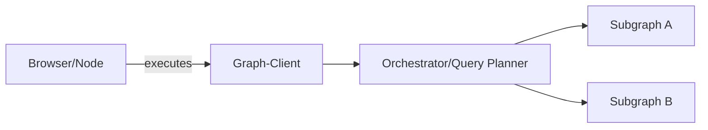
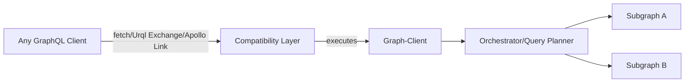
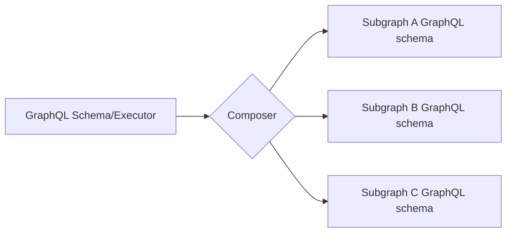
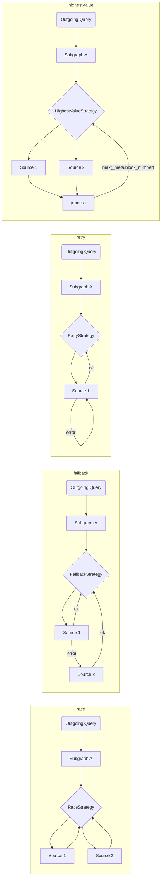
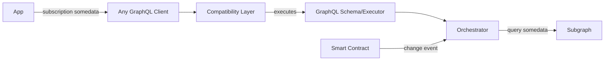

# The Graph客户端结构

为了满足支持分布式网络的需要，我们计划采取若干行动，确保The Graph客户端提供所有应用需求：

1. 编写多个子图(在客户端)
2. 返回到多个索引人/源/托管服务
3. 自动/手动选取源策略
4. Agnostic 核心，能够运行任何GraphQL客户端集成

## 独立模式

## 使用任意GraphQL客户端

## 子图组成

为了实现简单高效的客户端组合，我们将使用[`graphql-tools`](https://graphql-tools.com)创建远程模式/执行器，然后可以挂接到GraphQL客户端。

API 可以是原始的 `graphql-tool` 变换器，也可以使用 [GraphQL-Mesh 声明的 API](https://graphql-mesh.com/docs/transforms/transforms-introduction) 来构造架构。

## 子图执行策略

在被定义为源的每一个子图中，都有一种方法来定义其源索引人和查询策略，下面是几个选项：

> 我们可以配送几个内置策略，以及一个简单的接口，让开发者自己写。

为了使战略概念走向极端，我们甚至可以建立一个订阅即时查询的魔力层， 带任何钩子, 并提供一个平滑的 DX 数据库：

使用此机制，开发者可以写入并执行 GraphQL `subscription` ， 但在这个位置下，我们会执行 GraphQL `query` 到 Graph索引人，并允许连接任何外部钩子/probe来重新运行操作。
这种方式，我们可以观看智能合约本身的变更。 GraphQL客户端将填补The Graph实时变化的需要。
